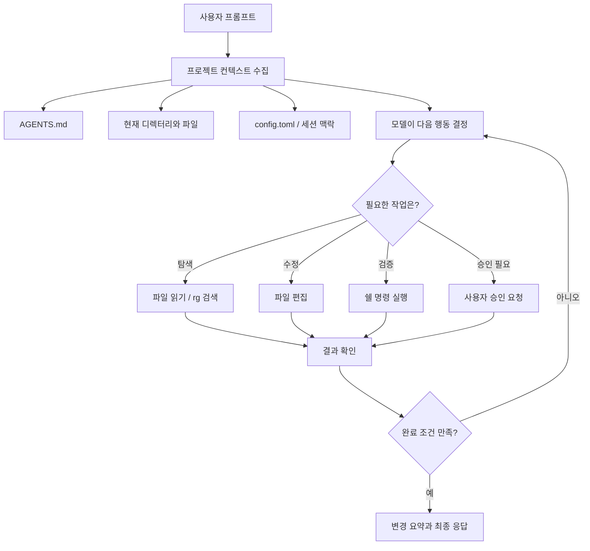

# Codex CLI

Codex CLI 는 OpenAI 의 코딩 에이전트를 터미널에서 사용하는 도구다.
Codex 앱이나 웹 UI 로 작업을 위임하는 흐름과 달리, CLI 는 현재 로컬 디렉터리의 파일을 읽고 수정하고 명령어를 실행하면서 작업한다.

이 문서는 공식 문서 기준으로 Codex CLI 로 할 수 있는 일을 정리하고, 이 저장소(`software-zero-to-all`)에서 문서를 작성하거나 PR 을 만들 때 사용했던 패턴과 연결해서 남긴다.

## 개요

Codex CLI 는 터미널에서 실행되는 로컬 코딩 에이전트다.

공식 문서 기준으로 CLI 는 다음 작업을 지원한다.

- 대화형 TUI 에서 저장소를 탐색하고 파일을 수정한다.
- 쉘 명령어를 실행하고 테스트나 빌드 결과를 보고 다음 작업을 이어간다.
- 이미지나 스크린샷을 첨부해 UI, 다이어그램, 에러 화면을 함께 설명한다.
- `codex exec` 로 비대화형 작업을 실행한다.
- `codex review` 로 커밋 전 변경분이나 특정 브랜치/커밋을 리뷰한다.
- `MCP`, `plugins`, `features`, `AGENTS.md`, `config.toml` 로 작업 환경과 규칙을 확장한다.
- sandbox 와 approval 정책으로 파일/명령 실행 권한을 제어한다.

나는 이 저장소에서는 애플리케이션 코드를 생성하기보다는 문서 작성, 공식 문서 확인, README 인덱스 갱신, PR 전 검토 같은 흐름에 주로 사용한다.

## 동작 방식

Codex CLI 를 단순히 "터미널 안의 ChatGPT" 로 생각하면 절반만 맞다.
일반 채팅처럼 답변만 만드는 것이 아니라, 사용자의 프롬프트를 기준으로 로컬 작업 공간을 읽고 필요한 명령을 실행하면서 결과를 다시 판단한다.

대략적인 동작 흐름은 아래와 같다.



예를 들어 아래처럼 요청했다고 하자.

```bash
codex "command/ 에 jq 사용법 문서를 추가하고 README 인덱스에도 링크를 넣어줘. 마지막에는 git diff --check 까지 확인해줘"
```

그러면 Codex 는 보통 아래 순서로 움직인다.

1. `AGENTS.md` 를 읽어 문서 컨벤션과 PR 규칙을 확인한다.
2. `README.md` 와 `command/` 아래 기존 문서를 훑어 문서 스타일을 파악한다.
3. 새 Markdown 파일을 만들고 예시 명령어를 작성한다.
4. `README.md` 의 `Command & Git` 섹션에 링크를 추가한다.
5. `git diff --check` 로 공백이나 Markdown 기본 문제를 확인한다.
6. 변경 파일과 검증 결과를 요약한다.

여기서 중요한 점은 Codex 가 "한 번에 정답을 출력"하는 도구라기보다, repo 안에서 작은 행동을 반복하면서 작업을 마무리하는 에이전트라는 점이다.
그래서 처음 요청할 때 작업의 끝 조건을 같이 주면 결과가 훨씬 안정적이다.

## 잘 쓰기 위한 프롬프트 구조

공식 베스트 프랙티스에서는 프롬프트에 `Goal`, `Context`, `Constraints`, `Done when` 을 넣는 방식을 권장한다.
이 저장소에서 문서를 맡길 때도 이 틀을 쓰면 좋다.

```text
Goal:
Codex CLI 로 할 수 있는 일을 ai/ 에 문서로 정리해줘.

Context:
- 이 저장소는 Markdown 기반 지식 저장소야.
- AGENTS.md 의 문서 컨벤션을 따라야 해.
- README.md 의 기존 인덱스 스타일을 먼저 확인해줘.

Constraints:
- 공식 OpenAI 문서를 기준으로 작성해줘.
- 내부 URL, 개인 서버 주소, secret 은 남기지 말아줘.
- README.md 인덱스도 날짜순으로 갱신해줘.

Done when:
- 새 문서가 추가되어 있고 README 링크가 연결되어 있어야 해.
- git diff --check 를 통과해야 해.
- 마지막 응답에 변경 파일과 확인 내용을 요약해줘.
```

위 내용을 한 줄 명령으로 쓰면 아래처럼 된다.

```bash
codex "Goal: Codex CLI 로 할 수 있는 일을 ai/ 에 문서로 정리해줘. Context: 이 저장소는 Markdown 기반 지식 저장소이고 AGENTS.md 컨벤션을 따라야 해. README.md 의 기존 인덱스 스타일을 먼저 확인해줘. Constraints: 공식 OpenAI 문서 기준으로 작성하고 secret/내부 URL 은 남기지 말아줘. README.md 인덱스도 날짜순으로 갱신해줘. Done when: git diff --check 를 통과하고 변경 파일과 확인 내용을 요약해줘."
```

조금 더 편하게는 대화형 모드에서 여러 줄로 붙여 넣는 편이 낫다.
작업이 애매하면 바로 구현을 시키기보다 먼저 계획을 요구한다.

```bash
codex "이 작업을 바로 수정하지 말고, 먼저 어떤 파일을 확인하고 어떤 순서로 고칠지 계획부터 세워줘."
```

작업이 커질수록 아래처럼 나누는 편이 좋다.

- 1차: 구조 파악과 계획 수립
- 2차: 실제 문서 작성 또는 코드 수정
- 3차: 검증과 PR 본문 작성

Codex 가 같은 실수를 반복하면 그때마다 프롬프트에 길게 적기보다는 `AGENTS.md` 에 짧은 규칙으로 남기는 편이 좋다.
이 저장소의 `AGENTS.md` 가 "문서 위치, 파일명, README 인덱스, PR 흐름"을 담고 있는 이유도 같은 맥락이다.

## 설치와 인증

macOS 에서는 `npm` 또는 Homebrew 로 설치한다.

```bash
npm i -g @openai/codex
```

```bash
brew install --cask codex
```

설치 후 터미널에서 `codex` 를 실행하면 첫 실행 시 인증을 요구한다.
ChatGPT 계정으로 로그인하거나 API key 를 사용할 수 있다.

```bash
codex
```

```bash
codex login
```

현재 설치된 CLI 버전 확인은 아래처럼 한다.

```bash
codex --version
```

업데이트는 로컬 CLI 도움말 기준으로 `codex update` 를 사용할 수 있고, npm 설치 환경에서는 공식 문서처럼 최신 패키지를 다시 설치해도 된다.

```bash
codex update
```

```bash
npm i -g @openai/codex@latest
```

설치 후 정상 동작을 가볍게 확인하려면 읽기 작업부터 시켜본다.

```bash
codex --sandbox read-only "이 저장소의 최상위 디렉터리 구조와 AGENTS.md 핵심 규칙을 요약해줘"
```

처음부터 파일 수정을 맡기기보다, 이런 식으로 읽기 전용 요청을 먼저 해보면 Codex 가 현재 repo 를 어떤 식으로 이해하는지 확인할 수 있다.

## 대화형 모드

가장 기본적인 사용 방식은 저장소 루트에서 `codex` 를 실행하는 것이다.

```bash
codex
```

시작과 동시에 프롬프트를 줄 수도 있다.

```bash
codex "이 저장소의 README 인덱스 구조를 설명해줘"
```

특정 디렉터리를 작업 루트로 지정하려면 `--cd` 또는 `-C` 를 사용한다.

```bash
codex --cd /Users/pasudo123/coding/software-zero-to-all
```

이미지를 함께 전달할 때는 `--image` 또는 `-i` 를 사용한다.

```bash
codex -i ./image/sample.png "이 다이어그램을 문서로 설명해줘"
```

대화형 모드는 중간에 방향을 바꾸기 쉽다는 장점이 있다.
예를 들어 문서 초안을 작성하게 한 뒤, 바로 이어서 아래처럼 추가 요청을 던질 수 있다.

```text
좋아. 그런데 지금 내용이 명령어 나열에 가까워.
처음 쓰는 사람이 따라 할 수 있게 "상황 -> 명령어 -> 언제 쓰는지" 순서로 다시 다듬어줘.
```

또는 검증을 더 요구할 수도 있다.

```text
README 링크가 실제 파일을 가리키는지 rg 로 확인하고,
git diff --check 결과도 같이 알려줘.
```

Codex 가 긴 작업을 진행 중일 때 `Tab` 으로 다음 턴에 보낼 요청을 미리 큐에 넣을 수 있다.
문서 작업에서는 "방금 작성한 내용의 어색한 표현만 다시 봐줘" 같은 후속 요청을 미리 걸어두기 좋다.

대화형 모드에서 자주 쓰는 slash command 는 아래와 같다.

| 명령어 | 용도 |
| --- | --- |
| `/diff` | 현재 변경된 diff 를 확인한다. |
| `/model` | 모델과 reasoning 수준을 바꾼다. |
| `/permissions` | 세션 중 승인/권한 정책을 조정한다. |
| `/mention` | 특정 파일이나 폴더를 대화에 첨부한다. |
| `/compact` | 긴 대화를 요약해 컨텍스트를 줄인다. |
| `/copy` | 마지막 완료 응답을 복사한다. |
| `/mcp` | 연결된 MCP 도구 목록을 확인한다. |
| `/plugins` | 설치되었거나 사용할 수 있는 plugin 을 확인한다. |
| `/init` | 현재 디렉터리에 `AGENTS.md` 초안을 만든다. |
| `/status` | 현재 세션과 환경 상태를 확인한다. |
| `/exit` | CLI 세션을 종료한다. |

이 저장소에서는 `AGENTS.md` 가 이미 단일 작업 가이드 역할을 하므로, `/init` 으로 새 규칙을 만들기보다는 기존 `AGENTS.md` 를 기준으로 작업한다.

### 상황별 대화형 예시

새 문서 초안을 만들 때:

```bash
codex "AGENTS.md 를 먼저 읽고, README.md 의 기존 인덱스 스타일을 참고해서 codex cli 문서 초안을 작성해줘. README 인덱스는 아직 수정하지 말고 초안만 보여줘."
```

초안이 마음에 들면 실제 반영을 요청한다.

```text
좋아. 이제 ai/2026-05-04_codex-cli.md 로 저장하고 README.md 인덱스에도 링크를 추가해줘.
```

기존 문서를 더 친절하게 다듬을 때:

```bash
codex "ai/2026-05-04_codex-cli.md 를 읽고, 처음 쓰는 사람도 따라 할 수 있게 예시를 보강해줘. 공식 문서 기준과 이 저장소에서 쓰는 패턴은 유지해줘."
```

PR 전 최종 점검을 맡길 때:

```bash
codex "현재 변경분을 검토해줘. 문서 링크, README 인덱스, git diff --check 기준으로 문제가 있는지 확인하고 필요한 수정까지 해줘."
```

## 대화 이어가기

Codex 는 세션 transcript 를 로컬에 저장한다.
이전 작업 맥락을 이어가려면 `resume` 을 사용한다.

```bash
codex resume
```

가장 최근 세션을 바로 이어가려면 아래처럼 실행한다.

```bash
codex resume --last
```

특정 세션을 이어갈 수도 있다.

```bash
codex resume <SESSION_ID>
```

이 저장소에서는 긴 문서 초안 작성 후 후속 검수, PR 본문 작성, 리뷰 반영처럼 앞선 맥락이 중요한 작업에 유용하다.

예를 들어 전날 Codex 와 문서 초안을 만들다가 멈췄다면 아래처럼 이어갈 수 있다.

```bash
codex resume --last
```

이어 열린 세션에서 이렇게 말하면 된다.

```text
어제 작성하던 codex cli 문서에서 "잘 쓰는 법" 섹션을 더 보강하고,
공식 베스트 프랙티스 링크도 reference 에 추가해줘.
```

비대화형으로 이어가고 싶을 때는 `exec resume` 을 사용한다.

```bash
codex exec resume --last "마지막 논의 내용을 바탕으로 PR 본문을 한글로 작성해줘"
```

## 비대화형 모드

반복 가능한 작업이나 스크립트성 작업은 `codex exec` 를 사용한다.
짧게 `codex e` 로도 실행할 수 있다.

```bash
codex exec "README.md 에서 깨진 command 링크가 있는지 확인해줘"
```

대화형 모드와 달리 `exec` 는 한 번 실행하고 끝나는 작업에 어울린다.
예를 들면 아래처럼 "검토하고 결과만 알려줘" 같은 작업이다.

```bash
codex exec --sandbox read-only "README.md 와 command/ 아래 Markdown 링크가 실제 파일을 가리키는지 확인하고, 문제만 목록으로 알려줘"
```

표준 입력을 프롬프트로 넘길 수도 있다.

```bash
printf '%s\n' "이 diff 를 보고 문서 표현을 다듬어줘" | codex exec -
```

긴 지시문은 파일로 만들어 stdin 으로 넘기는 방식도 좋다.

```bash
codex exec - < /tmp/codex-doc-review-prompt.md
```

자동화에서 결과를 다루려면 `--json` 으로 JSONL 이벤트를 출력한다.

```bash
codex exec --json "변경된 Markdown 파일을 검토해줘"
```

마지막 응답만 파일로 남기려면 `--output-last-message` 를 사용한다.

```bash
codex exec \
  --output-last-message /tmp/codex-review.md \
  "현재 변경분을 리뷰하고 PR 본문 초안을 작성해줘"
```

응답 형태를 고정해야 할 때는 JSON Schema 파일을 넘긴다.

```bash
codex exec \
  --output-schema ./schema/codex-result.schema.json \
  "문서 링크 점검 결과를 JSON 으로 정리해줘"
```

비대화형 세션도 이어갈 수 있다.

```bash
codex exec resume --last "앞서 찾은 문제를 기준으로 수정 계획을 다시 정리해줘"
```

문서 저장소에서는 `codex exec` 를 아래처럼 쓰기 좋다.

- 특정 디렉터리의 Markdown 링크 점검
- 여러 문서의 표현 통일
- `README.md` 인덱스 누락 여부 확인
- PR 본문 초안 작성
- 커밋 전 변경분 요약

예시로, 현재 변경분을 기준으로 PR 본문 초안을 만들고 싶다면 아래처럼 쓴다.

```bash
codex exec \
  --output-last-message /tmp/pr-body.md \
  "현재 git diff 를 기준으로 PR 본문을 한글로 작성해줘. 형식은 변경 배경, 주요 변경 사항, 확인한 내용, 리스크 및 참고사항 순서로 해줘."
```

출력이 기계적으로 필요하다면 JSON Schema 를 붙인다.
예를 들어 링크 점검 결과를 자동 처리하고 싶다면 `brokenLinks`, `checkedFiles`, `summary` 같은 필드를 schema 로 고정할 수 있다.

## 코드 리뷰

CLI 에는 리뷰 전용 명령이 있다.
커밋 전 변경분을 확인할 때는 `--uncommitted` 를 사용한다.

```bash
codex review --uncommitted
```

기준 브랜치와 비교하려면 `--base` 를 사용한다.

```bash
codex review --base main
```

특정 커밋만 리뷰할 수도 있다.

```bash
codex review --commit <SHA>
```

이 저장소에서는 PR 전 사람이 놓치기 쉬운 부분을 점검하는 용도로 맞다.

- 새 문서가 날짜/파일명 컨벤션을 지켰는가
- `README.md` 인덱스가 갱신되었는가
- 상대 링크가 실제 파일을 가리키는가
- secret, 내부 URL, 개인 서버 주소가 노출되지 않았는가
- 공식 문서 기반 설명에 오래된 명령이나 옵션이 섞이지 않았는가

리뷰 지시를 더 구체적으로 주면 결과도 좋아진다.

```bash
codex review --uncommitted "문서 저장소 기준으로 리뷰해줘. 특히 README 인덱스 누락, 상대 링크 오류, 날짜 기반 파일명 컨벤션, 공식 문서 링크의 신뢰성을 봐줘."
```

특정 기준 브랜치와 비교할 때는 아래처럼 사용한다.

```bash
codex review --base main "main 대비 변경된 문서만 보고, PR 전에 고쳐야 할 문제를 심각도 순으로 알려줘."
```

## 권한과 sandbox

Codex CLI 는 sandbox 와 approval 정책을 함께 사용한다.
sandbox 는 기술적인 실행 경계이고, approval 은 그 경계를 넘거나 위험한 작업을 할 때 사람에게 물어볼지 결정하는 정책이다.

대표 sandbox 모드는 아래와 같다.

| 모드 | 의미 | 사용 예시 |
| --- | --- | --- |
| `read-only` | 읽기 중심 작업 | 저장소 구조 파악, 리뷰, 설계 검토 |
| `workspace-write` | 현재 작업 공간 쓰기 허용 | 문서 추가, 코드 수정, 테스트 실행 |
| `danger-full-access` | 넓은 접근 허용 | 외부에서 별도 격리된 환경일 때만 고려 |

```bash
codex --sandbox read-only "이 저장소 문서 구조를 설명해줘"
```

```bash
codex --sandbox workspace-write "새 문서를 추가하고 README 링크를 갱신해줘"
```

권한을 고를 때는 아래 기준으로 생각하면 편하다.

- 설명, 탐색, 리뷰만 필요하면 `read-only`
- 파일을 직접 만들거나 고치게 할 때는 `workspace-write`
- 시스템 전체에 가까운 접근이 필요한 작업은 CLI 에 맡기기 전에 정말 필요한지 먼저 확인

문서 작성만 한다면 대부분 `workspace-write` 로 충분하다.
네트워크 접근이나 외부 디렉터리 쓰기가 필요하면 Codex 가 승인 요청을 하게 두는 편이 안전하다.

승인 정책은 `--ask-for-approval` 또는 `-a` 로 조정한다.

```bash
codex -a on-request
```

```bash
codex -a never
```

처음 쓰는 동안에는 `on-request` 가 무난하다.
Codex 가 필요하다고 판단할 때 승인을 요청하므로, 어느 작업에서 멈추는지 보면서 감을 잡을 수 있다.
완전히 반복 가능한 읽기/검토 작업에서는 `never` 도 쓸 수 있지만, 실패 시 사람이 중간에 승인해줄 수 없다는 점을 감안해야 한다.

추가 디렉터리에 접근해야 할 때는 `--add-dir` 를 사용한다.

```bash
codex --add-dir /Users/pasudo123/.codex/memories
```

`--dangerously-bypass-approvals-and-sandbox` 는 모든 승인과 sandbox 를 우회한다.
공식 문서와 CLI 도움말 모두 위험한 옵션으로 취급하므로, 별도 격리된 실행 환경이 아니라면 사용하지 않는 편이 좋다.

```bash
codex --dangerously-bypass-approvals-and-sandbox
```

개인적으로는 이 옵션을 "편의 옵션" 이 아니라 "격리된 CI/임시 컨테이너 안에서만 검토할 옵션" 으로 보는 게 맞다고 생각한다.

## 설정과 확장

Codex CLI 의 기본 설정은 `~/.codex/config.toml` 에 둔다.
일회성 실행에서는 `-c key=value` 로 설정을 덮어쓴다.

```bash
codex -c model="gpt-5.3-codex"
```

```bash
codex -c shell_environment_policy.inherit=all
```

여러 설정 묶음은 profile 로 나눌 수 있다.

```bash
codex --profile docs
```

예를 들어 문서 작업 전용 profile 을 둔다면 아래처럼 생각할 수 있다.

```toml
# ~/.codex/config.toml
[profiles.docs]
model = "gpt-5.3-codex"
sandbox_mode = "workspace-write"
approval_policy = "on-request"
```

그 다음 문서 작업을 시작할 때 profile 을 지정한다.

```bash
codex --profile docs "AGENTS.md 기준으로 새 문서를 작성해줘"
```

실제 config key 는 CLI 버전에 따라 달라질 수 있으므로 `codex --help` 와 공식 config 문서를 함께 확인한다.

MCP 서버는 외부 도구와 컨텍스트를 Codex 에 연결하는 방식이다.

```bash
codex mcp list
```

```bash
codex mcp add <NAME> --url <MCP_SERVER_URL>
```

stdio 로 실행되는 MCP 서버는 명령어를 직접 넘긴다.

```bash
codex mcp add <NAME> -- <COMMAND>
```

plugin 은 반복 작업에 필요한 skill, MCP, app 묶음을 제공한다.

```bash
codex plugin --help
```

feature flag 는 `features` 명령으로 확인하거나 켜고 끈다.

```bash
codex features list
```

```bash
codex features enable <FEATURE>
```

AGENTS.md 는 설정 파일은 아니지만, Codex 를 잘 쓰는 데 가장 체감이 큰 장치다.
Codex 는 작업 시작 시 전역 `~/.codex/AGENTS.md` 와 프로젝트 안의 `AGENTS.md` 를 읽고, 더 가까운 디렉터리의 지침을 나중에 반영한다.
그래서 반복적으로 요구하는 말은 프롬프트보다 `AGENTS.md` 에 남기는 편이 좋다.

이 저장소에서는 아래 내용이 이미 좋은 프로젝트 지침이 된다.

- 새 문서는 날짜 기반 파일명 사용
- 여러 번 다시 볼 문서는 `README.md` 인덱스에 링크 추가
- 문서 변경 후 `git diff --check` 수행
- PR 제목과 본문은 한글 중심으로 작성
- secret, 내부 URL, 개인 서버 주소는 placeholder 처리

Codex 가 같은 실수를 두 번 하면, "다음부터는 이 규칙을 AGENTS.md 에 어떻게 추가하면 좋을까?" 라고 물어보는 것도 좋다.

## shell completion

쉘 자동완성 스크립트는 `completion` 명령으로 생성한다.

```bash
codex completion zsh
```

```bash
codex completion bash
```

```bash
codex completion fish
```

zsh 환경에서는 생성한 completion 스크립트를 `.zshrc` 또는 completion 디렉터리에 연결해서 사용한다.

## 로컬 sandbox 명령

`codex sandbox` 는 Codex 가 제공하는 sandbox 안에서 명령을 직접 실행할 때 사용한다.
macOS 는 Seatbelt, Linux 는 bubblewrap 계열 sandbox 를 사용한다.

```bash
codex sandbox macos --help
```

```bash
codex sandbox linux --help
```

평소 문서 작성 흐름에서는 직접 쓸 일이 많지 않지만, 특정 명령이 sandbox 안에서 어떻게 동작하는지 확인할 때 도움이 된다.

## 더 잘 사용하기 위한 습관

Codex 는 알아서 많은 것을 해주지만, 좋은 입력과 좋은 검증 루프가 있을 때 훨씬 안정적이다.

### 작은 단위로 맡기기

큰 작업을 한 번에 던지면 Codex 가 많은 결정을 스스로 하게 된다.
예를 들어 "Codex CLI 완벽 가이드를 써줘" 보다는 아래처럼 나누는 편이 낫다.

```text
1. 공식 문서와 기존 command 문서 스타일을 먼저 조사해줘.
2. 어떤 목차로 쓰면 좋을지 제안해줘.
3. 내가 승인하면 파일을 작성해줘.
4. 마지막에 README 인덱스와 git diff --check 를 확인해줘.
```

### 완료 조건을 같이 주기

완료 조건이 없으면 Codex 는 "그럴듯한 답변"에서 멈출 수 있다.
아래처럼 끝 상태를 같이 적는다.

```bash
codex "dummy/ 의 Redis 문서를 command/ 문서 스타일로 다듬어줘. 완료 조건: 파일명은 유지, README 링크 변경 없음, git diff --check 통과, 마지막에 변경 요약 제공."
```

### 검증 명령을 명시하기

문서 저장소라도 검증할 수 있는 것은 많다.

```bash
codex "문서 수정 후 아래 명령을 실행해서 확인해줘: git diff --check, rg -n '새 문서 제목' README.md command/"
```

Spring/Kotlin 프로젝트라면 `./gradlew test`, 프론트엔드라면 `npm test` 나 `npm run build` 처럼 해당 repo 의 검증 명령을 적어준다.

### 모르는 영역은 먼저 설명하게 하기

처음 보는 코드나 개념을 바로 수정하게 하지 말고 먼저 설명을 시킨다.

```bash
codex --sandbox read-only "이 프로젝트에서 문서 인덱스가 어떻게 관리되는지 README.md 와 AGENTS.md 기준으로 설명해줘. 아직 파일은 수정하지 마."
```

설명을 보고 방향이 맞으면 그때 수정 요청을 한다.
이 방식은 Codex 의 이해가 내 의도와 맞는지 초반에 확인할 수 있어 안전하다.

### 중간 diff 를 자주 보기

대화형 모드에서는 `/diff` 를 자주 확인한다.
특히 문서 작업은 내용이 길어질수록 불필요한 문체 변경이 섞이기 쉽다.

```text
/diff
```

diff 를 본 뒤에는 이렇게 좁혀서 요청한다.

```text
좋아. 그런데 기존 문장까지 너무 많이 바뀌었어.
이번 요청에서 새로 추가한 "동작 방식"과 "잘 쓰는 법" 섹션만 유지하고,
나머지 섹션의 문체 변경은 최소화해줘.
```

### 사람이 결정할 것을 남겨두기

Codex 는 구현과 정리에 강하지만, 글의 관점이나 선택 기준은 사람이 정해주는 편이 좋다.
예를 들어 이 문서는 "Codex 앱보다 CLI 를 중심으로 쓰는 사람"을 독자로 정했기 때문에, 앱 기능 소개보다 CLI 명령과 로컬 repo 작업 패턴을 우선했다.

## 이 저장소에서 쓰는 패턴

이 저장소는 Markdown 기반 지식 저장소이므로, Codex CLI 를 사용할 때도 코드 생성보다 문서 품질과 Git 흐름을 중심에 둔다.

### 문서 추가

```bash
codex "공식 문서를 확인해서 command/ 에 새 문서를 추가하고 README 인덱스를 갱신해줘"
```

작업 지시에는 보통 아래 조건을 함께 준다.

- `AGENTS.md` 의 문서 컨벤션을 따른다.
- 파일명은 `yyyy-MM-dd_topic-kebab.md` 형식으로 만든다.
- 공식 문서 링크는 `reference` 섹션에 남긴다.
- `README.md` 의 관련 인덱스를 날짜순으로 갱신한다.
- secret, 내부 URL, 개인 서버 주소는 placeholder 로 둔다.

### 탐색과 근거 확인

Codex 에게도 `rg`, `fd`, `sed` 같은 CLI 를 우선 쓰게 한다.

```bash
codex "rg 로 기존 command 문서 스타일을 먼저 확인하고, 비슷한 톤으로 codex cli 문서를 작성해줘"
```

공식 문서 기반 글이면 최신 문서를 확인하도록 명시한다.

```bash
codex --search "OpenAI 공식 Codex CLI 문서를 기준으로 설치, exec, review, sandbox 사용법을 정리해줘"
```

### PR 전 점검

문서 변경 후에는 최소한 아래를 확인한다.

```bash
git diff --check
```

```bash
rg -n "codex-cli|Codex CLI" README.md ai/
```

Codex 리뷰도 함께 사용할 수 있다.

```bash
codex review --uncommitted
```

### worktree 흐름

이 저장소의 `AGENTS.md` 는 가능하면 작업 브랜치별 `git worktree` 사용을 권장한다.
Codex 에게 작업을 맡길 때도 이 흐름을 그대로 지시하는 편이 좋다.

```bash
codex "main 은 유지하고 docs/codex-cli 브랜치 worktree 에서 문서 추가 작업 계획을 세워줘"
```

문서 하나를 빠르게 추가하는 정도라면 현재 작업 공간에서 진행할 수 있지만, PR 단위 작업은 아래 순서를 기준으로 둔다.

```bash
git fetch origin
git checkout main
git pull origin main
git checkout -b docs/codex-cli
```

작업 후에는 변경 확인, 커밋, push, PR 생성 순서로 간다.

```bash
git diff --check
git status --short
git add README.md ai/2026-05-04_codex-cli.md
git commit -m "docs : codex cli"
git push -u origin docs/codex-cli
gh pr create --base main --title "docs : codex cli 정리" --body-file /tmp/pr-body.md
```

## 주의할 점

- Codex CLI 의 명령과 옵션은 빠르게 변한다. 글 작성 시점의 `codex --help` 와 공식 문서를 함께 확인한다.
- 모델명, 가격, 제공 플랜은 변경될 수 있으므로 문서에 오래 고정하지 않고 공식 링크를 참고한다.
- `danger-full-access`, `--dangerously-bypass-approvals-and-sandbox`, `-a never` 는 편하지만 위험하다.
- 문서 저장소에서도 secret 과 내부 URL 은 남기지 않는다.
- AI 가 작성한 문서는 마지막에 사람이 읽고 말투, 사실관계, 링크를 한 번 더 확인한다.

## reference

- [OpenAI Developers - Codex CLI](https://developers.openai.com/codex/cli)
- [OpenAI Developers - Codex CLI features](https://developers.openai.com/codex/cli/features)
- [OpenAI Developers - Codex CLI command line options](https://developers.openai.com/codex/cli/reference)
- [OpenAI Developers - Slash commands in Codex CLI](https://developers.openai.com/codex/cli/slash-commands)
- [OpenAI Developers - Sandbox](https://developers.openai.com/codex/concepts/sandboxing)
- [OpenAI Developers - Prompting](https://developers.openai.com/codex/prompting)
- [OpenAI Developers - Best practices](https://developers.openai.com/codex/learn/best-practices)
- [OpenAI Developers - Custom instructions with AGENTS.md](https://developers.openai.com/codex/guides/agents-md)
- [OpenAI Cookbook - Codex Prompting Guide](https://developers.openai.com/cookbook/examples/gpt-5/codex_prompting_guide)
- [OpenAI Codex GitHub repository](https://github.com/openai/codex)
