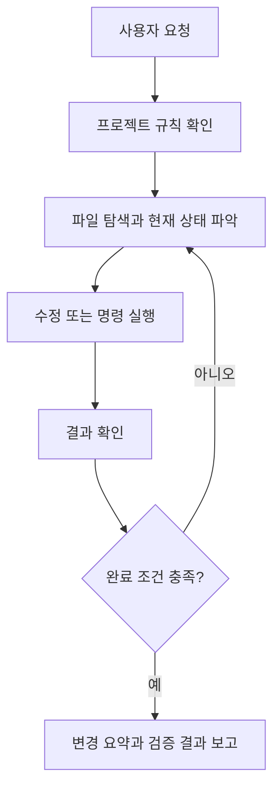

# Codex CLI

Codex CLI는 OpenAI의 코딩 에이전트를 터미널에서 쓰는 도구다.
터미널에서 실행하지만 단순한 채팅창은 아니다. 현재 디렉터리의 파일을 읽고, 필요한 명령을 실행하고, 변경을 만든 뒤 검증까지 이어가는 작업 도구에 가깝다.

이 글은 설치 방법보다 실제로 어떻게 쓰면 덜 헤매는지를 중심으로 정리한다. 설치와 인증은 공식 문서가 더 자주 바뀌므로 여기서는 다루지 않는다.

## 개요

Codex CLI를 잘 쓰는 핵심은 "무엇을 해줘"보다 "어디까지 끝내면 되는지"를 같이 말하는 것이다.

예를 들어 아래처럼 요청하면 Codex가 스스로 확인해야 할 끝 지점이 분명해진다.

```text
AGENTS.md를 먼저 읽고, ai/에 LLM 개요 문서를 추가해줘.
README.md 인덱스도 갱신하고, 마지막에는 git diff --check까지 확인해줘.
```

이 저장소에서는 주로 아래 작업에 쓴다.

| 작업 | 잘 맞는 이유 |
| --- | --- |
| 문서 초안 작성 | 기존 문서 톤과 README 인덱스를 함께 볼 수 있다. |
| 문서 재정리 | 여러 파일의 링크와 분류를 같이 점검할 수 있다. |
| 공식 문서 기반 정리 | 검색, 요약, reference 정리를 한 흐름에서 처리할 수 있다. |
| PR 전 점검 | diff, 링크, 컨벤션, secret 노출 여부를 같이 볼 수 있다. |
| 반복 검토 | `exec`, `review`로 같은 기준의 검토를 다시 실행할 수 있다. |

## 동작 방식

Codex CLI는 요청을 받으면 보통 아래 순서로 움직인다.



여기서 `AGENTS.md`가 중요하다.
Codex는 작업 중 프로젝트 지침을 참고한다. 매번 "README도 고쳐줘", "secret은 남기지 마", "문체는 사람처럼 다듬어줘"라고 길게 쓰기보다, 반복되는 기준은 `AGENTS.md`에 남기는 편이 좋다.

## 프롬프트를 쓰는 방식

긴 작업은 아래 네 가지를 넣으면 안정적이다.

| 항목 | 의미 | 예시 |
| --- | --- | --- |
| Goal | 최종 목표 | `Codex CLI 문서를 베스트 프랙티스 중심으로 정리` |
| Context | 저장소나 작업 배경 | `Markdown 기반 지식 저장소, AGENTS.md 준수` |
| Constraints | 피해야 할 것 | `설치/인증 제외, 사용성 낮은 옵션 제외` |
| Done when | 완료 조건 | `README 갱신, git diff --check 통과` |

한 번에 쓰면 이렇게 된다.

```text
Goal:
ai/2026-05-04_codex-cli.md를 베스트 프랙티스 중심으로 정리해줘.

Context:
이 저장소는 Markdown 지식 저장소이고 AGENTS.md의 글쓰기 기준을 따라야 해.

Constraints:
설치와 인증은 제외해줘. 자주 쓰지 않는 옵션은 과감히 빼고, sandbox는 실제 사용 기준으로 설명해줘.

Done when:
README.md 인덱스가 맞고, git diff --check를 통과해야 해.
```

작업이 크면 처음부터 수정을 맡기지 않고 계획부터 요구하는 것도 좋다.

```bash
codex "이 작업을 바로 수정하지 말고, 먼저 어떤 파일을 확인하고 어떤 순서로 고칠지 계획부터 세워줘."
```

## 대화형 모드

가장 기본적인 방식은 저장소 루트에서 `codex`를 실행하는 것이다.

```bash
codex
```

시작하면서 바로 요청을 줄 수도 있다.

```bash
codex "README.md의 AI 섹션과 ai/ 디렉터리 구조를 설명해줘"
```

대화형 모드는 방향을 중간에 바꾸기 좋다.
초안을 만든 뒤 바로 아래처럼 이어갈 수 있다.

```text
좋아. 그런데 말투가 너무 설명서 같아.
기존 학습 메모처럼 조금 더 자연스럽게 다듬어줘.
```

자주 쓰는 slash command는 많지 않다. 문서 작업 기준으로는 아래 정도면 충분하다.

| 명령어 | 언제 쓰나 |
| --- | --- |
| `/diff` | 지금까지 바뀐 내용을 확인한다. |
| `/status` | 현재 모델, 권한, 작업 상태를 확인한다. |
| `/permissions` | 명령 실행이나 파일 쓰기 승인 방식을 조정한다. |
| `/model` | 모델이나 reasoning 수준을 바꾼다. |
| `/mention` | 특정 파일이나 폴더를 대화에 붙인다. |
| `/compact` | 대화가 길어졌을 때 맥락을 요약한다. |
| `/exit` | 세션을 종료한다. |

`/init`, `/plugins`, `/mcp` 같은 기능은 필요할 때만 보면 된다.
이 저장소에서는 이미 `AGENTS.md`가 있으므로 `/init`으로 새 지침을 만들 일은 거의 없다.

## 비대화형 모드

반복 가능한 검토나 짧은 자동화는 `codex exec`가 편하다.

```bash
codex exec "README.md의 AI 섹션 링크가 실제 파일을 가리키는지 확인해줘"
```

문서 저장소에서는 이런 작업에 잘 맞는다.

| 작업 | 예시 |
| --- | --- |
| 링크 점검 | `README와 ai/의 상대 링크 문제만 알려줘` |
| 표현 검토 | `AI가 쓴 느낌이 강한 문장만 찾아줘` |
| PR 본문 초안 | `현재 git diff 기준으로 한글 PR 본문을 작성해줘` |
| 변경 요약 | `이번 변경의 목적과 리스크를 짧게 정리해줘` |

자동화 결과를 파일로 남기고 싶다면 `--output-last-message`를 쓴다.

```bash
codex exec \
  --output-last-message /tmp/pr-body.md \
  "현재 git diff를 기준으로 PR 본문을 한글로 작성해줘."
```

결과를 프로그램에서 다룰 목적이면 `--json`이나 `--output-schema`를 검토한다.
다만 평소 문서 작업에서는 사람이 읽을 요약이면 충분한 경우가 많다.

## 코드 리뷰

CLI에는 리뷰 전용 명령도 있다.

```bash
codex review --uncommitted
```

기준 브랜치와 비교하려면 아래처럼 쓴다.

```bash
codex review --base main
```

이 저장소에서는 리뷰 기준을 구체적으로 적어주는 편이 좋다.

```bash
codex review --uncommitted "문서 저장소 기준으로 봐줘. README 인덱스 누락, 상대 링크 오류, 날짜 기반 파일명, secret 노출 여부를 우선 확인해줘."
```

리뷰 결과는 그대로 믿기보다 "사람이 마지막으로 한 번 더 보는 체크리스트"로 두는 게 안전하다.
특히 공식 문서의 최신성, 문체, 개인 메모의 뉘앙스는 사람이 판단해야 한다.

## 권한과 sandbox

sandbox는 Codex가 파일과 명령에 접근할 수 있는 범위를 정하는 장치다.
실제로 자주 쓰인다. 특히 로컬 저장소에서 파일을 고치거나 명령을 실행하는 도구이기 때문에, 처음부터 넓은 권한을 주기보다 작업 성격에 맞게 좁혀두는 편이 좋다.

approval은 sandbox 경계를 넘거나 위험한 명령을 실행할 때 사람에게 물어볼지 정하는 정책이다.
두 개를 같이 봐야 한다.

| 모드 | 의미 | 추천 상황 |
| --- | --- | --- |
| `read-only` | 파일을 읽고 명령 결과를 확인하는 수준 | 구조 파악, 리뷰, 설계 검토 |
| `workspace-write` | 현재 작업 공간의 파일 수정 허용 | 문서 작성, 코드 수정, 테스트 실행 |
| `danger-full-access` | 거의 제한 없는 접근 | 격리된 임시 환경에서만 신중히 검토 |

읽기만 필요한 작업은 `read-only`가 좋다.

```bash
codex --sandbox read-only "AGENTS.md와 README.md 기준으로 이 저장소 문서 구조를 설명해줘"
```

파일 수정까지 맡길 때는 `workspace-write`가 보통 충분하다.

```bash
codex --sandbox workspace-write "ai/에 새 문서를 추가하고 README 링크를 갱신해줘"
```

승인 정책은 처음에는 `on-request`가 무난하다.
Codex가 권한이 더 필요하다고 판단하면 멈추고 물어보기 때문에, 어떤 작업이 위험하거나 범위를 넘는지 확인할 수 있다.

```bash
codex -a on-request
```

`-a never`는 자동화에는 편하지만, 권한이 막히면 스스로 풀 수 없다.
읽기 전용 점검이나 실패해도 괜찮은 검토 작업에만 쓰는 편이 낫다.

추가 디렉터리를 읽어야 할 때는 `--add-dir`를 사용한다.

```bash
codex --add-dir /Users/pasudo123/.codex/memories
```

`--dangerously-bypass-approvals-and-sandbox`는 이름 그대로 위험하다.
편의 옵션으로 보지 말고, 버려도 되는 임시 컨테이너나 별도 격리 환경에서만 검토한다.

## 이 저장소에서의 좋은 흐름

문서 하나를 추가할 때는 아래 흐름이 편하다.

```text
1. AGENTS.md와 README.md를 먼저 읽어줘.
2. 기존 비슷한 문서 2~3개를 보고 글투와 목차를 맞춰줘.
3. 새 문서를 작성하고 README 인덱스를 갱신해줘.
4. git diff --check와 링크 경로를 확인해줘.
5. 마지막에 변경 파일과 확인 결과를 짧게 알려줘.
```

PR 전에는 아래 요청이 잘 맞는다.

```bash
codex "현재 변경분을 문서 저장소 기준으로 검토해줘. 링크, README 인덱스, 파일명, secret 노출, AI 느낌이 강한 문장을 중심으로 봐줘."
```

큰 작업은 한 번에 맡기기보다 나누는 편이 낫다.

| 단계 | 맡길 일 |
| --- | --- |
| 1차 | 구조 파악과 계획 |
| 2차 | 실제 문서 작성 또는 이동 |
| 3차 | README, 링크, 문체 검토 |
| 4차 | PR 본문 작성 |

Codex가 같은 실수를 반복하면 프롬프트를 길게 만들기보다 `AGENTS.md`에 짧은 규칙을 추가한다.
이 저장소에서 글쓰기 기준을 따로 둔 이유도 여기에 있다.

## 주의할 점

- Codex CLI의 명령과 옵션은 바뀔 수 있다. 오래 남길 글에는 구체적인 버전/가격보다 공식 링크를 남긴다.
- 위험한 권한 옵션은 문서 작업에 거의 필요 없다.
- 공식 문서 기반 글은 작성 시점에 원문을 확인한다.
- AI가 쓴 초안은 마지막에 사람이 문체와 사실관계를 다시 본다.
- secret, 내부 URL, 개인 서버 주소는 `<HOST>`, `<TOKEN>` 같은 placeholder로 남긴다.

## reference

- [OpenAI Developers - Codex CLI](https://developers.openai.com/codex/cli)
- [OpenAI Developers - Codex CLI command line options](https://developers.openai.com/codex/cli/reference)
- [OpenAI Developers - Slash commands in Codex CLI](https://developers.openai.com/codex/cli/slash-commands)
- [OpenAI Developers - Sandbox](https://developers.openai.com/codex/concepts/sandboxing)
- [OpenAI Developers - Best practices](https://developers.openai.com/codex/learn/best-practices)
- [OpenAI Developers - Custom instructions with AGENTS.md](https://developers.openai.com/codex/guides/agents-md)
- [OpenAI Cookbook - Codex Prompting Guide](https://developers.openai.com/cookbook/examples/gpt-5/codex_prompting_guide)
