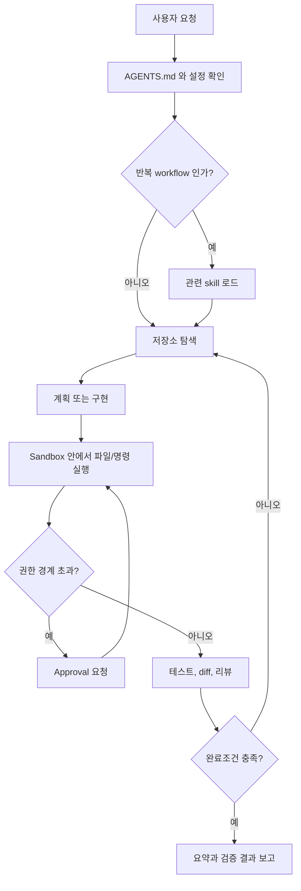

# Codex Skills 와 Harness 실무 정리

Codex를 잘 쓰려면 모델만 볼 게 아니라, 모델이 일하는 환경까지 같이 봐야 한다.
프롬프트는 한 번의 요청을 움직이고, `AGENTS.md`는 저장소의 반복 규칙을 기억하게 하고, skill은 반복되는 작업 절차를 재사용 가능하게 만든다.

이 글은 Codex skills와 harness를 어떻게 배우고, 실무에서 어떤 패턴으로 쓰면 좋은지 정리한 메모다.
설치나 옵션 나열보다 "반복되는 일을 어떻게 안정적인 작업 흐름으로 만들 것인가"에 초점을 둔다.

## 개요

Codex는 단순한 채팅창이 아니라 저장소 안에서 파일을 읽고, 명령을 실행하고, 변경을 검증하는 coding agent다.
그래서 실무에서는 아래 세 가지를 같이 관리해야 한다.

| 구분 | 역할 | 어디에 두나 |
| --- | --- | --- |
| 프롬프트 | 이번 작업의 목표, 맥락, 제약, 완료조건 | 대화 입력 |
| `AGENTS.md` | 저장소에서 항상 지켜야 하는 규칙 | 저장소 루트 또는 하위 디렉터리 |
| Skill | 반복되는 작업 절차와 참고 자료 | `.agents/skills`, 사용자 skill, plugin |

공식 문서에서도 Codex를 일회성 assistant보다 "시간이 지나며 설정하고 개선하는 teammate"처럼 다루라고 설명한다.
처음부터 자동화를 만들기보다, 사람이 반복해서 요청하던 좋은 프롬프트와 검증 루프를 `AGENTS.md`나 skill로 옮기는 쪽이 안전하다.

## 용어 정리

| 용어 | 의미 | 실무 감각 |
| --- | --- | --- |
| `AGENTS.md` | Codex가 작업 전에 읽는 프로젝트 지침 | 저장소의 헌법처럼 짧고 반복적인 규칙만 둔다. |
| Skill | 재사용 가능한 workflow 작성 형식 | 매번 붙여 넣던 작업 절차를 `SKILL.md`로 만든다. |
| Plugin | skill과 app을 배포하기 위한 묶음 | 팀이나 외부 사용자에게 설치 가능한 형태로 나눌 때 쓴다. |
| MCP | 외부 시스템과 Codex를 연결하는 표준 | GitHub, Google Drive, Notion처럼 repo 밖 맥락이 필요할 때 쓴다. |
| Sandbox | Codex가 명령을 실행할 때의 기술적 경계 | 어떤 파일을 고치고, 네트워크를 쓸 수 있는지 정한다. |
| Approval | sandbox 경계를 넘을 때 사람에게 물어보는 정책 | 위험하거나 권한이 큰 작업을 멈춰 세우는 장치다. |
| Harness | Codex가 작업하는 실행 환경 전체 | working directory, tools, sandbox, approval, session state를 묶어 보는 말이다. |

여기서 harness는 특정 파일명이나 단일 기능명이라기보다, Codex가 실제로 움직이는 작업 환경을 가리키는 말로 이해하면 편하다.
같은 모델을 써도 working directory가 틀렸거나, 테스트 명령이 없거나, sandbox가 너무 좁으면 결과가 달라진다.

## 동작 방식

Codex 작업은 대략 아래 흐름으로 볼 수 있다.



이 흐름에서 중요한 점은 "Codex가 똑똑한가"보다 "Codex가 좋은 경계와 좋은 피드백 루프 안에서 일하고 있는가"다.
권한, 도구, 검증 명령, 참고 문서가 정리되어 있으면 모델이 추측해야 하는 부분이 줄어든다.

## Skills 를 배우는 순서

Skill은 반복 workflow를 저장하는 형식이다.
공식 문서 기준으로 skill은 `SKILL.md`를 가진 디렉터리이고, 필요하면 `scripts/`, `references/`, `assets/`를 함께 둔다.

| 단계 | 할 일 | 예시 |
| --- | --- | --- |
| 1 | 반복 프롬프트를 찾는다 | "PR 본문을 한글로 써줘", "문서 링크를 점검해줘" |
| 2 | instruction-only skill로 시작한다 | 절차, 기준, 완료조건만 `SKILL.md`에 둔다. |
| 3 | 참고 문서를 분리한다 | 긴 정책, 예시, 체크리스트는 `references/`로 뺀다. |
| 4 | 반복 명령은 script로 만든다 | 링크 검사, changelog 생성처럼 기계적인 일은 `scripts/`로 둔다. |
| 5 | 팀 배포가 필요하면 plugin을 본다 | 여러 저장소에서 공유할 때 설치 가능한 묶음으로 만든다. |

처음부터 복잡한 skill을 만들 필요는 없다.
실무에서는 "이 요청을 세 번째 하고 있다"는 느낌이 들 때 skill 후보로 본다.
특히 문서 작성, PR 본문 작성, 리뷰 기준 적용, 릴리스 노트 생성처럼 절차가 반복되는 작업이 잘 맞는다.

좋은 skill description은 짧고 명확해야 한다.
Codex는 모든 skill 전문을 처음부터 다 읽지 않고, 이름과 설명을 보고 필요한 skill을 고른 뒤 `SKILL.md`를 읽는다.
그래서 description 앞부분에 언제 트리거되어야 하는지, 언제 쓰지 말아야 하는지를 분명히 두는 편이 좋다.

## Harness 를 실무에서 보는 법

harness는 Codex가 실제로 일하는 작업대다.
아래 항목이 맞아야 작업 품질이 안정된다.

| 항목 | 확인할 것 |
| --- | --- |
| Working directory | 저장소 루트인지, 하위 모듈인지 확인한다. |
| Project instructions | `AGENTS.md`가 짧고 최신인지 본다. |
| Tools | `rg`, `fd`, 테스트 러너, 빌드 도구, `gh` 같은 전용 도구가 준비되어 있는지 본다. |
| Sandbox | 읽기/쓰기/네트워크 권한이 작업 성격에 맞는지 본다. |
| Approval | 위험한 명령이나 외부 접근에서 사람이 멈춰볼 수 있는지 본다. |
| Verification | 테스트, lint, `git diff --check`, 링크 점검 같은 완료 기준이 있는지 본다. |

공식 sandbox 설명에 따르면 sandbox는 Codex가 unrestricted access 없이 자율적으로 움직일 수 있게 만드는 경계다.
approval은 그 경계를 넘을 때 사람에게 묻는 정책이다.
둘은 서로 다른 장치지만 같이 봐야 한다.

문서 작업에서는 `workspace-write`와 `on-request` 정도가 보통 충분하다.
읽기만 필요한 분석은 `read-only`가 더 낫고, 위험한 전체 권한 옵션은 격리된 환경이 아니면 피한다.

## 실무 패턴

Codex를 매일 쓰다 보면 아래 패턴이 가장 자주 반복된다.

| 패턴 | 쓰는 상황 | 요령 |
| --- | --- | --- |
| Goal / Context / Constraints / Done when | 대부분의 작업 요청 | 완료조건을 꼭 넣는다. |
| Plan first | 요구사항이 모호하거나 변경 범위가 큰 작업 | 먼저 탐색과 질문을 시키고, 이후 구현한다. |
| `AGENTS.md` 갱신 | 같은 실수를 반복할 때 | 프롬프트를 길게 만들지 말고 저장소 규칙으로 옮긴다. |
| Skill화 | 같은 절차를 여러 번 반복할 때 | 처음엔 instruction-only로 작게 만든다. |
| MCP 연결 | repo 밖 맥락이 필요할 때 | GitHub, 문서, 이슈, 캘린더처럼 외부 진실 공급원에 쓴다. |
| Worktree 분리 | 긴 작업이나 병렬 작업 | 같은 파일을 여러 agent가 건드리지 않게 한다. |
| Review loop | PR 전이나 큰 변경 후 | diff, 테스트, 링크, secret 노출을 확인한다. |

커뮤니티 글에서도 비슷한 조언이 반복된다.
짧은 `AGENTS.md`, 실제 CI와 같은 명령, 권한을 좁게 시작하는 습관, 반복 workflow를 skill로 빼는 방식이 공통적으로 나온다.
특정 블로그의 옵션 이름은 바뀔 수 있으므로, 오래 남기는 문서에는 원칙을 적고 최신 명령은 공식 문서나 `codex --help`로 확인한다.

## 예시

이 저장소에서 문서 추가 작업을 skill로 만든다면 아래 정도가 시작점이다.

```markdown
---
name: docs-note
description: Use when adding or reorganizing Markdown learning notes in software-zero-to-all. Do not use for application code changes.
---

1. Read AGENTS.md, README.md, and the nearest topic README.
2. Choose the closest topic directory.
3. Use yyyy-MM-dd_topic-kebab.md for new learning notes.
4. Add a short overview, context, behavior, examples, cautions, and references when useful.
5. Update README indexes only where the new document should be discoverable.
6. Run git diff --check and check relative links before final summary.
```

처음엔 이 정도 instruction-only skill이면 충분하다.
나중에 링크 검사나 README 정렬 같은 작업이 반복되면 `scripts/`를 붙이는 식으로 키운다.

## 주의사항

- `AGENTS.md`는 길수록 좋은 파일이 아니다. 반복 규칙과 금지사항만 남긴다.
- skill은 "모든 일을 아는 비서"보다 "하나의 workflow를 잘 수행하는 절차서"에 가깝게 만든다.
- MCP는 외부 맥락이 필요할 때만 붙인다. 프롬프트에 복붙해도 충분한 단발성 정보라면 과한 설정일 수 있다.
- sandbox와 approval은 귀찮은 장치가 아니라 사고를 줄이는 경계다.
- 최신 모델명, 가격, 옵션, 기능명은 변동이 잦으므로 공식 문서를 다시 확인한다.
- token, password, 내부 URL, 개인 서버 주소는 문서와 프롬프트에 남기지 않는다.

## reference

- [OpenAI Developers - Agent Skills](https://developers.openai.com/codex/skills)
- [OpenAI Developers - Custom instructions with AGENTS.md](https://developers.openai.com/codex/guides/agents-md)
- [OpenAI Developers - Sandbox](https://developers.openai.com/codex/concepts/sandboxing)
- [OpenAI Developers - Codex best practices](https://developers.openai.com/codex/learn/best-practices)
- [OpenAI Cookbook - Codex Prompting Guide](https://developers.openai.com/cookbook/examples/gpt-5/codex_prompting_guide)
- [AgentLint - Codex CLI Best Practices](https://www.agentlint.app/blog/codex-cli-best-practices)
- [Reddit r/codex - Codex CLI best practices repo discussion](https://www.reddit.com/r/codex/comments/1s6wz6j/codex_cli_now_supports_subagents_hooks_like/)
- [Anthropic - Claude Code Best Practices](https://code.claude.com/docs/en/best-practices)
