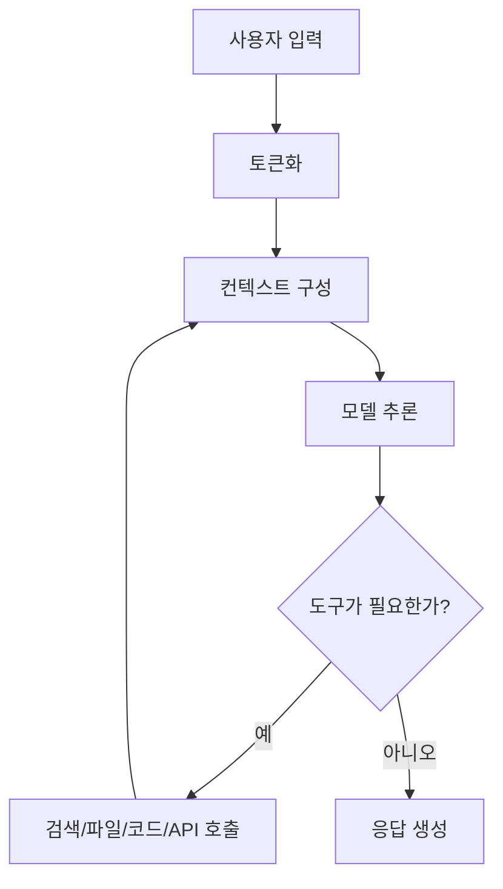

# LLM 개요

LLM은 Large Language Model의 줄임말이다. 한국어로는 대규모 언어 모델 정도로 부른다.
이름만 보면 "말을 잘하는 모델"처럼 보이지만, 실제로는 텍스트, 코드, 이미지, 음성, 도구 호출을 하나의 작업 흐름으로 엮는 기반 기술에 가깝다.

이 글은 LLM을 제품 홍보 문구가 아니라 기술과 사용 관점에서 이해하기 위한 메모다.

## 개요

LLM은 입력을 토큰 단위로 읽고, 다음에 올 토큰을 예측하는 방식으로 동작한다.
그런데 모델 규모, 학습 데이터, 정렬 학습, 도구 사용, 긴 컨텍스트, 멀티모달 입력이 결합되면서 단순 자동완성보다 훨씬 넓은 일을 하게 되었다.

| 관점 | 설명 |
| --- | --- |
| 언어 모델 | 문맥을 보고 다음 토큰의 확률을 계산한다. |
| 지식 인터페이스 | 사람이 자연어로 질문하면 문서, 코드, 표, 로그를 해석한다. |
| 추론 엔진 | 여러 단계를 거쳐 계획, 비교, 검토, 디버깅을 수행한다. |
| 도구 사용자 | 검색, 파일 읽기, 코드 실행, API 호출 같은 외부 도구를 사용할 수 있다. |
| 멀티모달 모델 | 텍스트뿐 아니라 이미지, 음성, 영상, PDF를 함께 다룬다. |

LLM을 이해할 때 중요한 점은 "모델 안에 모든 정답이 들어 있다"가 아니라는 것이다.
모델은 학습된 패턴과 현재 입력 컨텍스트를 바탕으로 가장 그럴듯한 출력을 만든다.
그래서 최신 정보, 사내 문서, 로컬 코드, 실행 결과는 검색이나 도구를 통해 붙여줘야 정확도가 올라간다.

## 왜 지금 떠오르는가

LLM이 갑자기 중요해진 이유는 모델이 커졌기 때문만은 아니다.
여러 조건이 같은 시기에 맞물렸다.

| 이유 | 내용 |
| --- | --- |
| Transformer 구조 | 긴 문맥 안에서 단어 사이 관계를 병렬로 학습하기 좋아졌다. |
| GPU와 분산 학습 | 훨씬 큰 데이터와 파라미터를 다룰 수 있게 되었다. |
| Instruction tuning | 사용자의 지시를 따르는 능력이 좋아졌다. |
| RLHF/RLAIF | 사람이나 AI 피드백으로 답변 선호도를 맞추는 방식이 널리 쓰였다. |
| 긴 컨텍스트 | 코드베이스, 문서 묶음, 대화 기록을 더 많이 넣을 수 있게 되었다. |
| Tool use | 모델이 검색, 코드 실행, 파일 편집 같은 외부 작업과 연결되었다. |
| 제품화 | ChatGPT, Claude, Gemini처럼 일반 사용자가 바로 만질 수 있는 형태가 생겼다. |

예전의 NLP 모델은 대개 "분류", "번역", "요약"처럼 한 가지 작업에 맞춰 썼다.
지금의 LLM은 같은 모델을 프롬프트와 도구 연결만 바꿔 여러 작업에 쓴다.
이 차이가 크다.

## 어떻게 동작하는가

가장 단순화하면 아래 흐름이다.

### 1) 토큰화

모델은 문장을 글자 그대로 읽지 않고 토큰으로 나눠 읽는다.
토큰은 단어일 수도 있고, 단어 조각일 수도 있고, 공백이나 기호를 포함한 조각일 수도 있다.

그래서 "컨텍스트 200K" 같은 표현은 글자 수가 아니라 토큰 수를 말한다.
한국어, 코드, 표, 로그는 토큰 사용량이 다르게 나온다.

### 2) 사전학습

대규모 텍스트와 코드 데이터로 다음 토큰 예측을 학습한다.
이 단계에서 문법, 지식, 코드 패턴, 추론에 필요한 기초 표현을 익힌다.

다만 사전학습만으로는 "사용자의 지시를 잘 따르는 모델"이 되지 않는다.
그 다음 단계가 필요하다.

### 3) 지시 학습과 정렬

Instruction tuning은 질문과 좋은 답변 예시를 통해 모델이 지시를 따르도록 만드는 과정이다.
RLHF나 RLAIF는 여러 답변 중 사람이 더 선호하는 답변에 가까워지도록 조정하는 과정이다.

이 단계 덕분에 모델은 단순히 문장을 이어 쓰는 것을 넘어, "비교해줘", "고쳐줘", "위험한 부분만 찾아줘" 같은 요청에 맞춰 응답한다.

### 4) 컨텍스트 윈도우

컨텍스트 윈도우는 모델이 한 번의 요청에서 볼 수 있는 작업 메모리다.
대화 기록, 첨부 문서, 코드, 도구 결과, 현재 질문이 여기에 들어간다.

컨텍스트가 길어지면 큰 문서를 다룰 수 있지만, 무조건 좋아지는 것은 아니다.
중요한 정보가 묻히거나 비용과 지연이 늘 수 있다.
긴 컨텍스트를 쓸 때도 필요한 파일, 필요한 로그, 원하는 출력 기준을 좁혀주는 편이 좋다.

### 5) 추론과 tool use

요즘 모델은 단순 답변뿐 아니라 여러 단계를 거쳐 문제를 푸는 추론 모델로 발전하고 있다.
코딩, 수학, 계획 수립, 복잡한 문서 비교에서 이 차이가 잘 드러난다.

도구 사용은 모델의 한계를 줄여준다.
모델이 모르는 최신 정보는 검색으로 확인하고, 코드가 맞는지는 테스트로 확인하고, 로컬 파일은 직접 읽어 판단한다.
Codex 같은 코딩 에이전트는 이 흐름을 개발 작업에 맞춘 예시다.

## Gemini 관점

Gemini는 Google의 LLM 계열이다.
공식 Gemini API 문서를 보면 텍스트뿐 아니라 이미지, 비디오, 오디오, PDF 입력을 함께 다루는 멀티모달 모델이라는 점을 강하게 내세운다.

| 관점 | 정리 |
| --- | --- |
| 강점 | 멀티모달 입력, 긴 컨텍스트, Google 검색 grounding, 코드 실행, 함수 호출 |
| 잘 맞는 일 | 영상/이미지/PDF를 같이 보는 분석, 대량 문서 처리, Google 생태계와 연결된 작업 |
| 볼 점 | stable/preview/latest 모델명이 나뉘므로 운영에서는 고정 모델명을 확인해야 한다. |

Gemini를 볼 때는 "텍스트 챗봇"보다 "여러 형태의 입력을 한 번에 처리하는 모델"로 보는 편이 자연스럽다.
특히 긴 문서, 영상, 이미지가 섞인 작업에서는 멀티모달 입력 자체가 설계 기준이 된다.

## Claude 관점

Claude는 Anthropic의 모델 계열이다.
공식 문서에서는 긴 컨텍스트, tool use, extended thinking, 예측 가능한 컨텍스트 처리 같은 부분을 자세히 설명한다.

| 관점 | 정리 |
| --- | --- |
| 강점 | 긴 문맥 처리, 문서 읽기, 코드와 글의 구조화, 안전한 답변 흐름 |
| 잘 맞는 일 | 긴 요구사항 분석, 코드베이스 이해, 문서 비교, 차분한 리뷰와 리팩터링 계획 |
| 볼 점 | 컨텍스트가 커질수록 비용과 지연이 커지고, 모델별 출력 한도와 beta 기능이 다르다. |

Claude를 쓸 때는 많은 문서를 넣고 "전체 맥락을 유지하면서 판단"하는 작업에 강점이 있다.
다만 긴 컨텍스트가 항상 좋은 결과를 보장하지는 않는다.
중요한 기준과 원하는 출력 형식을 함께 줘야 한다.

## ChatGPT / OpenAI 관점

ChatGPT와 OpenAI API는 모델 자체와 제품 경험이 함께 발전한 쪽에 가깝다.
공식 문서 기준으로 OpenAI는 reasoning model, Responses API, tool use, structured output, Codex 같은 agentic workflow를 중요하게 다룬다.

| 관점 | 정리 |
| --- | --- |
| 강점 | 추론 모델, 코딩/에이전트 작업, 도구 호출, 구조화 출력, 제품화된 ChatGPT 경험 |
| 잘 맞는 일 | 코딩, 계획 수립, 자동화, 문서 작성, 도구와 연결된 업무 흐름 |
| 볼 점 | 모델과 API 권장 방식이 빠르게 바뀌므로 공식 모델 페이지와 가이드를 확인해야 한다. |

OpenAI 쪽은 "대화형 AI"에서 출발해 개발 도구와 에이전트 흐름까지 이어진 느낌이 강하다.
Codex CLI도 그 연장선에 있다.
모델이 답만 하는 것이 아니라, 파일을 읽고 명령을 실행하고 결과를 다시 반영하는 식으로 작업한다.

## 비교해서 보기

아래 표는 절대적인 우열이 아니라, 어떤 관점으로 바라보면 좋은지에 가깝다.

| 구분 | Gemini | Claude | ChatGPT / OpenAI |
| --- | --- | --- | --- |
| 중심 이미지 | 멀티모달과 Google 생태계 | 긴 문맥과 신중한 분석 | 추론, 도구, 에이전트 작업 |
| 강한 입력 | 텍스트, 이미지, 영상, 음성, PDF | 긴 문서, 코드, 대화 맥락 | 텍스트, 코드, 이미지, 도구 결과 |
| 자주 보는 용도 | 대량/멀티모달 분석 | 문서 검토, 코드 이해, 긴 계획 | 코딩, 자동화, 구조화된 작업 |
| 주의할 점 | preview/latest 모델 사용 정책 | 긴 컨텍스트 비용과 한도 | 빠른 모델/기능 변화 |

실무에서는 하나만 고집하기보다 작업 성격으로 고르는 편이 낫다.

- 이미지/영상/PDF가 섞이면 Gemini를 먼저 떠올린다.
- 긴 글과 코드 흐름을 차분히 읽혀야 하면 Claude가 잘 맞을 수 있다.
- 코딩, 도구 호출, 자동화 흐름은 ChatGPT/OpenAI 계열이 편한 경우가 많다.

## 유의사항

LLM은 그럴듯한 답을 만들 수 있지만, 그럴듯함이 곧 사실은 아니다.
아래 기준은 계속 챙기는 편이 좋다.

| 항목 | 확인할 것 |
| --- | --- |
| 최신성 | 법, 가격, 모델명, API 옵션은 공식 문서를 다시 본다. |
| 근거 | 중요한 판단은 source나 실행 결과를 남긴다. |
| 보안 | token, password, 내부 URL을 프롬프트나 문서에 남기지 않는다. |
| 비용 | 긴 컨텍스트, 멀티모달, reasoning은 비용과 지연이 커질 수 있다. |
| 검증 | 코드나 명령은 테스트, 빌드, diff로 확인한다. |

LLM을 잘 쓰는 방식은 "모델에게 다 맡기기"보다 "사람이 기준을 주고, 모델이 초안과 검증 루프를 빠르게 돌게 하기"에 가깝다.

## reference

- [Attention Is All You Need](https://arxiv.org/abs/1706.03762)
- [Google AI for Developers - Gemini models](https://ai.google.dev/gemini-api/docs/models)
- [Google AI for Developers - Function calling](https://ai.google.dev/gemini-api/docs/function-calling)
- [Anthropic Docs - Models overview](https://docs.anthropic.com/en/docs/about-claude/models/overview)
- [Anthropic Docs - Context windows](https://docs.anthropic.com/en/docs/build-with-claude/context-windows)
- [Anthropic Docs - Tool use](https://docs.anthropic.com/en/docs/agents-and-tools/tool-use/implement-tool-use)
- [OpenAI API - Models](https://platform.openai.com/docs/models)
- [OpenAI API - Reasoning models](https://platform.openai.com/docs/guides/reasoning)
- [OpenAI Developers - Codex CLI](https://developers.openai.com/codex/cli)
