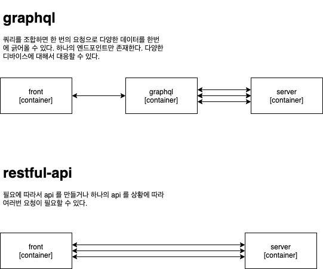

# graphql 유튜브 보면서 공부하기.
Graph QL 이란 sql 과 마찬가지로 쿼리언어이다.

## graphql 시작하기
수행 프로젝트 : https://github.com/coding-buddha/graphql-helllo-world

#### sql 과 gql 의 차이
* sql 의 경우에는 데이터베이스 시스템에 저장된 데이터를 효율적으로 가져오는 것이 목적이다. 
  * sql 의 문장은 주로 백엔드 시스템에서 작성하고 호출된다.
* gql 의 경우에는 웹 클라이언트가 데이터를 서버로부터 효율적으로 가져오는 것이 목적이다. 
  * gql 의 문장은 주로 클라이언트 시스템에서 작성하고 호출된다.

#### graphql 의 query 와 mutation 의 차이
query 의 경우에는 데이터 조회할 때 (read) 시에 사용하고, mutation 의 경우에는 데이터 조작(create, update, delete) 할 때 사용한다고 한다.   
둘의 차이는 크게 없지만, 개념적으로 사용하는 방법에 대한 규약을 정해놓은 상태라고 한다.
```
mutation {
  register {
    id
    username
  }
}
```

```
query {
  hello
}
```



## reference
* https://github.com/benawad
* https://tech.kakao.com/2019/08/01/graphql-basic/
* [graphql-beginner](https://www.youtube.com/watch?v=DyvsMKsEsyE&list=PLN3n1USn4xln0j_NN9k4j5hS1thsGibKi&ab_channel=BenAwad)
