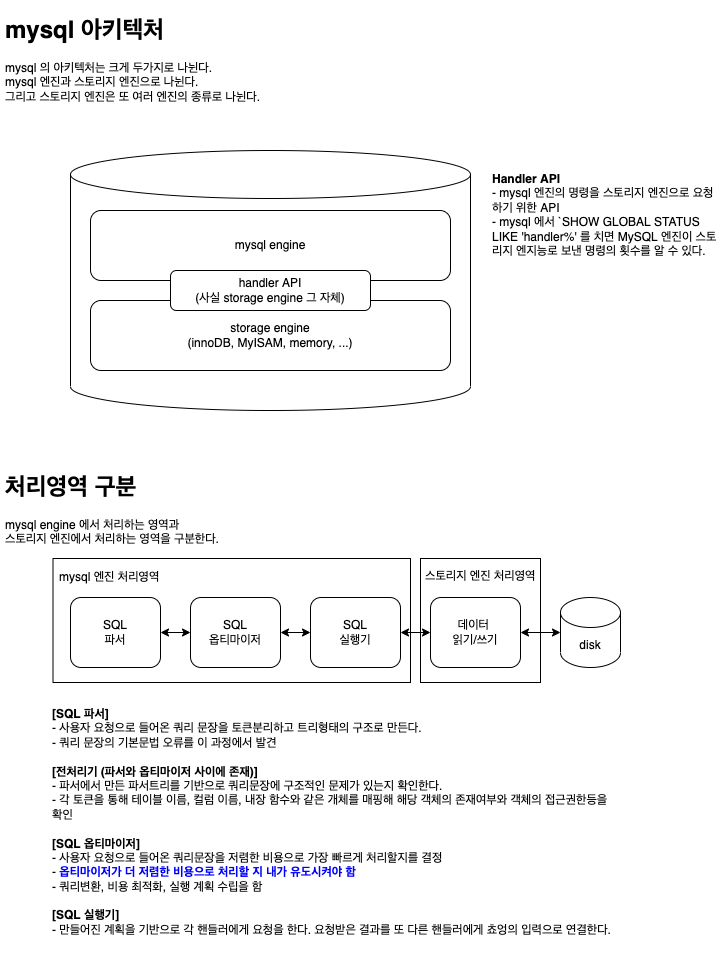

# real mysql 8.0
real mysql 을 읽으면서 기록.

---
## 0. 테스트를 위한 mysql 설치
```yml
version: '3.7'
services:
  db:
    image: library/mysql:8.0
    command: --character-set-server=utf8mb4 --collation-server=utf8mb4_unicode_ci
    restart: always
    environment:
      - MYSQL_ROOT_PASSWORD=rootpass
      - MYSQL_ROOT_HOST=%
      - MYSQL_DATABASE=testdb
    container_name: realmysql-container
    ports:
      - "33666:3306"
```

---
## 1. 아키텍처
<kbd>
  
</kbd>

---
## 2. 트랜잭션과 잠금
### 2.1. 트랜잭션
* InnoDB 와 MyISAM 의 두 스토리지 엔진간 commit 및 rollback 차이
  * InnoDB 는 트랜잭션 원칙에 입각하여 전체다 커밋되거나 아니면 에러 발생 시 롤백된다.
  * MyISAM 은 같은 트랜잭션 그룹이더라도, 일부만 커밋되는 Partial Update 현상을 보인다.
* 트랜잭션의 작업의 단위를 `최소화` 할 수 있도록 한다.
  * 단순 조회의 경우에 트랜잭션을 사용하여야 하는지 확인한다.
  * 트랜잭션들 사이에 외부 시스템과 연동되는 경우 트랜잭션에 포함시킬지 여부를 판단해야 한다.

### 2.2. mysql 엔진잠금 (p.160)
* `MySQL 엔진 잠금은 스토리지 엔진 전체에 영향을 끼침`
* `스토리지 엔진 잠금은 스토리지 엔진 간 상호 영향을 끼치지 않음`
* 글로벌락, 테이블락(묵시적, 명시적), 네임드락, 메타데이터 락등이 존재한다.

### 2.3. InnoDB 스토리지 잠금 (p.166)
* InnoDB 스토리지 잠금에는 네가지가 존재한다.
  * __1) 레코드 락__
    * 레코드 자체만을 잠그는 것을 의미한다.
    * InnoDB 스토리지 엔진에서는 레코드가가 아닌 `인덱스의 레코드를 잠근다.`
  * 2) 갭 락
    * 레코드와 인접한 레코드 사이의 간격만을 잠그는 것을 의미한다.
  * 3) 넥스트 키 락
    * 레코드 락과 갭 락을 합쳐놓은 형태의 잠금을 의미한다.
  * 4) 자동증가 락
    * `AUTO_INCREMENT 락` 이라고 하는 테이블 수준의 잠금을 사용한다.
    * `AUTO_INCREMENT 락` 은 아주 짧은 시간동안 걸렸다가 해제되는 잠금이라서 대부분의 경우 문제가 되지 않는다.
    * mysql5.1 이상부터는 `innodb_autoinc_lock_mode` 라는 시스템변수를 이용해 자동증가 락의 작동방식을 변경할 수 있다. (p.169)
      * innodb_autoinc_lock_mode=0 : 자동증가락 사용
      * innodb_autoinc_lock_mode=1 : 선택적
      * innodb_autoinc_lock_mode=2 : 래치 (뮤텍스), 가볍고 빠름
* InnoDB 의 잠금은 레코드를 잠그는 것이 아니라 `인덱스를 잠그는 방식` 으로 처리된다.
  * 즉 변경하여야할 레코드를 찾기위해 검색한 인덱스의 레코드를 모두 락을 걸어야 한다.
  * 경우에 동시성이 상당히 떨어질 수 있다. (p.171)
* 잠금을 해제하기 위해선 processlist 에서 kill 명령을 통해 해당하는 pid 를 죽여야 한다.

### 2.4. MySQL 격리수준
* 격리수준 : 여러 트랜잭션이 동시에 처리될 때, 특정 트랜잭션이 다른 트랜잭션에서 변경하거나 조회되는 데이터를 볼 수 있게 허용할지 말지를 결정
* `SERIALIZABLE` 격리수준이 아니라면, 크게 성능의 개선이나 저하는 발생하지 않는다.
* 격리수준
  * READ UNCOMMITTED
  * READ COMMITTED
  * REPEATABLE READ
  * SERIALIZABLE
  * [자세한 내용은 여기를 참고](../database/Transaction_Isolation_Levels.md)

---
## 3. 인덱스
### 3.1. 디스크 읽기 방식 (p.214 : 직접 책으로 보는 것이 중요하다.)
* 데이터베이스 성능튜닝은 디스크 I/O 를 얼마나 줄이는지가 관건이다.
* 랜덤IO 방식과 순차IO 방식이 존재한다.
* dbms 의 인덱스는 컬럼의 값을 주어진 순서대로 미리 정렬해서 보관한다.
* 인덱스와 데이터파일의 저장되는 방식은 다르다.
  * 인덱스 : sortedList 처럼 정렬된 상태로 저장된다.
  * 데이터파일 : arrayList 처럼 저장된 순서에 맞게 그대로 유지힌다.
* 인덱스는 sortedList 처럼 정렬된 상태로 저장되기 때문에 INSERT, DELETE, UPDATE 처리에 대해서 느린 반면에 SELECT 에서는 월등한 성능을 보여준다.
  * `인덱스는 SELECT 성능을 높이기 위한` 기능이라고 볼 수 있다.

### 3.2. B-Tree 인덱스
* db 인덱스 알고리즘에서 가장 흔하게 사용된다.
  * B-Tree 는 인덱스 구조체 내에서 항상 `정렬된` 상태를 유지한다.
* B-Tree 의 B 는 `Balance` 를 의미한다. 

#### 3.2.1. B-Tree 인덱스의 구조 및 특성
* [관련 그림은 여기서](https://hoing.io/archives/5960)
  * b-tree index 구조에 대한 그림이 있다. 아니면 real mysql8.0 p.221 을 참고한다.
* 루트노드, 브랜치노드, 리프노드, 데이터파일이 존재
 * 루트노드 : 최상위에 존재하는 노드
 * 브랜치노드 : 루트노드와 리프노드를 연결하는 중간다리 노드
 * 리프노드 : 실제 데이터 레코드를 찾아가기 위한 주솟값을 가지고 있는 노드
 * 데이터 파일의 레코드는 정렬되어 있지 않고 임의의 순서대로 저장되어 있다.
* 각각의 노드는 `page` 로 저장되어 있다.
* `page`
  * 운영체제의 page 를 의미한다.
  * dbms 는 데이터들을 디스크에 저장하는데 필요에 따라서 디스크에 저장된 데이터들을 메모리에 올리려고 한다.
  * 하지만 디스크에 있는 전체의 데이터를 메모리에 올리지 못하므로, 그에 따라 데이터를 논리적인 기준으로 일정한 크기의 `page(=block)` 로 나누고 그것을 메모리에 적재하게 된다.
  * dbms 에서는 데이터를 read/write 할 때에 page `page` 단위로 입출력하게 될 것이다.
  * 추가적으로 메모리에 유지하는 페이지들을 관리하는 모듈이 별도로 있는데, page buffer 또는 buffer manager 라는 이름도 있는거 같다.
  * https://www.datanet.co.kr/news/articleView.html?idxno=115592
  * https://d2.naver.com/helloworld/407507

#### 3.2.2 카디널리티 (선택도 혹은 기수성)
* 인덱스에는 Cardinality 가 존재
* 인덱스 키 값 가운데 유니크한 값의 수를 의미한다.
  * 인덱스 키 값 가운데 중복된 값이 많아지면 카디널리티는 낮다라고 표현한다.
  * `인덱스는 카디널리티가 높을수록 검색대상이 줄어들기 때문에 성능상 이점이 있다.`
* 결과적으로 카디널리티가 큰 값을 인덱스로 설정하도록 해야한다.
  * 전체 1만건의 데이터가 있다고 가정 (p.229 참고)
    * 인덱스 키 값이 10개가 있을 때, 10000 / 10 = 1000 건이 인덱스로 조회될수 있다고 평균낼 수 있다.
    * 인덱스 키 값이 1000개가 있을 때, 10000 / 10000 = 10 건이 인덱스로 조회될 수 있다고 평균낼 수 있다.
    * 인덱스 키 값이 높아야 그 값을 인덱스로 설정했을 시에 효과가 좋다.

#### 3.2.3 읽어야 하는 레코드 수
* 100만건의 데이터가 있다고 가정
  * 전체 테이블에서 50만건을 읽고 50만건을 버릴 것인지
  * 전체 테이블에서 인덱스를 이용하여 50만건만 읽을 것인지
  * `위의 조건` 에서는 인덱스를 통해 읽어야 하는 레코드의 수가 전체 데이터 건에 `20% ~ 25%` 가 넘어간다면 인덱스를 이용하지 않는 편이 효율적이라고 말한다.
  * 강제도 인덱스를 사용하도록 힌트를 줘도 성능상의 이점은 얻을 수 없다.

### 3.3 B-Tree 인덱스를 통한 데이터 읽기
#### 3.3.1 인덱스 레인지 스캔 (p.230)
* 검색해야할 인덱스의 범위가 결정되었을 때 사용하는 방식
* 시작해야하는 위치를 찾으면 그때부터 `리프노드의 레코드만 순서대로 읽으면 된다.`
  * 리프노드에 저장된 레코드 주소로 데이터 파일의 레코드를 읽어들일 때, `레코드 한 건당 랜덤I/O 가 발생`
  * 결과적으로 인덱스를 통한 데이터 읽는 작업은 비용이 많이 드는 작업으로 친다.
* 인덱스를 통해 읽어야할 데이터가 20~25% 를 넘으면, 인덱스를 통한 읽기보다는 테이블의 데이터를 직접 읽는 것이 효율적인 처리 방식이 된다.
* 만약 커버링 인덱스로 처리되는 쿼리는 디스크의 레코드를 읽지 않아도 되기 때문에 (랜덤I/O 가 적게 발생). 읽기 성능은 빠르다.

#### 3.3.2 인덱스 풀 스캔
* 인덱스의 처음부터 끝까지 모두 읽는 방식
* 인덱스를 효율적으로 사용하지 못하는 상태
* 테이블 풀 스캔보다는 적은 디스크 I/O 로 쿼리를 처리할 수 있다.

#### 3.3.3 루스 인덱스 스캔 (과거)

#### 3.3.4 인덱스 스킵 스캔 (p.236 : mysq8.0 이후, 책을 읽자)
* mysql8.0 디폴트 옵션
* 옵티마이저가 복합 인덱스에 대해서 하나만 인덱스를 쓰더라도 인덱스 검색이 가능토록 최적화 쿼리를 생성한다.
* 단점이 일부 있다.
  * WHERE 조건절에 조건이 없는 인덱스의 선행 컬럼의 유니크한 값의 개수가 적어야 함 (ex. MALE, FEMALE 처럼 얼마 없어야 함) 
  * 쿼리가 인덱스에 존재하는 컬럼만으로 처리 가능해야함 (커버링 인덱스)

### 3.4 B-Tree 인덱스의 가용성과 효율성
* 인덱스를 쓰는 방식에는 두가지 방식이 존재
  * 작업 범위 결정 조건
  * 필터링 조건 (= 체크 조건)
* 위의 두 조건 중에서 `작업 범위 결정 조건` 이 쿼리의 처리성능을 개선시켜준다. (중요)

#### 3.4.1 인덱스 가용성과 효율성 판단 (p.251) 


---
## 20. 인덱스를 잘못 적용한 케이스
index 값을 조작한 경우
```sql
## salary 는 인덱스 설정이 되어있음

## index full scan
$ SELECT * FROM salaries WHERE salary * 10 > 150000; 

## index range scan
$ SELECT * FROM salaries WHERE salary > 150000; 
$ SELECT * FROM salaries WHERE salary > 15000 * 10; 
```

index 값을 조회 시, 데이터 타입이 잘못된 경우
```sql
CREATE TABLE tb_test(age VARCHAR(10), index ix_age(age));
 
INSERT INTO tb_test VALUES ('1');
INSERT INTO tb_test VALUES ('2');
INSERT INTO tb_test VALUES ('3');
INSERT INTO tb_test VALUES ('4');
INSERT INTO tb_test VALUES ('5');
INSERT INTO tb_test VALUES ('6');

# index full scan 수행
SELECT * FROM tb_test WHERE age = 2;

# index 를 제대로 탔음 : Non_Unique 인덱스를 탔다는 의미
SELECT * FROM tb_test WHERE age = '2';
```

#### 20.1. WHERE 인덱스 사용, (+ GROUP BY, ORDER BY)
* `WHERE 가 먼저 선행되어야 이후에 GROUP BY, ORDER BY 를 동작시킬 수 있다.`
* `다중컬럼 기준` 으로 설명한다.
  * WHERE 절만 쓰는 경우
    * 다중컬럼 컬럼의 인덱스 순서를 WHERE 조건 컬럼 순서와 `맞출 필요가 없다.` -> 옵티마이저가 알아서 처리한다. -> 테스트 해보니 그렇다.
  * WHERE + GROUP BY 같이 쓰는 경우
    * WHERE 조건 컬럼과 GROUP BY 컬럼은 다중컬럼 순서와 `맞출 필요가 있다.`
    * 맞추지 않는다면 단순 Index Range Scan 을 타게 된다.
    * 컬럼이 중간에 비면 안된다. COL_01, COL_02, COL_03 을 다중컬럼 인덱스의 순서로 작성했따면 그대로 WHERE, GROUP BY 절도 동일한 순서로 가야한다.
  * WHERE + ORDER BY
    *  WHERE + ORDER BY 와 동일한 수준이다.
  * WHERE + GROUP BY + ORDER BY
    * `GROUP BY 와 ORDER BY 는 같이 인덱스를 사용` 해야 효과가 발휘된다.
  * 관련 플로우는 real mysql 8.0 의 65 장을 살핀다.
