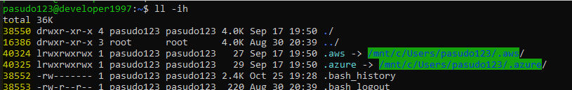

## ln command 👀
* 하드링크 및 심볼릭링크 설정 명령어
* 하드링크 와 심볼릭를 이해하기 위해선 inode 에 대한 이해가 밑바탕이 되어야한다.

## inode
* 유닉스 계통 파일 시스템에서 사용하는 자료구조이다.
* 아이노드는 정규 파일, 디렉토리 등 파일 시스템에 관한 정보를 가지고 있다.
* 파일들은 각자 하나의 아이노드를 가지고 있으며, 아이노드는 소유자 그룹, 접근모드, 파일형태, 아이노드 숫자 등 해당 파일에 관한 정보를 가지고 있다.
* 파일시스템 내의 파일들은 고유한 아이노드 숫자를 통해 식별이 가능하다.
* 아래 이미지에서 __노란색 형광표기__ 가 되어있는게 아이노드 번호이다.



## 심볼릭링크
* 윈도우 시스템의 `바로가기 기능` 과 매우 유사하다.
* 원본파일에 대한 정보가 포함되어 있지 않으며, 원본 파일 위치에 대한 포인터만 포함되므로 inode 를 가진 링크파일이 생성된다. (inode 값이 다르다.)
* 원본파일을 삭제할경우 액세스 `불가능` 하다.
* 원본파일을 다시 되살릴경우 액세스가 `다시 가능` 하다.

__사용방법__
```shell
$ ln -s {origin-file} {link-file}
```

```shell
pasudo123@developer1997:/mnt/c/develop/etc$ ln -s {sample} {sample-sym}
pasudo123@developer1997:/mnt/c/develop/etc$ ll -i
36028797019193832 -rwxrwxrwx 1 pasudo123 pasudo123    6 Oct 25 20:10 sample*
11258999068722483 lrwxrwxrwx 1 pasudo123 pasudo123    6 Oct 25 20:11 sample-sym -> sample*
```

## 하드링크
* 하드링크는 원본 파일의 inode 에 대한 직접적인 포인터이다.
* 원본파일은 하드링크와 비교하면 아무 차이가 없다.
* 하드링크에는 새로운 inode 에 대한 생성이 없다. (`동일한 inode 값` 을 가진다.)
* 원본파일을 삭제하더라도 액세스 `가능` 하다.

__사용방법__
```shell
$ ln {origin-file} {link-file}
```

```
pasudo123@developer1997:/mnt/c/develop/etc$ ln {sample} {sample-hard}
pasudo123@developer1997:/mnt/c/develop/etc$ ll -i
36028797019193832 -rwxrwxrwx 1 pasudo123 pasudo123    6 Oct 25 20:10 sample*
36028797019193832 lrwxrwxrwx 1 pasudo123 pasudo123    6 Oct 25 20:11 sample-hard*
```