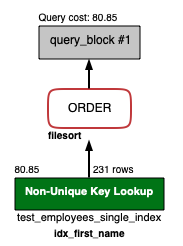

# 단일인덱스와 복합인덱스 성능 차이 확인
real mysql 을 읽다가 다중 컬럼 인덱스 내, 단일 인덱스를 여러개 둬서 복합인덱스처럼 쓰면 안될까? 라는 생각이 들었다. 결론부터 말하면 `성능차이` 가 `존재` 한다.

## 0.0 mysql version
```sql
mysql> SELECT VERSION();
+-----------+
| VERSION() |
+-----------+
| 8.0.27    |
+-----------+
1 row in set (0.00 sec)
```

---
## 1.0 사전준비
* 테이블을 두 개 준비한다.
    * test_employees_single_index (단일 인덱스로 설정된 테이블)
    * test_employees_multiple_index (복합 인덱스로 설정된 테이블)
* `두 테이블 모두 데이터의 양은 동일` 하다. 
    * `300024 rows`

---
## 2.0 index 설정
first_name 과 hire_date 는 각각 단일 인덱스로 존재하고 있는 상태
<kbd>
    
</kbd>

first_name 과 hire_date 는 복합 인덱스로 존재하고 있는 상태   
(first_name 이 1번째 순서, hire_date 가 2번째 순서)
<kbd>
    
</kbd>

---
## 3.0 쿼리비교
### 3.1 WHERE 절 컬럼 1개로 조회할 경우 성능 + 특정컬럼만 조회

#### 3.1.1 단일 인덱스 테이블
```sql 
$ SELECT first_name, hire_date FROM test_employees_single_index WHERE first_name = 'Sanjai';
```

<kbd>
    
</kbd>

#### 3.1.2 복합인덱스를 가진 테이블에 WHERE 절 수행 (feat. 커버링 인덱스)
```sql
$ SELECT first_name, hire_date FROM test_employees_multiple_index WHERE first_name = 'Sanjai';
```

<kbd>
    
</kbd>

* SELECT 절에 first_name, hire_date 값만 조회하는 상태에서 복합인덱스의 cost 가 더 낮게 나온다. 
* `만약에 SELECT * FROM 으로 조회한다면 두 쿼리의 cost 는 동일하다.`

### 3.1 (번외) WHERE 절 컬럼 1개로 조회할 경우 성능
#### 3.1.a 단일인덱스 테이블, 단일인덱스로 조회
```sql 
$ SELECT * FROM employees_sig WHERE first_name = 'Jenwei';
```
<kbd>
   
</kbd>

#### 3.1.b 복합인덱스 테이블, 단일 인덱스로 조회
```sql
$ SELECT * FROM employees_mul WHERE first_name = 'Jenwei';
```
<kbd>
   
</kbd>

> 위 둘의 코스트는 결과적으로 동일하다.!!

---
### 3.2 WHERE 절 컬럼 2개로 조회할 경우 성능
#### 3.2.1 단일 인덱스 테이블. 두 개의 조건절을 가지고 조회한다.
```sql
$ SELECT * FROM test_employees_single_index WHERE first_name = 'Sanjai' AND hire_date = '1987-01-14';
```

<kbd>
    
</kbd>


#### 3.2.2 복합 인덱스 테이블. 두 개의 조건절을 가지고 조회한다.
```sql
$ SELECT * FROM test_employees_multiple_index WHERE first_name = 'Sanjai' AND hire_date = '1987-01-14';
```

<kbd>
    
</kbd>

* SELECT 절로 조회할 시, 복합인덱스의 성능이 더 좋게 나온다.   
    * 단일 인덱스는 Index Merge 를 수행한다.
    * 인덱스 머지란? 
        * 인덱스를 이용하며 테이블을 읽을 때, 하나의 테이블에서 2개 이상의 인덱스를 이용하는 경우
        * 풀 테이블 스캔보다는 빠르지만, 제대로 된 인덱스 하나를 레인지 스캔하는 것보단 느릴 수 있다.

---
### 3.3 WHERE + ORDER BY 를 같이 쓰는 경우
#### 3.3.1 `단일 인덱스 테이블`에서 WHERE 과 ORDER BY 를 같이 써본다.
```sql 
$ SELECT * FROM test_employees_single_index WHERE first_name = 'Xuejia' ORDER BY hire_date;
```

<kbd>
    
</kbd>

* ORDER 를 수행하는 경우, `filesort` 가 수행된다.
    * `hire_date 가 인덱스가 걸려있음에도 불구하고` `order by 에서 전혀 인덱스의 이점을 누리지 못하고 있다`.
    * filesort 는 정렬작업이 쿼리수행하는 시점에 수행된다. 따라서 건수가 많아지면 쿼리의 응답속도가 느리게 된다.
    

#### 3.3.2 `복합 인덱스 테이블`에서 WHERE 과 ORDER BY 를 같이 써본다.
```sql
$ SELECT * FROM test_employees_multiple_index WHERE first_name = 'Xuejia' ORDER BY hire_date;
```

<kbd>
    
</kbd>

* cost 는 단일인덱스 테이블에서 측정한 것과 동일한데, order by 시 인덱스를 이용해서 소팅하고 있어서 별도의 filesort 는 사용하고 있지 않다.

#### 3.3.3 `복합 인덱스 테이블`에서 WHERE 과 ORDER BY 의 `컬럼 순서를 변경`해본다.
```sql
$ SELECT * FROM test_employees_multiple_index WHERE hire_date = '1985-06-11' ORDER BY first_name;
```

<kbd>
    
</kbd>

* real mysql의 내용처럼 컬럼의 순서 (first_name, hire_date) 가 WHERE 과 ORDER BY 의 순서와 미스매치되고 있어서 WHERE 절에 대한 인덱스 사용이 안된다. 그로인해 ORDER 쪽도 인덱스 사용을 못하고 있다. real mysql 60페이지 참고

---
## 4.0 테스트하면서 추가로 확인한 사항
#### 4.1 단일인덱스, 복합인덱스 둘 다 단순 ORDER BY {column} 으로 하는 경우에 table full scan 을 탄다. 그리고 filesort 를 두 쿼리 모두 사용한다.
* 결과적으로 인덱스를 가지고 order by 만 단독으로 사용하는 경우에는 인덱스의 장점을 누릴 수 없다.
```sql 
## 아래의 두 쿼리는 모두 동일하게 table_full_scan + filesort(X) 이다.
$ SELECT * FROM test_employees_single_index ORDER BY hire_date;
$ SELECT * FROM test_employees_multiple_index ORDER BY hire_date;
```

## 5.0 결론
* 단일인덱스로 WHERE, ORDER BY 를 이용하면 WHERE 절에서 조건은 타지만 ORDER BY 에서는 filesort 를 사용한다.
    * 복합인덱스로 WHERE, ORDER BY 를 이용할 시에는 인덱스 컬럼 순서에 맞게 쿼리작성되면 filesort 를 사용하지 않는다.
* 커버링 인덱스가 아닌 단순 WHERE 절로만 조회하는 경우 단일인덱스나, 복합인덱스 성능은 동일하다. 다만 WHERE + ORDER BY, WHERE + GROUP BY, WHERE + ORDER BY + GROUP BY 를 쓰려고 하는 경우에는 복합인덱스를 고려할 수 있도록 한다.
