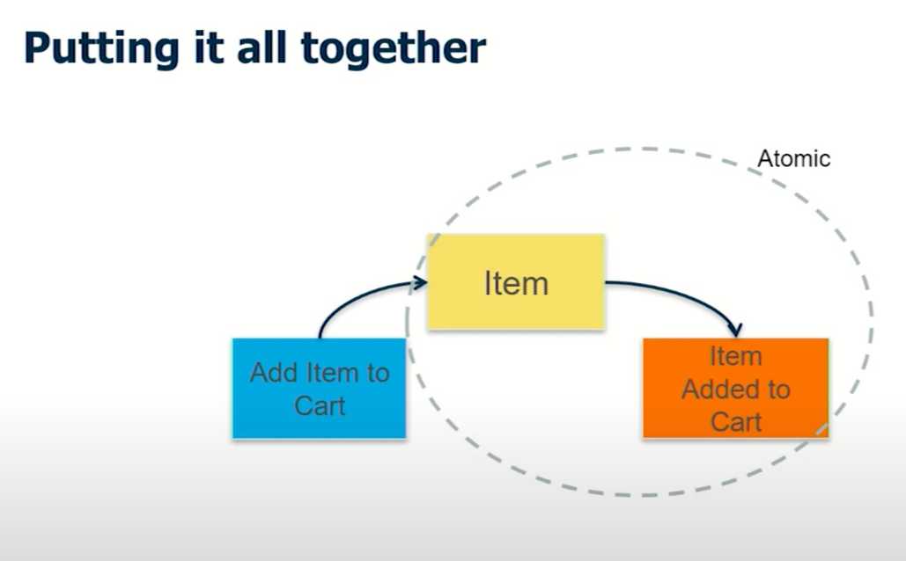

# ddd with pivotal
[마이크로서비스 개발을 위한 Domain Driven Design](https://youtu.be/QUMERCN3rZs) 을 보고 정리하며, 동영상 흐름대로 기록한다.

# 1. 개요
* 마이크로서비스를 디자인하는 과정에서 어떤 디자인을 해서 초점을 맞출건지 이해하기
  * 전체 비즈니스 도메인을 해석하고, 그 도메인을 나눈다. 
  * 내부시스템, 외부시스템을 구분한다. 이벤스 스토밍을 한다.
  * 서비스 간의 통신 및 sync, async, queue, external system 과 통신해야 하는지 이야기
  * 어떤 api 를 가져야 하는지, 어떤 db 를 가져야 하는지, 어떤 백로그를 가져야 하는지

# 2. 왜 마이크로서비스 개발을 위한 DDD 인가
* 도메인 전문가는 IT 용어를 모름. IT 전문가는 도메인 현업들의 언어를 모름.
  * 개발의 변경 및 수정, 릴리즈가 느려지는데, 이런 과정을 모두 모여서 공유 및 일을 추진.
* DDD 를 통해 이벤트 스토밍 및 일련의 과정은 반복적인 과정을 통해서 일어나야함 -> 변경이 잦음

# 3 이벤트 스토밍
<kbd>

</kbd>

* 비즈니스 + IT 를 같이 맞춘다.
* 비즈니스에 일어나는 이벤트들을 쭉쭉쭉 그려나간다. 그리고 큰 범주로 불리는 바운디드 컨텍스트로 나눈다.
* 여러가지 색깔의 스티키 노트.
  * `주황색 스티커`
    * 이벤트를 도출할 시 사용. 애플리케이션을 사용하는 사용자가 발생하는 이벤트. 시스템 내에서의 이벤트
    * notification, state transfer 이 속한다.
    * 해당 이벤트들은 과거형 혹은 수동형으로 쓰게된다.
      * ex) Item added to cart, 아이템이 카트에 들어갔다.
  * `파란색 스티커`
    * 이벤트를 일으키는 커맨드. 이벤트가 일어나는 소스가 된다.
  * `노란색 스티커`
    * 마이크로서비스로 전환될 때 중요 컨셉
    * command 가 object 에 영향을 주고, 그것이 event 로 간다.

### 3.1 command, aggregate, event
<kbd>

</kbd>
 
* command 가 object 를 조작하고, 그것은 event 가 된다.
* event 가 일어난다는 것은 item 의 state change 가 일어난다.

### 3.2 command, aggregate, event is pair
<kbd>

</kbd>

* 위의 세가지가 하나의 쌍이 된다.
* command 가 영향을 끼치는 aggregate, 해당 aggregate 가 event 를 일으킴.

# 4. Boris
위의 이벤트 스토밍을 통해서 나온 디자인들을 테크니컬한 implementation 으로 가져가야 한다.   
이를 Boris 다이어그램이라고 칭한다. sync 는 어디로 할 것인지, async 는 어디로 할 것인지 등을 구분한다.

### 4.1 테크니컬 implementation
<kbd>

</kbd>

* 분홍색은 외부 시스템

# 5. SnapE  
<kbd>

</kbd>

서비스들 중에서 일부 서비스들중에서 상세 스펙들을 정의한다.
* 어떤 api 를 가져야 하는지
* 어떤 데이터를 가져야 하는지
* 어떤 ui 랑 연동이 되는지
* 연동시 risk 는 없는지

# 6. 이벤트들의 나열
<kbd>

</kbd>

* command & event 로 표현해서 나열한다.
* 해당 작업들은 IT 전문가와 도메인 전문가가 만나서 같이 할 수 있는 장점이 있다.
* 이벤트가 나오면 이제 그룹핑을 해야한다. 그리고 세가지를 고려해야 한다.
  * 데이터 오너십을 고려한다. : 어떤 팀이 데이터를 가져가야 하는지 고려한다.
  * 배포 주기 및 라이프 사이클의 조건들을 생각한다.
  * 독립적인 스케일 가능성을 고려한다. : 확장 또는 축소 가능여부 등을 살핀다.
* 그룹핑이 되면 이후에 애그리게이트를 기준으로 컨텍스트를 나눌 수 있다.

## 6.1. bounded context
<kbd>
  
</kbd>

* 파란색으로 되어있는 게 bounded context 이다.
* 노란색은 aggregate 이다.
* 해당 내용은 여기서 끝난게 아니라, 매번 변경될 여지가 남아있다.
* 위 그림에서 매수와 매도를 `주문` 으로 묶었지만 데이터 오너십이 다르다면 매수와 매도로 aggregate 를 나눌 수 있다.

# 7. boris diagram
이벤트 스토밍을 통해서 전체적인 서비스 키워드 및 candidate 를 정의했으면 서로간의 상관관계를 정의할 수 있다.   
서비스와 서비스 사이의 요청방식을 동기 혹은 비동기 어떤 방식으로 할 것인지 결정한다.

<kbd>
     
</kbd>
* 빨간색은 비동기 호출이다.
* 파란색은 동기 호출이다.
* BFF 는 Backend For FrontEnd 로써, 화면을 그려주기 위한 backend 인데, 기존에 만들어진 api 를 이용하려 처리할 수 있도록 한다.

# 8. SnapE
<kbd>
  
</kbd>

* user story 는 백로그로 들어가기 때문에 상세하게 명세할 필요가 있다.
