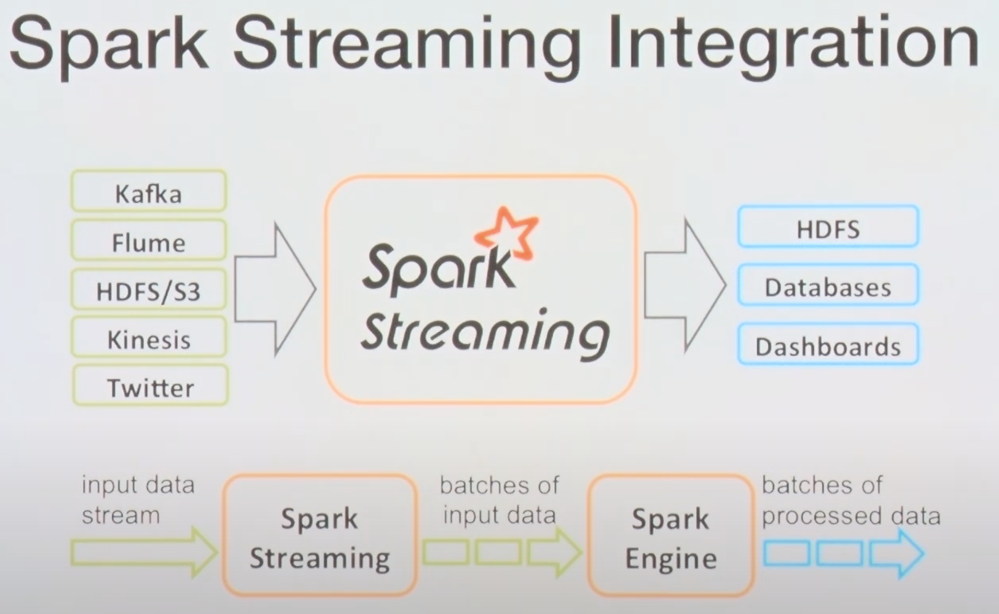
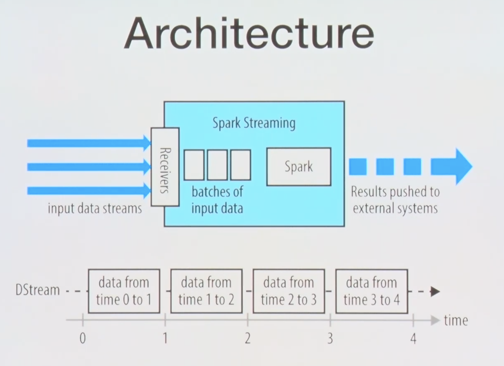

## 아파치 스파크 입문 2강 - Spark 의 실시간/배치
* https://youtu.be/vFjpg5wSuII 를 듣고 정리

## 빅데이터 프로세싱
* Batch Processing
    * ex) MapReduce
* Stream Processing
    * 데이터가 온 즉시 바로 처리
    * 연산이 상대적으로 간단해야한다.
    * ex) storm
* Micro-Batching
    * small batch size (batch + streaming)
    * latency in seconds
    * ex) spark streaming

## Stream Processing Framework
* native streaming
    * kafka -> processing operator -> sink operator
* micro-batching : (ex. spark streaming)
    * kafka -> micro-batches -> processing operator -> sink operator

## Spark Streaming Integration

* kafka, Flume, HDFS/S3, Kineis, Twitter 에 데이터를 Spark Streaming 이 수신받고, 이를 연산하고 이후에 HDFS, DB, DashBoards 등에 저장된다.

## 아키텍처

* input data를 받고, 각각 DStream 을 생성하고 스파크 연산을 수행한다.

## 

