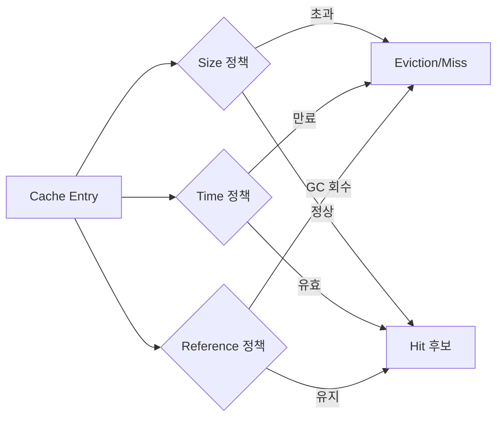
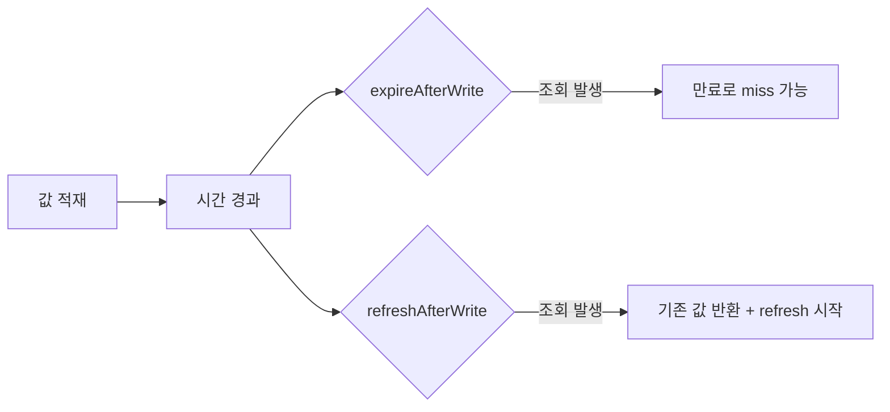
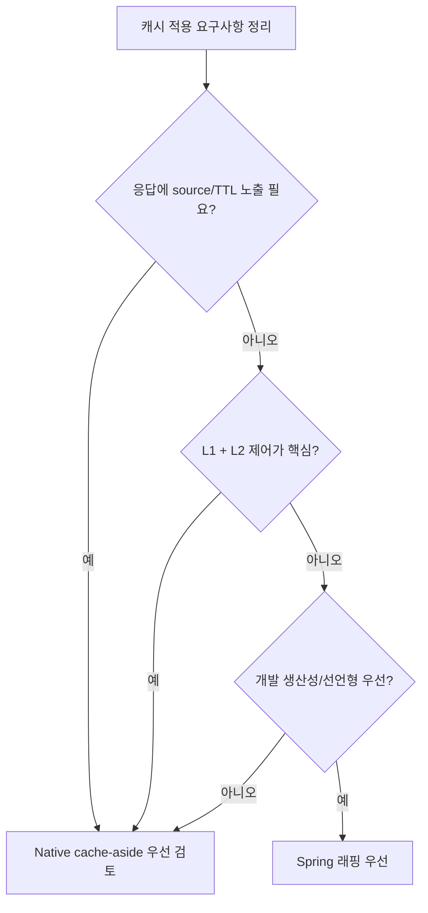

# Caffeine Local Cache 딥다이브

Spring Boot에서 Caffeine을 사용할 때는 적용 방식의 선택 기준을 먼저 정리해야 한다.

> 선택 기준: `@Cacheable` + `CaffeineCacheManager` 중심의 선언형 적용 vs native Caffeine API 기반의 직접 제어

이 문서는 다음 4축으로 정리한다.
- 사용방법
- 동작방식
- 응용방식
- 유의사항(사이드 이펙트)

그리고 내부 구현은 별도 심화 문서로 분리했다.
- 심화: [Caffeine 내부구조 심화 문서](./2026-03-22_caffeine-local-cache-internals-deep-dive.md)

---

## TL;DR
- Caffeine은 단순 Map이 아니라 **축출 정책 + 동시성 최적화 + 높은 hit ratio**를 목표로 설계된 캐시다.
- Spring 래핑 방식도 충분히 강력하다. 다만 응답에 source/TTL을 노출하거나 L1/L2 흐름을 세밀하게 제어하려면 native 방식이 더 명확할 수 있다.
- 캐시 품질은 "라이브러리 선택"보다 "TTL/키/무효화/관측성 설계"가 좌우한다.

---

## 1) 사용방법

### 1-1. 의존성

```kotlin
implementation("org.springframework.boot:spring-boot-starter-cache")
implementation("com.github.ben-manes.caffeine:caffeine")
```

### 1-2. 최소 설정 (Spring Bean)

```kotlin
@Bean
fun localCache(
    @Value("\${study.cache.local-ttl-seconds:10}") ttlSeconds: Long,
): Cache<String, Product> {
    return Caffeine.newBuilder()
        // write 이후 ttlSeconds가 지나면 만료
        .expireAfterWrite(Duration.ofSeconds(ttlSeconds))
        // 최대 엔트리 수 제한
        .maximumSize(10_000)
        // 통계 수집 활성화 (Micrometer 연결 시 유용)
        .recordStats()
        .build()
}
```

### 1-3. LoadingCache / AsyncLoadingCache 예시

```kotlin
// miss 시 loader를 통해 자동 적재
val loadingCache = Caffeine.newBuilder()
    .maximumSize(10_000)
    .expireAfterWrite(Duration.ofMinutes(5))
    .build<String, Product> { key ->
        // loader 내부는 느린 IO(DB/API) 가능
        productRepository.findById(key)
            ?: error("not found: $key")
    }

// 비동기 로딩 버전 (CompletableFuture)
val asyncCache = Caffeine.newBuilder()
    .maximumSize(10_000)
    .buildAsync<String, Product> { key, _ ->
        CompletableFuture.supplyAsync {
            productRepository.findById(key)
                ?: error("not found: $key")
        }
    }
```

### 1-4. API 선택 기준 (표)

| API | 추천 상황 | 장점 | 유의사항 |
| --- | --- | --- | --- |
| `Cache<K, V>` | cache-aside를 서비스 코드에서 직접 제어할 때 | 제어점이 가장 많음 | miss 로딩/중복 요청 방지 로직을 직접 설계해야 함 |
| `LoadingCache<K, V>` | miss 로딩 규칙이 명확할 때 | 코드 간결, 자동 로딩 | loader 실패/지연 시 영향 범위를 설계해야 함 |
| `AsyncLoadingCache<K, V>` | 로딩 지연이 크고 비동기 처리가 필요할 때 | 스레드 점유 감소, 병렬 처리 유리 | Future 체인/타임아웃/예외 처리 설계 필요 |

### 1-4-1. study 코드에서의 세 가지 캐시

`StudyCacheTierService`는 같은 origin 데이터를 세 가지 Caffeine 패턴으로 읽어본다. `Cache`는 수동 cache-aside, `LoadingCache`는 자동 loader, `refreshAfterWriteCache`는 stale 값을 잠깐 유지하면서 갱신하는 실습용이다.

```kotlin
private val originData = ConcurrentHashMap<String, String>()

private val cacheAsideCache: Cache<String, String> = Caffeine.newBuilder()
    .expireAfterWrite(Duration.ofSeconds(properties.localTtlSeconds))
    .maximumSize(properties.localMaximumSize)
    .recordStats()
    .build()

private val loadingCache: LoadingCache<String, String> = Caffeine.newBuilder()
    .expireAfterWrite(Duration.ofSeconds(properties.localTtlSeconds))
    .maximumSize(properties.localMaximumSize)
    .recordStats()
    .build { key -> loadForLoadingCache(key) }

private val refreshAfterWriteCache: LoadingCache<String, String> = Caffeine.newBuilder()
    .refreshAfterWrite(Duration.ofSeconds(properties.refreshAfterWriteSeconds))
    .expireAfterWrite(Duration.ofSeconds(properties.localTtlSeconds))
    .maximumSize(properties.localMaximumSize)
    .recordStats()
    .build { key -> loadForRefreshCache(key) }
```

### 1-5. Spring 래핑 사용 예시

```kotlin
@Bean
fun cacheManager(): CacheManager {
    val manager = CaffeineCacheManager("products")
    manager.setCaffeine(
        Caffeine.newBuilder()
            .maximumSize(10_000)
            .expireAfterWrite(Duration.ofSeconds(10))
    )
    return manager
}

@Cacheable(cacheNames = ["products"], key = "#id")
fun findProduct(id: String): Product {
    return productRepository.findById(id)
        ?: error("not found")
}
```

출처:
- Caffeine Wiki: https://github.com/ben-manes/caffeine/wiki
- Spring Caffeine 설정: https://docs.spring.io/spring-framework/reference/integration/cache/store-configuration.html#cache-store-configuration-caffeine

---

## 2) 동작방식

### 2-1. Eviction 정책 3축 (표)

| 축 | 주요 옵션 | 무엇을 줄이려는가 | 언제 유용한가 | 흔한 실수/주의점 |
| --- | --- | --- | --- | --- |
| Size | `maximumSize`, `maximumWeight` + `weigher` | 메모리 초과와 과도한 eviction | 키 종류가 많고 트래픽이 넓게 퍼질 때 | `maximumWeight`를 "엔트리 개수 제한"으로 오해하면 안 됨 |
| Time | `expireAfterWrite`, `expireAfterAccess`, `expireAfter(Expiry)` | 오래된(stale) 데이터 노출 | 데이터 신선도가 SLA에 직접 영향 줄 때 | "쓰기 기준 만료"와 "접근 기준 만료"를 혼동하기 쉬움 |
| Reference | `weakKeys`, `weakValues`, `softValues` | GC 압력 상황에서 회수되지 않는 객체 | 메모리 압력 대응이 최우선일 때 | 성능 최적화 수단으로 먼저 쓰면 예측이 어려워질 수 있음 |

### 2-1-1. Eviction 3축 관계도



이 다이어그램에서 핵심은 세 가지다.
- Size, Time, Reference는 독립적으로 설정해도 동시에 결과에 영향을 준다.
- TTL이 남아 있어도 size/reference 조건으로 miss가 먼저 발생할 수 있다.
- 따라서 miss 원인 분석 시 "시간 정책만" 보면 오판하기 쉽다.

### 2-2. Size 기반 상세
- `maximumSize`: 엔트리 수 기반 상한
- `maximumWeight + weigher`: 엔트리별 비용을 정의해 가중치 합으로 제어
- Caffeine은 admission/eviction 정책을 통해 hit ratio를 최대화하려고 시도한다(W-TinyLFU 계열)
- 예시 시나리오: "상품 100만 건 중 자주 조회되는 1만 건만 빠르게 유지"가 목표라면 Size 제한이 기본 전략이 된다.

예시:
```kotlin
val byCount = Caffeine.newBuilder()
    // 최대 10,000개 엔트리
    .maximumSize(10_000)
    .build<String, Product>()

val byWeight = Caffeine.newBuilder()
    // 최대 가중치 50,000
    .maximumWeight(50_000)
    // 엔트리별 비용(예: payload 크기) 계산
    .weigher<String, Product> { _, value -> value.payloadBytes }
    .build<String, Product>()
```

### 2-3. Time 기반 상세
- `expireAfterWrite`: 마지막 쓰기 시점 기준 만료
- `expireAfterAccess`: 마지막 접근 시점 기준 만료
- `expireAfter(Expiry)`: 엔트리별 커스텀 만료 정책
- 예시 시나리오: "가격은 10초마다 바뀔 수 있다"는 조건이면 `expireAfterWrite(10s)`가 명확하다.

예시:
```kotlin
val writeBased = Caffeine.newBuilder()
    // "생성/갱신 후 10초" 기준 만료
    .expireAfterWrite(Duration.ofSeconds(10))
    .build<String, Product>()

val accessBased = Caffeine.newBuilder()
    // "마지막 접근 후 10초" 동안 접근 없으면 만료
    .expireAfterAccess(Duration.ofSeconds(10))
    .build<String, Product>()
```

### 2-4. Reference 기반 상세
- `weakKeys`: key를 약한 참조로 관리
- `weakValues`, `softValues`: value를 GC 정책과 연계
- 참조 기반 정책은 성능보다 메모리 압력 대응 목적일 때 선택하는 편이 안전하다.
- 예시 시나리오: "개발 툴/백오피스처럼 메모리 급등 구간이 잦다"면 Reference 정책을 제한적으로 검토한다.

예시:
```kotlin
val gcSensitive = Caffeine.newBuilder()
    // key를 weak reference로 관리
    .weakKeys()
    .build<String, Product>()
```

정리:
- Size는 "얼마나 담을지"를 정한다.
- Time은 "얼마나 오래 둘지"를 정한다.
- Reference는 "GC 상황에서 어떻게 회수될지"를 정한다.

출처:
- Eviction: https://github.com/ben-manes/caffeine/wiki/Eviction
- Design: https://github.com/ben-manes/caffeine/wiki/Design

---

## 3) expire vs refresh (표 + 예시)

### 3-1. 개념 비교

| 항목 | `expireAfterWrite` | `refreshAfterWrite` |
| --- | --- | --- |
| 트리거 | 만료 시점 도달 | 읽기 시점에 refresh 대상 확인 |
| 만료 후 조회 결과 | miss 발생 가능 | 기존 값 반환 가능 |
| 갱신 실행 방식 | 새 조회 시 로딩 | 조회를 계기로 갱신 시작 |
| 목적 | 엄격한 유효기간 | 지연 스파이크를 줄인 점진 갱신 |

### 3-1-1. expire vs refresh 시간축



이 다이어그램에서 볼 포인트는 두 가지다.
- `expireAfterWrite`는 만료 후 miss가 날 수 있는 정책이다.
- `refreshAfterWrite`는 cron처럼 자동으로 도는 주기 갱신이 아니라 조회 트리거 기반이다.

### 3-2. 코드 예시

```kotlin
// expire: ttl 이후에는 로딩이 완료되기 전까지 miss가 발생할 수 있음
val expireCache = Caffeine.newBuilder()
    .expireAfterWrite(Duration.ofSeconds(10))
    .build<String, Product> { key -> loadFromStore(key) }

// refresh: 조회 시 refresh가 트리거되고, refresh 중 기존값을 반환할 수 있음
val refreshCache = Caffeine.newBuilder()
    .refreshAfterWrite(Duration.ofSeconds(10))
    .build<String, Product> { key -> loadFromStore(key) }
```

study 코드에서는 origin 값을 바꿔도 캐시를 무효화하지 않는 테스트로 stale 값을 관찰한다. 이후 `refresh(key)`를 호출하면 loader가 다시 실행되고 새 값을 볼 수 있다.

```kotlin
studyCacheTierService.putData("product:3", "old")
studyCacheTierService.getWithRefreshAfterWrite("product:3").value // old

studyCacheTierService.putData(
    key = "product:3",
    value = "new",
    invalidateCaches = false,
)

studyCacheTierService.getWithRefreshAfterWrite("product:3").value // old
studyCacheTierService.refreshNow("product:3").value // new
```

출처:
- Refresh: https://github.com/ben-manes/caffeine/wiki/Refresh

---

## 4) Spring 래핑 vs Native Caffeine 직접제어

### 4-1. 비교 표

| 관점 | Spring 래핑 (`@Cacheable`, `CaffeineCacheManager`) | Native Caffeine + 수동 cache-aside |
| --- | --- | --- |
| 생산성 | 높음 (선언형) | 중간 (직접 구현) |
| 로직 가시성 | 메서드 단위로 분산될 수 있음 | 서비스 플로우에 집중되어 명확 |
| source/TTL 응답 노출 | 기본 추상화 범위 밖 | 직접 구현 가능 |
| L1(Local) + L2(Redis) 세밀 제어 | 추가 설계 필요 | 자연스럽게 구현 가능 |
| 학습 목적 적합성 | 개념 입문에 유리 | 내부 흐름 학습에 유리 |

### 4-1-1. 방식 선택 가이드



이 다이어그램은 우열 비교가 아니라 선택 기준을 정리하기 위한 도식이다.
- 메서드 결과 캐싱 중심이면 Spring 래핑이 빠르게 적용된다.
- 계층 캐시 오케스트레이션과 응답 의미 제어가 핵심이면 Native 방식이 유리하다.

### 4-2. 왜 이 study는 Native를 선택했는가
현재 study 요구사항은 다음과 같다.
- 조회 source(`LOCAL_CACHE/LOADER/MISS`)를 응답으로 내려야 함
- cache-aside, loading, refresh 패턴의 차이를 같은 데이터로 비교해야 함
- origin 데이터 변경 시 캐시 invalidate 여부를 실험해야 함
- hit/miss/eviction과 loader 호출 수를 함께 관찰해야 함

Native Caffeine을 직접 쓰면 응답에 hit/miss 원인을 담거나, 특정 캐시만 골라 비우는 코드가 명시적으로 드러난다.

```kotlin
fun getWithCacheAside(key: String): CacheLookupResponse {
    cacheAsideCache.getIfPresent(key)?.let { cached ->
        return CacheLookupResponse(
            key = key,
            value = cached,
            pattern = CachePattern.CACHE_ASIDE,
            source = CacheSource.LOCAL_CACHE,
            message = "Cache-aside hit",
        )
    }

    val loaded = originData[key] ?: return CacheLookupResponse(
        key = key,
        value = null,
        pattern = CachePattern.CACHE_ASIDE,
        source = CacheSource.MISS,
        message = "Origin data does not exist",
    )

    cacheAsideCache.put(key, loaded)
    return CacheLookupResponse(
        key = key,
        value = loaded,
        pattern = CachePattern.CACHE_ASIDE,
        source = CacheSource.LOADER,
        message = "Loaded origin data and populated Caffeine",
    )
}
```

이 요구사항은 "캐시 적용"보다 "캐시 흐름 자체"가 핵심이라, 수동 cache-aside가 더 직접적이다.

### 4-3. Spring 래핑의 한계로 해석하면 안 되는 이유
그렇지 않다. Spring 래핑은 메서드 결과 캐싱에 매우 효율적이다.
다만 이번 주제는 "결과 캐싱"이 아니라 "계층 캐시 오케스트레이션"이 중심이라 선택이 달라진 케이스다.

### 4-4. Caffeine vs Ehcache (공식 근거 기반 비교)
확인 기준 날짜: 2026-03-22

| 관점 | Caffeine (공식 근거) | Ehcache (공식 근거) | 실무 해석 |
| --- | --- | --- | --- |
| Spring 통합 경로 | Spring 문서에서 `org.springframework.cache.caffeine` 기반 `CaffeineCacheManager`를 직접 제공 | Spring 문서에서 Ehcache 3.x는 JSR-107(JCache) 준수로 별도 전용 지원 없이 JCache 경로 사용 | Spring 캐시 추상화에서 단순/직접 통합은 Caffeine이 직관적이고, 표준 API(JCache) 중심이면 Ehcache도 자연스럽다 |
| 설계 목표 | Caffeine 공식 문서/README는 high performance, near optimal hit rate를 강조하고 Design 문서에서 W-TinyLFU 정책을 명시 | Ehcache 문서는 tiered caching(heap/off-heap/disk/clustered)과 운영 제약/설정 규칙을 상세히 제공 | 인메모리 hit ratio와 단순 고성능 최적화는 Caffeine이 강점이고, 저장 계층 전략과 운영 옵션은 Ehcache가 강점이다 |
| 저장 계층/지속성 | 기본적으로 로컬 인메모리 캐시에 집중 | Tiering 문서에서 off-heap/disk/clustered를 다루고, XML 문서에서 `PersistentCacheManager`/`<persistence>`를 명시 | 캐시를 메모리 밖 계층까지 설계하려면 Ehcache의 기능 폭이 넓다 |
| 쓰기 연동 기능 | cache-aside/loader 중심 설계가 일반적 | Writers 문서에서 write-through/write-behind, batching/coalescing/concurrency 옵션 제공 | 시스템 오브 레코드와 쓰기 연동 정책이 중요하면 Ehcache 설계 옵션이 유용하다 |

### 4-4-1. 왜 Caffeine이 좋다고 말하는가 (조건부)
- "Spring 기반 로컬 캐시를 빠르게 붙이고 튜닝하고 싶다"는 조건에서는 Caffeine이 더 단순한 선택이 되기 쉽다.
- "near optimal hit rate"와 W-TinyLFU 기반 정책을 공식 문서에서 명시하므로, 성능/히트율 관점의 설명 근거가 명확하다.
- 다만 이 평가는 "인메모리 로컬 캐시 중심" 조건에서 유효하다. 저장 계층/지속성/쓰기 연동이 핵심이면 Ehcache가 더 맞을 수 있다.

### 4-4-2. 선택 가이드 (요약표)

| 요구사항 | 더 잘 맞는 선택 | 이유 |
| --- | --- | --- |
| Spring에서 빠르게 로컬 캐시 적용 + 코드 간결성 우선 | Caffeine | Spring의 전용 Caffeine 통합 경로가 단순하고, builder 기반 튜닝이 직관적 |
| 히트율 중심의 인메모리 캐시 최적화 | Caffeine | 공식 Design 문서에서 W-TinyLFU 기반 hit rate 최적화 방향을 명시 |
| off-heap/disk/clustered 계층 설계가 필요 | Ehcache | 공식 Tiering 문서에서 다중 계층과 제약 조건을 체계적으로 제공 |
| JCache(JSR-107) 표준 API 중심 운영 | Ehcache | Spring 문서에서 Ehcache 3.x의 JSR-107 준수와 JCache 경로를 명시 |
| write-behind 등 쓰기 경로 제어가 중요 | Ehcache | 공식 Writers 문서에서 배치/코얼레싱/동시성 옵션을 제공 |

출처:
- Spring cache store config: https://docs.spring.io/spring-framework/reference/integration/cache/store-configuration.html#cache-store-configuration-caffeine
- Spring `CaffeineCacheManager` Javadoc: https://docs.enterprise.spring.io/spring-framework/docs/6.1.22/javadoc-api/org/springframework/cache/caffeine/CaffeineCacheManager.html
- Caffeine README: https://github.com/ben-manes/caffeine
- Caffeine Design: https://github.com/ben-manes/caffeine/wiki/Design
- Ehcache 3.11 JSR-107 Provider: https://www.ehcache.org/documentation/3.11/107.html
- Ehcache 3.11 Tiering: https://www.ehcache.org/documentation/3.11/tiering.html
- Ehcache 3.11 XML (`<persistence>`): https://www.ehcache.org/documentation/3.11/xml.html
- Ehcache 3.11 Writers (write-behind): https://www.ehcache.org/documentation/3.11/writers.html

---

## 5) 응용방식

### 5-1. 패턴별 적용 가이드 (표)

| 패턴 | 적합한 상황 | 핵심 구현 포인트 |
| --- | --- | --- |
| Cache-aside | 가장 일반적인 읽기 최적화 | miss 시 하위 저장소 조회 + 상위 캐시 적재 |
| Read-through (LoadingCache) | 로딩 규칙이 일관적일 때 | loader 예외/타임아웃 설계 |
| Write-through/Write-behind | 쓰기 일관성과 처리량 균형 | 실패 재시도/순서 보장 정책 필요 |
| L1 + L2 계층 캐시 | 저지연 + 인스턴스 간 데이터 공유 | TTL 관계, 무효화 전파 전략 설계 |

### 5-2. 운영 관측성 추천
- `recordStats()`로 hit/miss/eviction 지표 수집
- removal listener로 eviction cause 추적
- 지표 예시: hit ratio, load latency, eviction count, stale read 비율

### 5-3. `recordStats()` 자세히 보기

`recordStats()`를 켜면 캐시가 내부 통계를 누적한다.

```kotlin
val cache = Caffeine.newBuilder()
    // 통계 수집 활성화
    .recordStats()
    .maximumSize(10_000)
    .build<String, Product>()

val stats = cache.stats()
println("hitCount = ${stats.hitCount()}")
println("missCount = ${stats.missCount()}")
println("hitRate = ${stats.hitRate()}")
println("evictionCount = ${stats.evictionCount()}")
println("averageLoadPenalty(ns) = ${stats.averageLoadPenalty()}")
```

어떻게 해석하면 좋은가:
- `hitRate`가 낮다: 키 설계/TTL/최대 크기 중 하나가 맞지 않을 가능성
- `evictionCount`가 급증한다: 캐시 크기가 너무 작거나 트래픽 패턴이 변했을 가능성
- `averageLoadPenalty`가 높다: miss 시 하위 저장소(DB/Redis/API) 지연이 큰 상태

실무에서 많이 쓰는 해석 순서:
1. `hitRate` 단독으로 보지 말고 `request 수`와 같이 본다.
2. `evictionCount` 급증 구간의 배포/트래픽 이벤트를 같이 본다.
3. `averageLoadPenalty`가 오르면 캐시가 아니라 하위 저장소 지연부터 확인한다.
4. 정책 변경 전/후를 같은 시간대 기준으로 비교한다(피크 시간 고정).

주의:
- 통계는 "방향성" 파악 용도다. 한 지표만 보고 정책을 바꾸면 오판할 수 있다.
- `hitRate`만 높이고 stale 문제가 커지면 오히려 비즈니스 품질은 떨어질 수 있다.

study 코드의 stats 응답은 Caffeine 통계와 loader 호출 수를 같이 보여준다. Caffeine의 hit/miss와 실제 하위 저장소 로딩 횟수를 함께 봐야 캐시 정책을 해석하기 쉽다.

```kotlin
fun getStats(cacheName: String): CacheStatsResponse {
    val cache = cacheByName(cacheName)
    val stats = cache.stats()
    return CacheStatsResponse(
        cacheName = cacheName,
        requestCount = stats.requestCount(),
        hitCount = stats.hitCount(),
        missCount = stats.missCount(),
        hitRate = stats.hitRate(),
        evictionCount = stats.evictionCount(),
        estimatedSize = cache.estimatedSize(),
        loaderCallCount = loaderCount(cacheName),
    )
}
```

---

## 6) 유의사항 (사이드 이펙트)

### 6-1. 사이드 이펙트 요약표

| 이슈 | 실제로 보이는 증상 | 왜 발생하나 | 완화 전략 |
| --- | --- | --- | --- |
| TTL 의미 혼동 | "Redis는 30초인데 응답 TTL은 10초"처럼 보여 장애로 오해 | L1/L2 TTL 기준이 다름 | `source`와 TTL 의미를 API 계약으로 고정 |
| stale 데이터 노출[1] | 방금 수정했는데 이전 값이 잠깐 보임 | refresh/비동기 갱신 특성 | 쓰기 시 invalidate, 중요 경로는 expire 기반 설계 |
| stampede[2] | 특정 순간 DB/Redis QPS가 급등하고 지연이 연쇄 발생 | 동시 miss 요청 집중 | loading/async, jitter TTL, key 단위 lock |
| reference 정책 부작용 | 캐시 hit/miss 패턴이 예측과 다름 | GC 영향 + 참조 전략 | strong 기본, 메모리 압력 구간에 한정 적용 |
| 테스트 불안정 | 같은 테스트가 가끔만 실패 | sleep 의존 시간 레이스 | `Ticker` 기반 테스트 고려 |

### 6-2. 체크리스트
- 캐시 목적(성능/일관성/비용절감)을 명시한다.
- TTL, invalidation, fallback 정책을 문서화한다.
- 관측 지표 없이 감으로 정책을 조정하지 않는다.

각주:
- [1] stale 데이터: 최신 원본 데이터와 캐시 데이터가 잠시 불일치하는 상태
- [2] stampede: 동일 키 miss가 동시에 몰리며 하위 저장소 부하가 폭증하는 현상

---

## 7) 더 깊은 내부 구조 보기

아래 심화 문서에서 Caffeine의 내부 자료구조/버퍼/maintenance 흐름을 더 상세히 다룬다.
- [Caffeine 내부구조 심화 문서](./2026-03-22_caffeine-local-cache-internals-deep-dive.md)

---

## 공식 참고자료
- Caffeine GitHub: https://github.com/ben-manes/caffeine
- Caffeine Wiki Home: https://github.com/ben-manes/caffeine/wiki
- Caffeine Design: https://github.com/ben-manes/caffeine/wiki/Design
- Caffeine Eviction: https://github.com/ben-manes/caffeine/wiki/Eviction
- Caffeine Refresh: https://github.com/ben-manes/caffeine/wiki/Refresh
- Spring Caffeine Store Config: https://docs.spring.io/spring-framework/reference/integration/cache/store-configuration.html#cache-store-configuration-caffeine
- Spring `CaffeineCacheManager` Javadoc: https://docs.enterprise.spring.io/spring-framework/docs/6.1.22/javadoc-api/org/springframework/cache/caffeine/CaffeineCacheManager.html
- Ehcache 3.11 Docs Home: https://www.ehcache.org/documentation/3.11/
- Ehcache 3.11 JSR-107 Provider: https://www.ehcache.org/documentation/3.11/107.html
- Ehcache 3.11 Tiering: https://www.ehcache.org/documentation/3.11/tiering.html
- Ehcache 3.11 XML: https://www.ehcache.org/documentation/3.11/xml.html
- Ehcache 3.11 Writers: https://www.ehcache.org/documentation/3.11/writers.html
