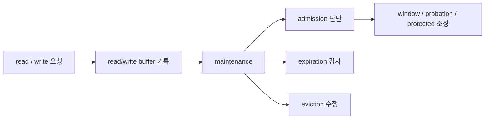
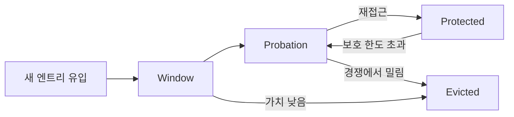
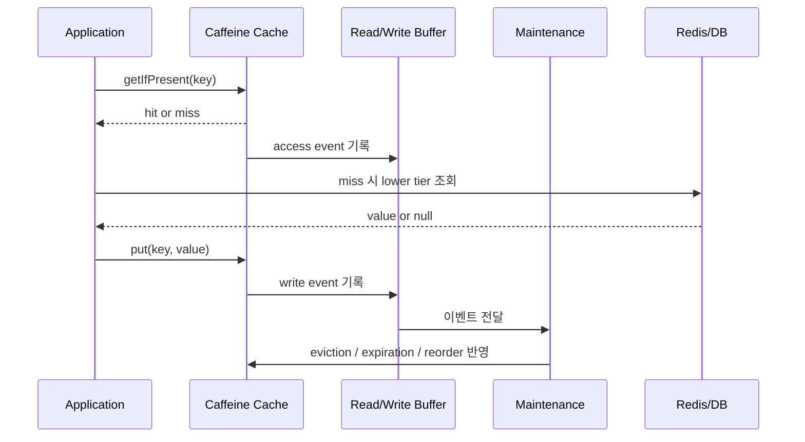
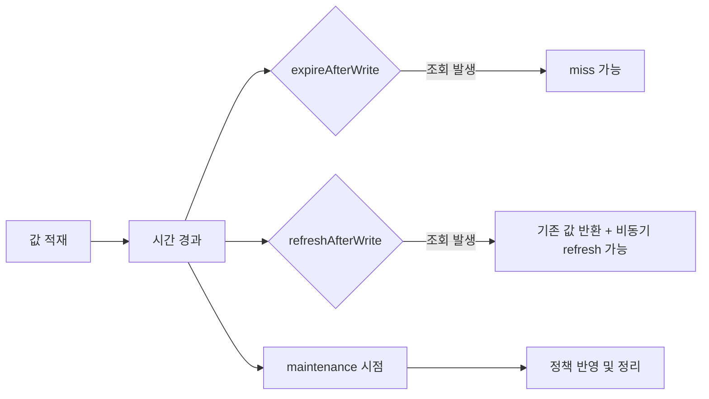

# Caffeine 내부구조 심화: Low-level 동작 관점

이 문서는 [Caffeine Local Cache 딥다이브](./2026-03-22_caffeine-local-cache-deep-dive.md)의 심화편이다.
목표는 API 이름을 외우는 것이 아니라, Caffeine이 왜 빠르고 왜 예상과 다른 시점에 miss/eviction/refresh가 보일 수 있는지를 내부 동작 관점에서 이해하는 것이다.

---

## 1) 큰 그림: Caffeine이 실제로 하는 일

Caffeine은 "값을 담아두는 Map"이라기보다, "어떤 값을 남기고 어떤 값을 밀어낼지 계속 판단하는 정책 엔진"에 가깝다.

### 1-1. 핵심 개념 표

| 개념 | 내부에서 하는 일 | 왜 필요한가 | 사용자가 체감하는 효과 | 이해 포인트 |
| --- | --- | --- | --- | --- |
| Admission | 새로 들어온 엔트리를 바로 보호하지 않고 평가한다 | 일회성 트래픽이 캐시를 오염시키지 않게 하기 위해 | burst 트래픽에서도 hit ratio가 덜 무너진다 | "들어왔다"와 "오래 남는다"는 다른 문제다 |
| Eviction | 남길 가치가 낮은 엔트리를 밀어낸다 | 메모리 한도와 hit ratio를 동시에 관리하기 위해 | 오래된 값이나 덜 중요한 값이 사라진다 | TTL이 남아 있어도 size 정책으로 먼저 빠질 수 있다 |
| Read/Write Buffer | 접근 이벤트를 즉시 전역 구조에 반영하지 않고 모은다 | hot path에서 락 경쟁을 줄이기 위해 | 읽기 성능이 좋아진다 | 정책 반영이 항상 즉시 보이지는 않는다 |
| Maintenance | 모아둔 이벤트를 정리하며 eviction/expiration을 수행한다 | 성능과 정책 정확도의 균형을 맞추기 위해 | "왜 지금 정리됐지?" 같은 현상이 생길 수 있다 | 만료나 정리가 요청 순간과 정확히 일치하지 않을 수 있다 |
| Frequency Sketch | 최근 빈도를 압축 형태로 추적한다 | 자주 쓰이는 키를 더 오래 살리기 위해 | 반복 조회 키의 생존율이 높아진다 | 단순 LRU보다 hit ratio에 유리하다 |

### 1-2. 전체 흐름 다이어그램



이 그림에서 봐야 하는 포인트는 세 가지다.
- 요청이 들어올 때마다 모든 정책이 즉시 확정되는 구조가 아니다.
- 접근 기록은 버퍼에 쌓였다가 maintenance에서 반영된다.
- eviction, expiration, admission은 따로 노는 기능이 아니라 maintenance 안에서 함께 관찰되는 정책들이다.

출처:
- Caffeine Design: https://github.com/ben-manes/caffeine/wiki/Design

---

## 2) 내부 구역 모델: 왜 단일 LRU가 아닌가

단일 LRU는 "최근에 한 번 들어온 값"과 "계속 자주 쓰이는 값"을 충분히 구분하지 못한다.
Caffeine은 이 문제를 줄이기 위해 신규 유입 구역과 보호 구역을 나눠서 관리하는 사고방식을 사용한다.

### 2-1. 구역별 역할 표

| 구역 | 쉽게 풀면 | 어떤 데이터가 머무는가 | 언제 이동하는가 | 왜 필요한가 |
| --- | --- | --- | --- | --- |
| Window | 신규 진입 구역 | 막 들어온 엔트리 | 재접근되거나 경쟁에서 살아남으면 다음 구역으로 이동 | 새 트래픽을 바로 버리지 않고 한번 받아본다 |
| Probation | 시험 구역 | 일단 살아남았지만 아직 강하게 보호되지는 않는 엔트리 | 다시 접근되면 protected로 승격, 밀리면 제거 | 일회성 접근과 반복 접근을 구분한다 |
| Protected | 보호 구역 | 반복적으로 가치가 증명된 엔트리 | 보호 한도를 넘기면 일부가 probation으로 내려감 | 자주 쓰는 키를 쉽게 잃지 않게 한다 |

### 2-2. 구역 이동 다이어그램



이 구조를 실무 언어로 바꾸면 다음과 같다.
- Window는 "신규 손님 대기석"이다.
- Probation은 "한번 더 올지 보는 구간"이다.
- Protected는 "계속 오는 핵심 손님 자리"다.

### 2-3. 조회 패턴 예시 표

| 상황 | 단순 LRU에서 생길 수 있는 문제 | Caffeine 구역 모델이 유리한 이유 |
| --- | --- | --- |
| 이벤트로 인해 새로운 키 10만 개가 짧게 유입 | 기존 hot key가 대량으로 밀릴 수 있다 | 신규 키를 바로 핵심 구역으로 넣지 않아 hot key 보호에 유리하다 |
| 어떤 상품 키가 반복적으로 계속 조회 | 신규 유입 키와 섞이며 생존이 불안정할 수 있다 | 반복 조회가 확인되면 protected에 가까워져 오래 남기 쉽다 |
| 일회성 조회가 매우 많음 | 캐시 공간이 일회성 요청으로 쉽게 오염된다 | probation 경쟁을 통해 반복 사용 키를 상대적으로 살리기 쉽다 |

출처:
- Caffeine Design: https://github.com/ben-manes/caffeine/wiki/Design

---

## 3) 읽기, 쓰기, 정리는 어떻게 이어지는가

아래는 cache-aside 서비스에서 자주 보는 흐름이다.

```kotlin
fun getData(key: String): Response {
    // 1) local cache read
    cache.getIfPresent(key)?.let { return hit(it) }

    // 2) lower tier read (redis/db)
    val loaded = loadFromRedis(key) ?: return miss()

    // 3) local cache write
    cache.put(key, loaded)
    return loadedFromRedis(loaded)
}
```

겉으로는 단순하지만, 내부에서는 아래와 같은 일이 이어진다.

### 3-1. 단계별 동작 표

| 시점 | 내부 동작 | 사용자 관점에서 보이는 결과 | 주의할 점 |
| --- | --- | --- | --- |
| `getIfPresent(key)` hit | 값 반환 + 접근 이벤트 기록 | 빠른 응답 | 접근 기록이 바로 전역 정책에 반영되는 것은 아니다 |
| `getIfPresent(key)` miss | 값 부재 확인 | 하위 저장소 조회 발생 | 실제 miss 원인이 TTL 만료인지 size eviction인지 바로 구분되지는 않는다 |
| `cache.put(key, value)` | 새 엔트리 삽입 + 정책 적용 후보 등록 | 다음 조회부터 local hit 가능 | 넣었다고 해서 곧바로 장기 생존이 확정되지는 않는다 |
| maintenance 수행 | 버퍼 소모 + eviction/expiration 정리 | 어떤 시점에 갑자기 miss가 보일 수 있음 | 사용자는 "방금까지 있던 값이 왜 사라졌지?"처럼 느낄 수 있다 |

### 3-2. 읽기/쓰기/정리 관계 다이어그램



이 다이어그램에서 중요한 점은 "조회 결과를 돌려주는 시점"과 "정책 정리가 반영되는 시점"이 항상 완전히 같지 않을 수 있다는 점이다.

---

## 4) expire, refresh, maintenance는 서로 무엇이 다른가

이 세 개가 섞여 보이면 Caffeine이 어렵게 느껴진다.
핵심은 "만료", "갱신", "정리 시점"이 서로 다른 문제라는 점이다.

### 4-1. 비교 표

| 항목 | `expireAfterWrite` | `refreshAfterWrite` | maintenance |
| --- | --- | --- | --- |
| 의미 | 일정 시간이 지나면 엔트리를 만료 대상으로 본다 | 일정 시간이 지나면 갱신 대상이 될 수 있다 | 버퍼 이벤트를 반영하며 정책을 실제로 정리한다 |
| 조회 시 체감 | 만료 후에는 miss가 날 수 있다 | refresh 중에는 기존 값이 반환될 수 있다 | "왜 지금 정리됐지?" 같은 타이밍 차이를 만든다 |
| 언제 실행되나 | 시간 조건 충족 후 접근/정리 시 반영 | 공식 문서 기준, 엔트리가 조회될 때 refresh가 실제로 시작된다 | 접근/쓰기 이후 내부 정리 시점에 수행된다 |
| 적합한 상황 | 신선도 보장이 우선일 때 | 응답 지연 완화가 우선일 때 | 직접 고르는 옵션이라기보다 내부 작동 메커니즘 |
| 흔한 오해 | TTL이 지나면 그 순간 즉시 사라진다고 생각 | cron처럼 주기적으로 자동 갱신된다고 생각 | 정리가 항상 동기적으로 즉시 보인다고 생각 |

### 4-2. 시간축 다이어그램



### 4-3. 실제로 많이 나오는 질문 표

| 관찰한 현상 | 내부에서 볼 수 있는 이유 | 먼저 확인할 것 |
| --- | --- | --- |
| TTL이 지났는데 값이 바로 안 사라진다 | maintenance와 접근 시점에 따라 정리가 뒤늦게 보일 수 있다 | 접근 패턴, expiration 정책, 테스트 방식 |
| TTL이 아직 남았다고 생각했는데 miss가 난다 | size eviction 또는 reference 정책으로 먼저 빠졌을 수 있다 | maximumSize/maximumWeight, GC 영향, hit/miss 지표 |
| refresh를 걸었는데 자동 갱신처럼 안 보인다 | 공식 문서 기준 refresh는 조회 시점에 실제 시작된다 | 해당 키가 refresh 가능 시점 이후 실제로 조회됐는지 |

출처:
- Caffeine Refresh: https://github.com/ben-manes/caffeine/wiki/Refresh
- Caffeine Eviction: https://github.com/ben-manes/caffeine/wiki/Eviction

---

## 5) 어떤 가이드라인을 기준으로 설명했는가

이 문서는 임의의 비유만으로 쓴 문서가 아니다.
아래 공식 자료의 설명 범위를 기준으로, 초심자가 이해하기 쉬운 운영 관점의 언어로 번역했다.

### 5-1. 기준 자료 표

| 기준 자료 | 이 문서에서 참고한 포인트 | 문서에 반영한 방식 |
| --- | --- | --- |
| Caffeine Design | admission, eviction, buffering, maintenance의 설계 의도 | "정책 엔진"이라는 큰 그림과 구역 모델 설명 |
| Caffeine Eviction | size/time/reference eviction의 동작 특성 | TTL이 남아 있어도 miss가 날 수 있는 이유, eviction 3축 해석 |
| Caffeine Refresh | refresh가 조회 시점에 실제 시작된다는 점, old value 유지 가능성 | expire vs refresh 오해 방지 표와 시간축 설명 |

### 5-2. 문서 작성 원칙

| 원칙 | 이유 |
| --- | --- |
| 내부 호출 순서를 전부 외우게 하지 않는다 | 학습 초반에는 세부 구현보다 동작 원리를 이해하는 편이 더 중요하다 |
| 비교 가능한 내용은 표로 정리한다 | low-level 설명은 문장만 나열하면 관계가 잘 안 보이기 쉽다 |
| 추상 용어 뒤에는 예시나 증상을 붙인다 | "왜 이 개념이 필요한가"가 보여야 기억에 남는다 |
| 다이어그램은 흐름이 어려운 곳에만 넣는다 | 시각화가 텍스트를 보조해야지, 또 다른 해석 대상이 되면 안 된다 |

---

## 6) 실무에서 보이는 증상과 해석

### 6-1. 증상 중심 해석 표

| 증상 | 내부 원인 후보 | 확인할 지표/설정 | 실무 대응 |
| --- | --- | --- | --- |
| hit rate가 갑자기 하락 | burst 트래픽, size 한도 부족, 신규 키 유입 급증 | `recordStats()`, key 분포, `maximumSize` | 키 패턴 분석 후 size 조정 또는 TTL 재설계 |
| Redis/DB 호출이 갑자기 늘어남 | local miss 증가, stampede, 예상보다 빠른 eviction | miss count, load latency, lower tier QPS | TTL 분산, loader 전략, 키 단위 보호 검토 |
| TTL이 남아 있는 것 같은데 miss | size eviction 또는 reference 기반 회수 | eviction count, GC 로그, reference 사용 여부 | strong 기본값 재검토, size 정책 확인 |
| refresh를 썼는데 최신 값 반영이 늦다 | refresh 대상이 되었어도 조회가 적음 | 해당 키의 실제 read 빈도 | 신선도가 더 중요하면 expire 기반으로 전환 검토 |
| 테스트가 간헐적으로 깨진다 | 시간 기반 정책과 maintenance 타이밍이 고정되지 않음 | 테스트 코드의 sleep 사용 여부 | `Ticker` 기반 테스트 또는 여유 있는 검증 조건 사용 |

### 6-2. 실전 읽기 순서

1. `recordStats()`로 hit/miss/eviction을 먼저 본다.
2. lower tier 지연과 local cache miss를 분리해서 본다.
3. TTL 문제인지, size 문제인지, refresh 오해인지 분리한다.
4. 정책을 바꾸기 전에 키 분포와 트래픽 패턴을 함께 본다.

---

## 7) 핵심 요약

- Caffeine은 빠른 Map이 아니라, admission과 eviction을 분리해 hit ratio를 높이려는 정책 엔진이다.
- `window / probation / protected`는 "신규 유입", "시험", "보호"라는 관점으로 보면 이해가 쉬워진다.
- `expire`, `refresh`, `maintenance`는 같은 문제가 아니며, miss 시점과 정리 시점이 다르게 보일 수 있다.
- 이 문서는 Caffeine 공식 `Design`, `Eviction`, `Refresh`를 기준으로, 운영자가 이해해야 할 수준의 안정적인 개념을 우선 설명했다.
