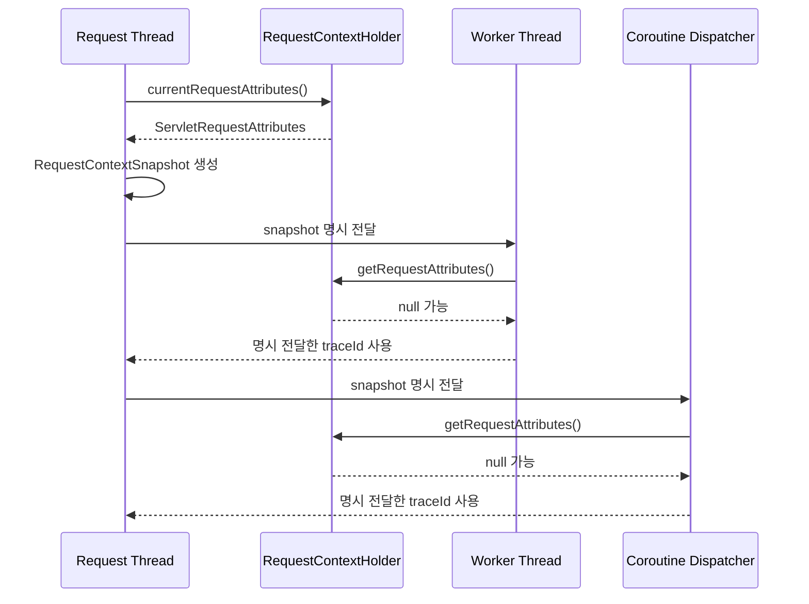

# RequestContextHolder 실전 가이드

`RequestContextHolder`는 현재 요청을 thread-bound 상태로 접근하기 위한 Spring 유틸리티다. 핵심은 "요청 스레드 안에서는 편리하지만, 비동기/코루틴 전환 시 그대로 믿으면 깨진다"이다.

## 요약

- Spring MVC에서는 `DispatcherServlet`이 현재 요청 컨텍스트를 기본 노출하므로, 요청 스레드 안에서는 `RequestContextHolder`로 요청 메타를 쉽게 읽을 수 있다.
- `RequestContextHolder`는 `ThreadLocal` 기반이므로 worker thread, coroutine context 전환 구간에서는 값이 비어있을 수 있다.
- 실무 Best Practice는 **입구(Controller)에서 필요한 값을 추출해 불변 DTO로 전달**하는 방식이다.
- 부득이하게 ThreadLocal을 코루틴에서 다뤄야 할 때는 `asContextElement`를 사용해 전파를 명시한다.

## 실습 코드 구조

Controller는 현재 요청, 별도 스레드, 코루틴 전환을 각각 확인할 수 있는 얇은 진입점이다. 학습 레포에서는 HTTP 호출 방법보다 아래 위임 관계를 보는 편이 더 중요하다.

```kotlin
@RestController
@RequestMapping("/study/request-context")
class StudyRequestContextController(
    private val studyRequestContextService: StudyRequestContextService,
) {
    @GetMapping("/current")
    fun current() = studyRequestContextService.inspectCurrentRequestContext()

    @GetMapping("/async")
    fun async() = studyRequestContextService.inspectAsyncContext()

    @GetMapping("/coroutine")
    suspend fun coroutine() = studyRequestContextService.inspectCoroutineContext()
}
```

요청 메타는 `RequestContextHolder`에서 읽어 `RequestContextSnapshot`으로 고정한다. 이 스냅샷을 명시적으로 넘기면 실행 모델이 바뀌어도 필요한 값이 유지된다.

```kotlin
private fun requireCurrentSnapshot(): RequestContextSnapshot {
    val attributes = RequestContextHolder.currentRequestAttributes()
        as? ServletRequestAttributes
        ?: error("현재 요청 컨텍스트를 읽을 수 없습니다.")

    return toSnapshot(attributes)
}

private fun toSnapshot(attributes: ServletRequestAttributes): RequestContextSnapshot {
    val request = attributes.request
    return RequestContextSnapshot(
        traceId = request.getHeader("X-Request-Id"),
        method = request.method,
        requestUri = request.requestURI,
        clientIp = request.remoteAddr,
        userAgent = request.getHeader("User-Agent"),
        threadName = Thread.currentThread().name,
    )
}
```

## 동작 방식



### 1) 요청 스레드 구간

`currentRequestAttributes()`는 현재 스레드에 바인딩된 `RequestAttributes`를 반환한다. 값이 없으면 `IllegalStateException`이 발생하므로, 요청 컨텍스트가 반드시 있어야 하는 경계에서만 사용한다.

```kotlin
fun inspectCurrentRequestContext(): CurrentRequestContextResponse {
    val snapshot = requireCurrentSnapshot()
    return CurrentRequestContextResponse(
        requestThreadName = snapshot.threadName,
        traceId = snapshot.traceId,
        method = snapshot.method,
        requestUri = snapshot.requestUri,
        clientIp = snapshot.clientIp,
        userAgent = snapshot.userAgent,
    )
}
```

### 2) 비동기/별도 스레드 구간

`CompletableFuture`나 executor worker thread로 넘어가면 같은 요청이어도 `RequestContextHolder`가 비어있을 수 있다. 그래서 worker에서 holder를 다시 읽는 값과 명시 전달한 값을 비교한다.

```kotlin
fun inspectAsyncContext(): AsyncRequestContextResponse {
    val requestSnapshot = requireCurrentSnapshot()

    val workerProbe = CompletableFuture.supplyAsync({
        val workerSnapshot = currentSnapshotOrNull()
        AsyncWorkerProbe(
            workerThreadName = Thread.currentThread().name,
            traceIdFromRequestContextHolder = workerSnapshot?.traceId,
            traceIdFromExplicitArgument = requestSnapshot.traceId,
        )
    }, asyncExecutor).get()

    return AsyncRequestContextResponse(
        requestThreadName = requestSnapshot.threadName,
        requestTraceId = requestSnapshot.traceId,
        workerThreadName = workerProbe.workerThreadName,
        traceIdFromRequestContextHolderInWorker = workerProbe.traceIdFromRequestContextHolder,
        traceIdFromExplicitArgumentInWorker = workerProbe.traceIdFromExplicitArgument,
    )
}
```

### 3) 코루틴 구간

코루틴이 다른 스레드로 재개되면 `ThreadLocal` 값은 자동 보장되지 않는다. 아래 코드는 `RequestContextHolder` 직접 조회, 명시 전달, `asContextElement` 전파를 나란히 비교한다.

```kotlin
suspend fun inspectCoroutineContext(): CoroutineRequestContextResponse {
    val requestSnapshot = requireCurrentSnapshot()

    val switchedWithoutPropagation = withContext(coroutineDispatcher) {
        CoroutineThreadProbe(
            switchedThreadName = Thread.currentThread().name,
            traceIdFromRequestContextHolder = currentSnapshotOrNull()?.traceId,
        )
    }

    val traceIdFromExplicitArgument = withContext(coroutineDispatcher) {
        requestSnapshot.traceId
    }

    val traceIdThreadLocal = ThreadLocal<String?>()
    val traceIdFromContextElement = withContext(
        coroutineDispatcher + traceIdThreadLocal.asContextElement(requestSnapshot.traceId),
    ) {
        traceIdThreadLocal.get()
    }

    return CoroutineRequestContextResponse(
        requestThreadName = requestSnapshot.threadName,
        requestTraceId = requestSnapshot.traceId,
        switchedThreadName = switchedWithoutPropagation.switchedThreadName,
        traceIdFromRequestContextHolderInSwitchedCoroutine = switchedWithoutPropagation.traceIdFromRequestContextHolder,
        traceIdFromExplicitArgumentInSwitchedCoroutine = traceIdFromExplicitArgument,
        traceIdFromThreadLocalContextElement = traceIdFromContextElement,
    )
}
```

테스트는 비동기/코루틴 전환에서 holder 값은 null이고, 명시 전달 값은 유지된다는 점을 검증한다.

```kotlin
bindRequest(traceId = "trace-async")

val response = studyRequestContextService.inspectAsyncContext()

response.traceIdFromRequestContextHolderInWorker.shouldBeNull()
response.traceIdFromExplicitArgumentInWorker shouldBe "trace-async"
```

## 응용 방식

### 1) 감사/추적 로깅

- `X-Request-Id`, `User-Agent`, `clientIp`를 요청 입구에서 추출해 서비스/비동기 작업 로그에 함께 전달한다.

### 2) 멀티테넌시/권한 문맥

- tenant id, actor id를 요청 경계에서 추출 후 DTO로 넘겨 도메인 로직에서 일관되게 사용한다.

### 3) 외부 연동 호출

- downstream 호출 시 trace id를 전달해 end-to-end 추적성을 확보한다.

## 유의사항

### 1) `inheritable=true` 남용 금지

- `RequestContextFilter#setThreadContextInheritable(true)`는 thread pool과 결합되면 다른 요청으로 컨텍스트가 새는 위험이 있다.

### 2) 깊은 계층에서의 직접 호출 지양

- 서비스/도메인 계층에서 `RequestContextHolder`를 직접 호출하면 테스트가 어려워지고 실행 모델 변경(비동기/배치)에 취약해진다.

### 3) API 선택 기준

- `currentRequestAttributes()`: 컨텍스트가 반드시 있어야 하는 경계에서 사용 (없으면 즉시 실패)
- `getRequestAttributes()`: optional한 조회가 필요한 구간에서 null-safe 처리

### 4) 테스트 전략

- 단위/통합 테스트에서 `RequestContextHolder.resetRequestAttributes()`로 격리 보장
- 요청 컨텍스트 없는 케이스(예외 발생)와 비동기 누락 케이스를 함께 검증

## 공식 문서

- RequestContextHolder Javadoc: https://docs.spring.io/spring-framework/docs/current/javadoc-api/org/springframework/web/context/request/RequestContextHolder.html
- RequestContextFilter Javadoc: https://docs.spring.io/spring-framework/docs/current/javadoc-api/org/springframework/web/filter/RequestContextFilter.html
- RequestContextListener Javadoc: https://docs.spring.io/spring-framework/docs/current/javadoc-api/org/springframework/web/context/request/RequestContextListener.html
- Kotlin Coroutines `asContextElement`: https://kotlinlang.org/api/kotlinx.coroutines/kotlinx-coroutines-core/kotlinx.coroutines/as-context-element.html
