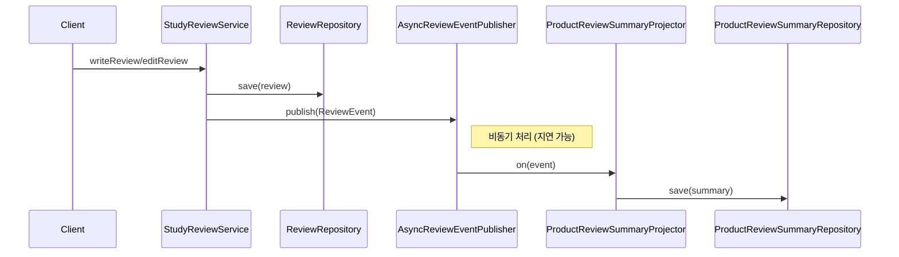

# Eventual Consistency 실습: Review -> ProductReviewSummary

## 요약

이 실습은 애그리거트 경계를 유지하면서도 화면/조회 요구를 만족하기 위해
eventual consistency를 적용하는 방법을 다룬다.

- `Review`는 독립 애그리거트로 쓰기 트랜잭션을 처리한다.
- 쓰기 직후 `ReviewEvent`를 발행한다.
- 비동기 소비자가 `ProductReviewSummary` 리드모델을 갱신한다.
- 따라서 쓰기 직후와 조회 결과 사이에 짧은 시차가 발생할 수 있다.

## 사용법

1. 리뷰 작성/수정은 `StudyReviewService`로 처리한다.
2. `InMemoryAsyncReviewEventPublisher`가 이벤트를 비동기로 전달한다.
3. `ProductReviewSummaryProjector`가 이벤트를 받아 요약 리드모델을 갱신한다.
4. 조회는 `ProductReviewSummaryRepository`에서 읽는다.

핵심 테스트:

- `src/test/kotlin/com/vibewithcodex/study/ddd/review/EventualConsistencyReviewSummaryTest.kt`

## 동작 방식



적용 코드는 크게 세 부분으로 나뉜다.

### 1) 쓰기 모델: Review 애그리거트 저장 후 이벤트 발행

`StudyReviewService`는 리뷰 쓰기 트랜잭션을 처리하고, 저장 직후 이벤트를 발행한다. 이 시점에 `ProductReviewSummary`를 직접 수정하지 않는 것이 포인트다.

```kotlin
@Service
class StudyReviewService(
    private val reviewRepository: ReviewRepository,
    private val reviewEventPublisher: ReviewEventPublisher,
) {
    @Transactional
    fun writeReview(command: WriteReviewCommand): Review {
        val review = Review.create(
            id = ReviewId.of(command.reviewId),
            productId = ProductId.of(command.productId),
            reviewerId = MemberId.of(command.reviewerId),
            score = ReviewScore.of(command.score),
            content = command.content,
        )

        return review.also {
            reviewRepository.save(it)
            reviewEventPublisher.publish(
                ReviewWrittenEvent(
                    reviewId = it.id,
                    productId = it.productId,
                    score = it.score.value,
                    occurredAt = Instant.now(),
                ),
            )
        }
    }
}
```

### 2) 비동기 전달: queue에 넣고 worker가 subscriber 호출

학습용 구현에서는 `LinkedBlockingQueue`와 worker thread로 지연을 재현한다. 운영에서는 이 자리를 Kafka, RabbitMQ, SQS 같은 메시지 브로커로 바꿀 수 있다.

```kotlin
class InMemoryAsyncReviewEventPublisher(
    private val processingDelayMillis: Long = 100,
) : ReviewEventPublisher, AutoCloseable {
    private val running = AtomicBoolean(true)
    private val queue = LinkedBlockingQueue<ReviewEvent>()
    private val subscribers = CopyOnWriteArrayList<ReviewEventSubscriber>()

    private val worker = Thread {
        while (running.get() || queue.isNotEmpty()) {
            val event = queue.poll(200, TimeUnit.MILLISECONDS) ?: continue
            Thread.sleep(processingDelayMillis)
            subscribers.forEach { it.on(event) }
        }
    }.apply { start() }

    override fun publish(event: ReviewEvent) {
        queue.offer(event)
    }

    override fun subscribe(subscriber: ReviewEventSubscriber) {
        subscribers.add(subscriber)
    }
}
```

### 3) 읽기 모델: 이벤트를 ProductReviewSummary에 투영

Projector는 이벤트를 읽기 모델에 반영한다. `ReviewWrittenEvent`는 리뷰 수와 평균을 새로 반영하고, `ReviewEditedEvent`는 이전 점수와 새 점수의 차이를 반영한다.

```kotlin
class ProductReviewSummaryProjector(
    private val summaryRepository: ProductReviewSummaryRepository,
) : ReviewEventSubscriber {
    override fun on(event: ReviewEvent) {
        when (event) {
            is ReviewWrittenEvent -> {
                val current = summaryRepository.findByProductId(event.productId)
                    ?: ProductReviewSummary.empty(event.productId)
                summaryRepository.save(current.applyReviewWritten(event.score))
            }

            is ReviewEditedEvent -> {
                val current = summaryRepository.findByProductId(event.productId)
                    ?: ProductReviewSummary.empty(event.productId)
                summaryRepository.save(current.applyReviewEdited(event.oldScore, event.newScore))
            }
        }
    }
}
```

테스트는 쓰기 직후 조회 모델이 비어 있을 수 있음을 먼저 확인하고, 이후 일정 시간 동안 projector 반영을 기다린다.

```kotlin
reviewService.writeReview(
    WriteReviewCommand(
        reviewId = "review-1",
        productId = "product-1",
        reviewerId = "member-1",
        score = 5,
        content = "excellent",
    ),
)

summaryRepository.findByProductId(ProductId.of("product-1")) shouldBe null

val afterWrite = awaitSummary(summaryRepository, "product-1") { summary ->
    summary.reviewCount == 1 && summary.averageScore == 5.0
}
```

정리하면 다음 코드가 서로 연결된다.

- 이벤트 모델: `ReviewEvent`, `ReviewWrittenEvent`, `ReviewEditedEvent`
- 퍼블리셔: `ReviewEventPublisher`, `InMemoryAsyncReviewEventPublisher`
- 프로젝터: `ProductReviewSummaryProjector`
- 리드모델: `ProductReviewSummary`

## 응용

- 실제 운영에서는 in-memory 퍼블리셔 대신 Kafka/RabbitMQ 같은 브로커로 교체할 수 있다.
- 리드모델(`ProductReviewSummary`)은 캐시/검색 인덱스/별도 조회 DB로 확장할 수 있다.
- 같은 방식으로 주문/결제/배송 상태 통합 조회 모델도 구성할 수 있다.

## 유의사항

- eventual consistency에서는 "즉시 일치"를 기대하면 안 된다.
- 이벤트 중복/순서 역전/재처리 실패를 고려해 소비자를 멱등하게 설계해야 한다.
- 트랜잭션은 여전히 "애그리거트 단위"로 작게 유지해야 한다.
- 이 예제는 학습용이므로 outbox 패턴/재시도/데드레터까지는 생략했다.
