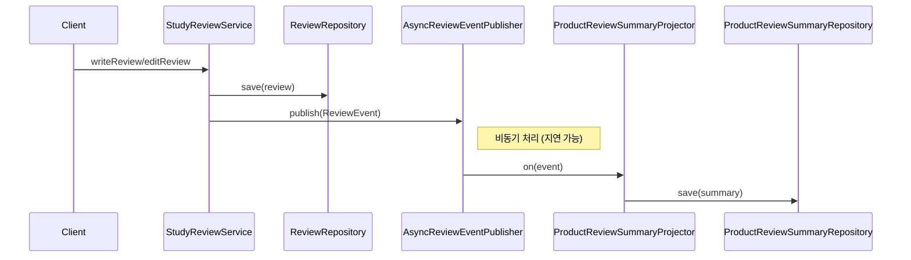

# Eventual Consistency 실습: Review -> ProductReviewSummary

## 요약

이 실습은 애그리거트 경계를 유지하면서도 화면/조회 요구를 만족하기 위해
eventual consistency를 적용하는 방법을 다룬다.

- `Review`는 독립 애그리거트로 쓰기 트랜잭션을 처리한다.
- 쓰기 직후 `ReviewEvent`를 발행한다.
- 비동기 소비자가 `ProductReviewSummary` 리드모델을 갱신한다.
- 따라서 쓰기 직후와 조회 결과 사이에 짧은 시차가 발생할 수 있다.

## 사용법

1. 리뷰 작성/수정은 `StudyReviewService`로 처리한다.
2. `InMemoryAsyncReviewEventPublisher`가 이벤트를 비동기로 전달한다.
3. `ProductReviewSummaryProjector`가 이벤트를 받아 요약 리드모델을 갱신한다.
4. 조회는 `ProductReviewSummaryRepository`에서 읽는다.

핵심 테스트:

- `src/test/kotlin/com/vibewithcodex/study/ddd/review/EventualConsistencyReviewSummaryTest.kt`

## 동작 방식

적용 코드:

- 이벤트 모델: `ReviewEvent`, `ReviewWrittenEvent`, `ReviewEditedEvent`
- 퍼블리셔: `ReviewEventPublisher`, `InMemoryAsyncReviewEventPublisher`
- 프로젝터: `ProductReviewSummaryProjector`
- 리드모델: `ProductReviewSummary`

## 응용

- 실제 운영에서는 in-memory 퍼블리셔 대신 Kafka/RabbitMQ 같은 브로커로 교체할 수 있다.
- 리드모델(`ProductReviewSummary`)은 캐시/검색 인덱스/별도 조회 DB로 확장할 수 있다.
- 같은 방식으로 주문/결제/배송 상태 통합 조회 모델도 구성할 수 있다.

## 유의사항

- eventual consistency에서는 "즉시 일치"를 기대하면 안 된다.
- 이벤트 중복/순서 역전/재처리 실패를 고려해 소비자를 멱등하게 설계해야 한다.
- 트랜잭션은 여전히 "애그리거트 단위"로 작게 유지해야 한다.
- 이 예제는 학습용이므로 outbox 패턴/재시도/데드레터까지는 생략했다.
