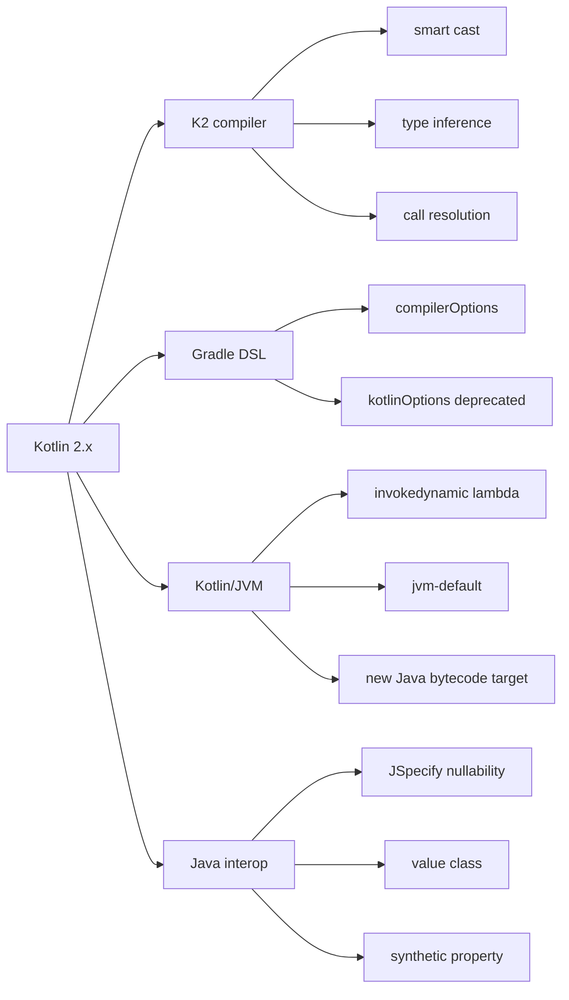
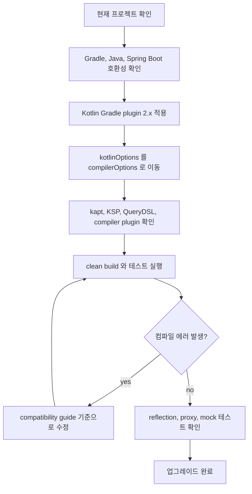

# Kotlin 2.x 변경점 정리 - JVM/Spring 관점

이 글은 Kotlin 2.x 를 JVM/Spring 프로젝트에서 사용할 때 먼저 봐야 할 변경점을 정리한다. Kotlin 2.x 전체 릴리즈 노트를 모두 옮기기보다는, 기존 Spring Boot + Gradle + Kotlin 프로젝트를 올리거나 새 프로젝트를 만들 때 영향을 줄 수 있는 내용을 공식 문서 기준으로 추렸다.

## 개요

Kotlin 2.x 에서 가장 큰 기준점은 Kotlin 2.0.0 이다. Kotlin 2.0.0 부터 K2 compiler 가 기본 컴파일러가 되었고, 이후 2.1, 2.2, 2.3 릴리즈는 K2 기반에서 언어 기능, Gradle DSL, JVM interop, compiler option 을 계속 정리해가는 흐름으로 볼 수 있다.

JVM/Spring 프로젝트 기준으로는 아래 내용을 먼저 보는 게 좋다.

- K2 compiler 가 기본값이 되면서 smart cast, type inference, call resolution 결과가 일부 달라질 수 있다.
- Gradle 설정은 `kotlinOptions {}` 보다 `compilerOptions {}` 를 기준으로 정리하는 방향이다.
- Kotlin/JVM 에서 lambda 생성 방식, interface default method 생성 방식, Java bytecode target 지원 범위가 달라졌다.
- Java 라이브러리와 같이 쓸 때 nullability annotation, value class, synthetic property 같은 interop 변경점이 컴파일 에러나 동작 차이를 만들 수 있다.



## 먼저 봐야 할 변화

### K2 compiler 기본 적용

Kotlin 2.0.0 부터 K2 compiler 가 기본값이다. K2 는 Kotlin compiler frontend 를 새로 작성한 것으로, semantic analysis, call resolution, type inference 를 담당하는 쪽이 크게 바뀌었다.

공식 migration guide 에서는 K2 의 장점으로 더 나은 call resolution/type inference, 더 빠른 컴파일, IDE 성능 개선을 든다. 다만 기존에 우연히 컴파일되던 코드가 더 엄격하게 막힐 수 있다. 특히 아래 코드는 업그레이드 때 확인해볼 만하다.

- smart cast 에 의존하는 코드
- generic type inference 가 복잡한 코드
- Java 와 Kotlin 이 상속/override 로 섞인 코드
- kapt, KSP, compiler plugin 을 쓰는 코드
- Spring proxy, JPA entity, QueryDSL 처럼 annotation processing 이 얽힌 코드

Kotlin 2.0.0 에서는 smart cast 가 더 넓은 상황에서 동작한다. 예를 들어 null check 나 type check 결과가 지역 변수, `when`, inline function 안에서 더 잘 전파된다. 반대로 Kotlin 2.1 이후 compatibility guide 에는 smart cast propagation 이 더 명확해진 변경도 있으므로, "이전보다 더 잘 된다"로만 기억하면 안 된다. 컴파일러가 타입 정보를 추론하는 방식 자체가 달라졌다고 보는 편이 낫다.

예를 들면 Kotlin 2.0.0 에서는 type check 결과를 지역 변수로 빼도 smart cast 가 자연스럽게 이어지는 케이스가 늘었다.

```kotlin
interface Event

data class OrderCreated(
    val orderId: Long,
) : Event {
    fun publishMetric() {
        println("order created: $orderId")
    }
}

fun handle(event: Event) {
    val isOrderCreated = event is OrderCreated

    if (isOrderCreated) {
        event.publishMetric()
    }
}
```

이런 코드는 "Kotlin 2.x 에서는 무조건 다 된다"가 아니라, K2 가 type check, local variable, control flow 를 더 적극적으로 연결해서 분석한다는 예시로 보는 게 좋다. 업그레이드 중에는 반대로 기존에 느슨하게 통과하던 코드가 더 엄격하게 막히는 경우도 compatibility guide 에서 같이 확인해야 한다.

### compiler plugin 확인

Kotlin 2.0.0 의 K2 compiler 는 주요 compiler plugin 을 지원한다. 공식 문서에는 `all-open`, `no-arg`, `serialization`, `kapt`, `Lombok`, `Parcelize`, `SAM with receiver`, `Power-assert` 등이 언급된다. Spring 프로젝트에서는 보통 아래 플러그인을 확인한다.

```kotlin
plugins {
    kotlin("jvm") version "2.3.21"
    kotlin("plugin.spring") version "2.3.21"
    kotlin("plugin.jpa") version "2.3.21"
    kotlin("kapt") version "2.3.21"
}
```

Kotlin 버전을 올릴 때는 Kotlin Gradle plugin, kapt/KSP, QueryDSL, serialization 같은 주변 도구 버전을 같이 확인해야 한다. Kotlin 컴파일러만 올리고 annotation processor 계열을 그대로 두면 빌드가 깨지거나 생성 코드가 달라질 수 있다.

## JVM/Spring 프로젝트에서 보는 변화

### lambda 는 invokedynamic 이 기본

Kotlin 2.0.0 부터 JVM lambda 생성 방식이 `invokedynamic` 기반으로 기본 변경되었다. 기존 Kotlin 은 lambda 를 익명 클래스로 생성했지만, 이제 Java lambda 와 비슷한 방식으로 더 가벼운 bytecode 를 만들 수 있다.

대부분의 Spring 애플리케이션 코드는 직접 수정할 일이 없다. 다만 lambda 의 익명 클래스 형태, 클래스 이름, reflection 결과, bytecode instrumentation 에 의존하는 테스트나 도구가 있다면 차이가 날 수 있다.

### interface default method 생성 방식 변경

Kotlin 2.2.0 부터 JVM interface function 은 기본적으로 JVM default method 로 컴파일된다. 관련 compiler option 은 안정화된 `-jvm-default` 이고, 기존 `-Xjvm-default` 는 deprecated 방향이다.

기본값은 `-jvm-default=enable` 로 볼 수 있다. 이전 방식처럼 `DefaultImpls` 중심의 생성을 원하면 아래처럼 비활성화할 수 있다.

```kotlin
kotlin {
    compilerOptions {
        freeCompilerArgs.add("-jvm-default=disable")
    }
}
```

이 변경은 Java 코드가 Kotlin interface 를 구현하거나, 서로 관계없는 상위 타입들이 같은 default method 를 제공하는 경우 영향을 줄 수 있다. Spring 에서는 Kotlin interface 를 Java 에서 구현하는 구조, 라이브러리 API 로 노출하는 interface, proxy 기반 구현체를 만들 때 확인해볼 만하다.

예를 들어 Kotlin interface 에 기본 구현이 있는 메서드를 Java 구현체가 받아야 하는 구조라면, Kotlin compiler 가 JVM default method 를 어떻게 생성하는지에 따라 Java 쪽 충돌이나 호출 방식이 달라질 수 있다.

```kotlin
interface OrderPolicy {
    fun canCancel(status: String): Boolean {
        return status != "SHIPPED"
    }
}

class DefaultOrderPolicy : OrderPolicy
```

일반 애플리케이션 코드에서는 보통 문제가 되지 않는다. 하지만 Kotlin interface 를 public API 로 배포하거나, Java 코드가 같은 interface 를 구현하거나, proxy/mock 도구가 interface default method 를 다루는 경우에는 Kotlin 2.2.0 이후 기본값을 알고 있어야 한다.

### Java bytecode target 지원

Kotlin 2.x 는 최신 Java target 을 계속 따라간다.

- Kotlin 2.0.0: Java 22 bytecode 를 생성할 수 있다.
- Kotlin 2.3.0: Java 25 bytecode 를 생성할 수 있다.

다만 Spring Boot 프로젝트에서 실제로 어떤 `jvmTarget` 을 쓸지는 Kotlin 이 지원하는 최대치보다 운영 JDK, Spring Boot 지원 범위, 배포 환경을 기준으로 정하는 게 맞다. 예를 들어 운영이 Java 21 이면 Kotlin 이 Java 25 bytecode 를 지원하더라도 `jvmTarget` 을 25 로 올릴 이유는 없다.

### JSpecify nullability 는 더 엄격해짐

Kotlin 2.1 compatibility guide 에서는 JSpecify nullability mismatch diagnostic 이 warning 에서 error 로 올라간다고 설명한다. 즉 Java 쪽에서 `@NonNull`, `@Nullable`, `@NullMarked` 같은 annotation 을 제공하는 경우 Kotlin 컴파일러가 더 강하게 타입 불일치를 막을 수 있다.

Spring 과 Java 라이브러리를 많이 섞는 프로젝트에서는 좋은 변화이면서 동시에 migration point 다. 기존에는 warning 만 보고 넘어가던 Java interop 코드가 Kotlin 2.x 업그레이드 후 컴파일 에러가 될 수 있다.

예를 들어 Java API 가 JSpecify annotation 으로 nullability 를 명확히 드러낸다고 하자.

```java
import org.jspecify.annotations.NullMarked;
import org.jspecify.annotations.Nullable;

@NullMarked
public interface MemberClient {
    Member findRequiredMember(String id);

    @Nullable
    Member findNullableMember(String id);
}
```

Kotlin 에서는 `findRequiredMember()` 결과는 non-null 로, `findNullableMember()` 결과는 nullable 로 다루는 쪽이 자연스럽다.

```kotlin
fun loadMemberName(client: MemberClient, id: String): String {
    val required = client.findRequiredMember(id)
    val nullable = client.findNullableMember(id)

    println(required.name)

    return nullable?.name ?: "unknown"
}
```

문제가 되는 건 Java annotation 과 Kotlin 사용부가 어긋나는 경우다. Kotlin 2.1 부터는 이런 mismatch 가 warning 이 아니라 error 로 올라갈 수 있으므로, 업그레이드 중에 Java 라이브러리의 nullability 계약을 맞춰 수정해야 한다.

## Gradle 설정 변화

Kotlin Gradle plugin 은 compiler option 설정을 `compilerOptions {}` 로 모으는 방향이다. 예전 프로젝트에서 자주 보던 `kotlinOptions {}` 는 점점 deprecated 된다. Kotlin 2.2.0 에서는 Gradle 의 `kotlinOptions {}` block deprecation level 이 error 로 올라간다고 공식 문서에서 안내한다.

JVM/Spring 프로젝트라면 아래처럼 정리하는 쪽이 좋다.

```kotlin
plugins {
    kotlin("jvm") version "2.3.21"
    kotlin("plugin.spring") version "2.3.21"
}

kotlin {
    compilerOptions {
        jvmTarget.set(org.jetbrains.kotlin.gradle.dsl.JvmTarget.JVM_21)
        freeCompilerArgs.add("-Xjsr305=strict")
    }
}
```

Multiplatform 이 아니더라도 `compilerOptions {}` 를 기준으로 잡아두면 Kotlin 2.x 이후 문서와 맞춰가기 쉽다.

기존 설정이 아래처럼 되어 있다면,

```kotlin
tasks.withType<org.jetbrains.kotlin.gradle.tasks.KotlinCompile> {
    kotlinOptions {
        jvmTarget = "21"
        freeCompilerArgs = freeCompilerArgs + "-Xjsr305=strict"
    }
}
```

Kotlin 2.x 에서는 프로젝트 전체 기준 설정을 우선 아래 형태로 옮겨두는 편이 좋다.

```kotlin
kotlin {
    compilerOptions {
        jvmTarget.set(org.jetbrains.kotlin.gradle.dsl.JvmTarget.JVM_21)
        freeCompilerArgs.add("-Xjsr305=strict")
    }
}
```

## 2.x 릴리즈별 메모

| 버전 | JVM/Spring 관점에서 볼 내용 |
| --- | --- |
| 2.0.0 | K2 compiler stable/default, smart cast 개선, lambda `invokedynamic` 기본화, Java 22 bytecode 지원, Gradle compiler options DSL |
| 2.1.0 | guard condition/non-local break/multi-dollar interpolation preview, kapt 개선, JSpecify nullability error 강화, 오래된 language version 제거 |
| 2.2.0 | guard condition/non-local break/multi-dollar interpolation stable, context parameters preview, `-jvm-default=enable` 기본화, `Base64`/`HexFormat` stable |
| 2.2.20 | tooling release 성격이 강함. JVM/Spring 단독 프로젝트보다 JS/Wasm/Multiplatform 변경이 더 크다. |
| 2.3.0 | Java 25 bytecode 지원, unused return value checker, explicit backing fields, stable time tracking, Gradle 9.0 compatibility |
| 2.3.21 | 2.3.20 이후 bug fix release. 새 기능보다는 안정화 릴리즈로 본다. |

Kotlin 2.x 릴리즈는 2.0 이후부터 language release, tooling release, bug fix release 로 나뉜다. 공식 release process 기준으로 language release 는 `2.x.0`, tooling release 는 `2.x.20`, bug fix release 는 `2.x.yz` 형태로 이해하면 된다.

Kotlin 2.3.0 의 unused return value checker 는 실험적 기능이지만, 실무 코드에서는 꽤 유용할 수 있다. 예를 들어 도메인 객체를 변경한다고 생각했지만 실제로는 새 값을 반환하는 함수라면, 반환값을 버리는 코드가 버그가 된다.

```kotlin
data class Order(
    val status: String,
) {
    fun cancel(): Order {
        return copy(status = "CANCELED")
    }
}

fun cancelOrder(order: Order) {
    order.cancel()
}
```

위 코드는 `cancel()` 이 새 `Order` 를 반환하지만 호출부가 결과를 쓰지 않는다. checker 를 켜면 이런 코드를 더 빨리 발견할 수 있다.

```kotlin
kotlin {
    compilerOptions {
        freeCompilerArgs.add("-Xreturn-value-checker=check")
    }
}
```

프로젝트 전체에 더 강하게 적용하려면 `-Xreturn-value-checker=full` 을 검토할 수 있다. 다만 실험적 기능이므로 바로 production build 의 hard rule 로 두기보다, 먼저 로컬이나 CI warning 관찰 용도로 써보는 쪽이 안전하다.

## 마이그레이션 체크리스트

Kotlin 1.9 또는 1.x 에서 2.x 로 올릴 때는 아래 순서로 보는 게 좋다.



1. Kotlin Gradle plugin, Spring Boot plugin, Java version, Gradle version 호환성을 먼저 맞춘다.
2. `kotlinOptions {}` 를 `compilerOptions {}` 로 옮긴다.
3. kapt, KSP, QueryDSL, serialization, all-open, no-arg 같은 compiler/annotation processing 도구를 확인한다.
4. `./gradlew clean build` 로 전체 컴파일과 테스트를 돌린다.
5. Java interop 에러를 확인한다. JSpecify nullability, value class, synthetic property, interface default method 관련 에러가 나올 수 있다.
6. reflection, bytecode instrumentation, proxy, mock 관련 테스트가 있다면 lambda `invokedynamic` 과 interface default method 변경 영향을 의심해본다.
7. `-language-version` 을 명시해둔 프로젝트라면 오래된 값이 남아있지 않은지 확인한다.

## 정리

Kotlin 2.x 는 문법 몇 개가 추가된 정도보다 compiler/tooling 기준선이 바뀐 릴리즈로 보는 게 좋다. JVM/Spring 프로젝트에서는 K2 compiler 로 인한 더 엄격한 분석, Gradle DSL 변경, Java interop 변경, annotation processing 호환성을 먼저 확인하면 된다.

새 프로젝트라면 Kotlin 2.x 의 기본값을 그대로 따라가고, 기존 프로젝트라면 compatibility guide 를 보면서 빌드와 테스트가 알려주는 지점을 하나씩 정리하는 방식이 가장 현실적이다.

## reference

- [Kotlin release process](https://kotlinlang.org/docs/releases.html)
- [What's new in Kotlin 2.0.0](https://kotlinlang.org/docs/whatsnew20.html)
- [What's new in Kotlin 2.1.0](https://kotlinlang.org/docs/whatsnew21.html)
- [What's new in Kotlin 2.2.0](https://kotlinlang.org/docs/whatsnew22.html)
- [What's new in Kotlin 2.2.20](https://kotlinlang.org/docs/whatsnew2220.html)
- [What's new in Kotlin 2.3.0](https://kotlinlang.org/docs/whatsnew23.html)
- [K2 compiler migration guide](https://kotlinlang.org/docs/k2-compiler-migration-guide.html)
- [Compiler options in the Kotlin Gradle plugin](https://kotlinlang.org/docs/gradle-compiler-options.html)
- [Compatibility guide for Kotlin 2.0.x](https://kotlinlang.org/docs/compatibility-guide-20.html)
- [Compatibility guide for Kotlin 2.1.x](https://kotlinlang.org/docs/compatibility-guide-21.html)
- [Compatibility guide for Kotlin 2.2.x](https://kotlinlang.org/docs/compatibility-guide-22.html)
- [Compatibility guide for Kotlin 2.3.x](https://kotlinlang.org/docs/compatibility-guide-23.html)
