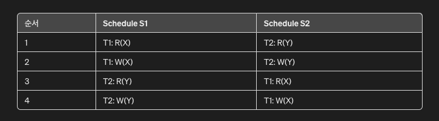

## database transaction schedule

## 스케줄 유형
- 완전한 스케줄은 각 트랜잭션에 대한 중단/롤백/커밋 작업을 포함하는 스케줄을 의미.
- 트랜잭션의 마지막 작업은 커밋 또는 중단이어야 함.
- Atomicity 하기 위해선 트랜잭션이 중단되면 수행된 모든 작업이 취소되어야 함.

### 유형 : 직렬 (Serial)
- 실행되는 스케줄이 중첩되지 않음.
- 한 트랜잭션이 끝나기 전에 다른 트랜잭션이 시작하지 않음.
- 일관성이 유지되지만, 동시성을 제한하기 때문에 처리량은 감소될 수 있음

### 유형 : 직렬가능 (Serializable)
- 결과가 Serial 과 동일함을 의미.
- 데이터 항목을 일관된 상태로 유지하는데 사용.
  - 동시에 발생하는 트랜잭션들의 스케줄의 정확성을 위한 주요 기준이며, 모든 일반 목적의 디비 시스템에서 지원.
  - 직렬가능하지 않은 스케줄은 잘못된 결과를 초래할 가능성이 있음

## 트랜잭션 충돌조건 (Conflicting actions)
- 세가지 조건을 만족해야 한다.
  - 다른 트랜잭션에 속할 것
  - 최소 하나는 쓰기 작업이 될 것
  - 같은 데이터 객체에 대한 접근을 할 것
- 충돌작업이 디비에 실제 적용되면 `materialized` 되며, 충돌이 발생했지만 디비에 적용되지 않으면 `non-materialized` 상태로 남음.
  - `materialized` : 디비 컨텍스트에서 쿼리의 결과가 실제 디비에 저장된 상태
  - `non-materialized` : 쿼리의 결과가 임시로 계산되고 저장되지 않은 상태

## 충돌 동등성 (Conflict equivalence)

- 2개의 트랜잭션 스케줄이 서로 다른 순서로 수행되더라도 같은 결과를 내는 경우.
- 스케줄 S1, S2 가 모두 동일한 트랜잭션 집합을 포함. 순서가 다름.
- 충돌하는 작업 쌍이 동일하기 때문에 충돌 동등.

## 충돌 직렬가능성 (Conflict-serializable)
- 하나의 스케줄이 하나 이상의 직렬 스케줄과 충돌 동등한 경우를 의미.

## 참고링크
* https://en.wikipedia.org/wiki/Database_transaction_schedule#cite_note-:0-4