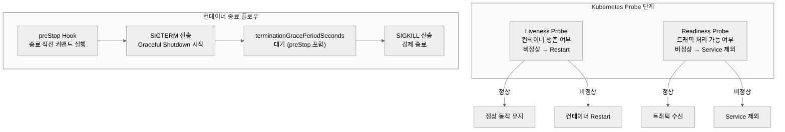

## k8s probe
probe 를 두가지 종류가 있다. readiness probe, liveness probe.
- Readiness Probe: 파드를 서비스 트래픽 대상에서 포함/제외
- Liveness Probe: 비정상 파드를 감지하여 재시작

   
## liveness probe 
* 컨테이너가 정상적으로 살아있는지 확인
* 정상적이지 않은 컨테이너라면 restart 수행
* 애플리케이션 구동시점에 `initialDelaySeconds` 만큼 기다리고 probe 검사 수행
* 만약 애플리케이션 실제 시작시간 보다 짧으면 `periodSeconds` 주기로 실행되며 pod failed 과 restart 가 일어날 수 있음
* 애플리케이션 뜨는 시간 및 웜업을 고려하여 `initialDelaySeconds` 를 주도록 한다.
  * (프로젝트마다 구동되는 시간이 다를 수 있음)

   
## readiness probe
* 컨테이너가 정상적으로 응답을 줄 수 있는지 확인
* 정상적이지 않은 컨테이너라면 svc 에서 서비스 제외 → 트래픽 차단.
* 애플리케이션 구동시점에 `initialDelaySeconds` 만큼 기다린다.
* 만약 애플리케이션 실제 시작시간보다 짧으면 `periodsSeconds` 주기로 실행되며 pod failed 과 서비스 제외가 될 수 있음
* 애플리케이션 뜨는 시간 및 웜업을 고려하여 `initialDelaySeconds` 를 주도록 한다.
  * (프로젝트마다 구동되는 시간이 다를 수 있음)

   
## preStop
* 컨테이너가 종료되기 직전에 명령을 실행하도록 하는 hook
* k8s 가 컨테이너에게 SIGTERM 을 전송하기 이전에 preStop hook 을 먼저 실행
* 이후에 처리가 마무리되면 kubelet 은 컨테이너로 SIGTERM 이 전송된다. 
  * SIGTERM을 전달받은 애플리케이션은 그때 graceful shutdown 을 수행

   
## terminationGracePeriodSeconds
* `terminationGracePeriodSeconds` 은 preStop 의 시간까지 포함하고 있음
* (preStop 진행시간 + 추가시간) <= `terminationGracePeriodSeconds` 이 되어야 한다.
* 컨테이너가 아닌 애플리케이션은 이 시점에 graceful shutdown 을 수행
* `terminationGracePeriodSeconds` 이 지난 다음 kubelet 은 컨테이너로 SIGKILL 을 전송한다. → 강제종료

   
## 다이어그램 간단히 (chatGPT)
