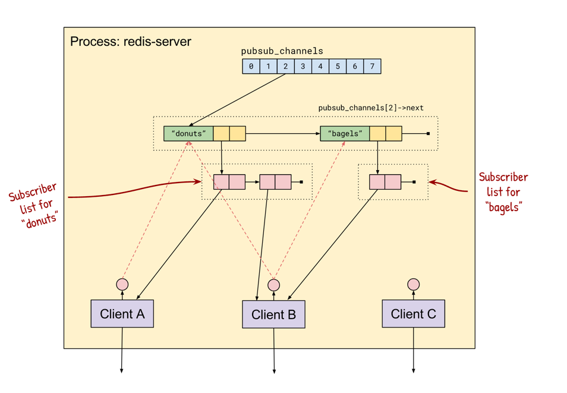
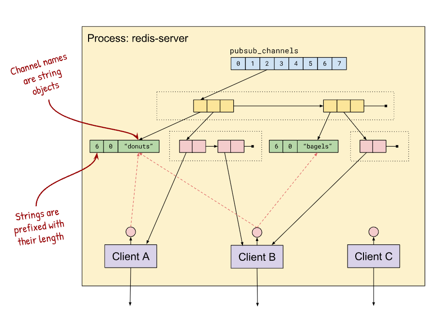

## 레디스 pub/sub 동작원리
[여기](https://jameshfisher.com/2017/03/01/redis-pubsub-under-the-hood/)를 전적으로 참고했다   
redis 오픈소스의 C 코드를 기반하여 설명되고 있어서 링크도 같이 첨부한다.

---
* 클라이언트가 SUBSCRIBE 명령어를 보내면 클라이언트 객체가 해당 채널에 추가된다.
  * dictAdd(server.pubsub_channels,channel,clients);
  * dictAdd 메소드는 element 를 해시테이블에 추가한다. [참고](https://github.com/redis/redis/blob/1d77a8e2c5e2322cc119af34a6685876af90effd/deps/hiredis/dict.c#L141)
* PUBLISH 를 수행하면 해시테이블에서 SUBSCRIBER 를 조회하고 각 클라이언트에게 메세지를 보낼 작업을 예약한다.
  * dictFind(server.pubsub_channels,channel); [참고](https://github.com/redis/redis/blob/unstable/deps/hiredis/dict.c#L255)
  * 메시지 전송작업 예약 [참고](https://github.com/redis/redis/blob/3.2.6/src/pubsub.c#L242-L245)
    * addReply(c,shared.mbulkhdr[3]);
    * addReply(c,shared.messagebulk);
    * addReplyBulk(c,channel);
    * addReplyBulk(c,message);
* 불가피하게 연결이 끊긴 경우에는 모든 채널을 방문하고 각 채널의 구독집합에서 클라이언트를 제거해야할 수 있다. 하지만 이건 비용이 비싸다.
  * 그래서 레디스는 pubsub_channels 구조체에 클라이언트가 어느 채널에 구독하였는지 추가적인 정보를 가지고 있다. 
  * 따라서 레디스는 클라이언트가 구독중인 채널만을 방문하여 pubsub_channels 구조체와 동기화를 수행한다.
* pubsub_channels 는 논리적으로 `Map<ChannelName, Set<Client>>` 형태를 가진다. 각 클라이언트의 구독 집합은 Set<ChannelName> 이다.
  * pubsub_channels 은 해시테이블이다.

---
* pubsub_channels 배열은 0 ~ 7 까지의 버킷을 가진 하나의 메모리 블록으로 할당된다. 
* 채널에 PUBLISH 하기위해, 채널의 이름을 해시하여 해당 채널의 버킷을 찾는다. 그리고 해당 채널의 클라이언트 집합을 순회한다.
* 하지만 서로 다른 채널의 이름이 동일한 버킷으로 해시될수가 있는데, 레디스는 이러한 충돌을 `Hash Chaining` 을 통해서 처리한다.
  * 각 버킷들이 채널에 `링크드리스트` 형태로 가지도록 처리.
  * **해시체이닝은 예전에 블로그에 공부차 기록해둔 내용이 있음. [참고](https://pasudo123.tistory.com/225)

#### pub/sub 상세 1
 
* 위 그림처럼 서로 다른 채널이 동일한 해시버킷, 2번을 가지고 있지만, 해시체이닝을 통해서 연결리스트로 채널이 관리되고 있음
* 그리고 클라이언트 집합도 채널 내에서 `링크드리스트` 형태를 가지고 있다.

#### pub/sub 상세 2
    
* 각 문자열은 해시객체 안에 있는 것처럼 보이지만 사실 문자열도 별도로 할당되어있다.
* 채널명, 구독 클라이언트가 각각 설정되어있음.

> 링크에선 더 많은 내용을 설명하고 있다. 하지만 내용적으로 복잡하다.   
> 디테일한 부분은 넘어갈 필요가 있다..
---

### redis pub/sub/unSub 의 시간복잡도
* PUB
  * 채널이름을 해싱하여 SUBSCRIBER 목록 찾는 과정이 필요하다. -> 해시테이블을 이용하기 때문에 O(1) 소요
  * 그리고 SUBSCRIBER 목록을 순회해서 메시지를 전송해야 한다. -> O(N) 소요 : 채널의 구독자 수가 적기 때문에 시간복잡도는 상대적으로 낮을 수 있다.
* SUB
  * 채널을 SUB 하기 위해 해시테이블에 SUBSCRIBER 목록을 찾는 과정이 필요하다. -> O(1) 소요
  * SUBSCRIBER 목록의 가장 맨 뒤에 새롭게 추가되어야 한다. -> O(1) 소요 : 링크드리스트 요소 추가이기 때문에 상수시간 소요된다.
* UN-SUB
  * 채널을 UN-SUNB 하기 위해 해시테이블에 SUBSCRIVER 목록을 찾는 과정이 필요하다. -> O(1) 소요
  * SUBSCRIBER 목록에서 UN-SUBSCRIBER 를 수행할 클라이언트를 찾는 과정이 필요하다. -> O(N) 소요
  