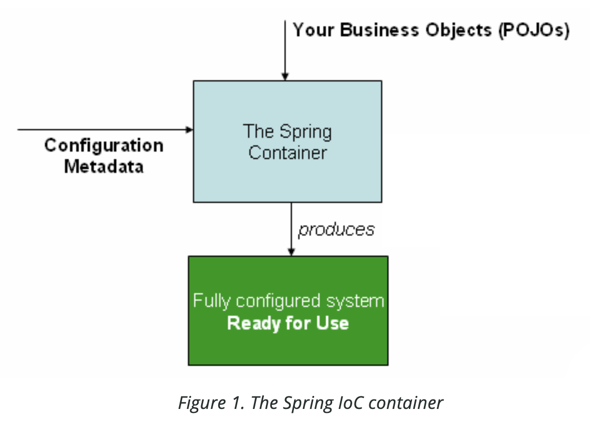

## 1회차, 스프링 도큐먼트 공부

## (1) Introduction to the Spring IoC Container and Beans
* org.springframework.beans 와 org.springframework.context 패키지는 스프링 프레임워크의 IoC컨테이너 기반이다.
* BeanFactory 는 Spring IoC컨테이너의 핵심 인터페이스다.
* BeanFactory 는 Bean 객체의 생성/구성/관리를 처리한다.
    * 하지만 기본적인 기능만 제공하고 있기 때문에 더 많은 기능을 사용하고자 하는 경우에는 `ApplicationContext` 를 이용해야 한다.
    * `ApplicationContext` 는 BeanFactory 의 상위집합 개념이다. (`ApplicationContext` 는 BeanFactory 의 하위 인터페이스)
    * 다음과 같은 추가기능을 제공한다.
        * Spring AOP 기능과 쉬운 통합
        * 메시지 리소스 처리
        * 이벤트 처리
        * 웹 애플리케이션 환경에서 WebApplicationContext 같은 레이어별 컨텍스트 제공
* 스프링에서 IoC컨테이너에 의해 관리되는 객체들은 빈(Bean) 이라고 부른다.

## (2) Container Overview
* ApplicationContext 인터페이스는 IoC컨테이너 그 자체를 표현하고 Bean 을 instantiating/configuring/assembling 한다.
  * instantating: 인스턴스화
  * configuring: 구성 및 설정 관리
  * assembling: 의존관리와 모듈설정
* ApplicationContext 는 configuration metadata 를 읽음으로써, 앞선 행위를 수행할 수 있다. 그리고 configuration metadata 를 설정하는 방법에는 여러가지가 존재한다. e.g. XML, Java annotations, Java code 등


비즈니스 오브젝트가 설정 메타데이터와 SpringContainer 를 만나서 Bean 으로 처리됨을 보여주고 있다.

--- 

#### ClassPathXmlApplicationContext : ApplicationContext 사용방법
* 전통적으로 XML 에 메타데이터 구성요소를 정의함으로써 빈을 생성/관리할 수 있는 IoC컨테이너
* xml 구성을 위해선 별도 xml 파일을 만들고 거기에 `<bean>` 태그를 붙여서 설정하여야 한다.

__sample.xml__
```xml
<?xml version="1.0" encoding="UTF-8"?>
<beans xmlns="http://www.springframework.org/schema/beans"
       xmlns:xsi="http://www.w3.org/2001/XMLSchema-instance"
       xsi:schemaLocation="http://www.springframework.org/schema/beans
		https://www.springframework.org/schema/beans/spring-beans.xsd">

    <bean id="coffeeService" class="com.example.springdocumenttraining.chapter01.CoffeeService">
        <property name="coffeeRepository" ref="coffeeRepository"/>
        <!-- <constructor-arg name="coffeeRepository" ref="coffeeRepository"/> -->
    </bean>

    <bean id="coffeeRepository" class="com.example.springdocumenttraining.chapter01.CoffeeRepository"/>
</beans>
```

__CoffeeService.kt__   
xml 파일에 `<property>` 로 설정하였을 때, `lateinit var` 키워드를 이용해서 설정 의존성 주입 가능
```kotlin
class CoffeeService {

    lateinit var coffeeRepository: CoffeeRepository

    fun getCoffee(): Coffee {
        return coffeeRepository.findCoffee()
    }
}

class CoffeeRepository {

    fun findCoffee(): Coffee {
        return Coffee(
            name = "아메리카노",
            price = (Random.nextLong(100000) / 100)
        )
    }
}
```

xml 파일에 `<constructor-arg>`로 설정하였을 때, 생성자 인자로 의존성 주입 가능
```kotlin
class CoffeeService(
    private val coffeeRepository: CoffeeRepository
) {

    fun getCoffee(): Coffee {
        return coffeeRepository.findCoffee()
    }
}
```

__ApplicationRunner.kt__   
스프링부트 애플리케이션이 뜨는 시점에서 xml 파일을 이용해서 빈을 등록하고 조회한다.
```kotlin
@Component
class Chapter01Runner: ApplicationRunner {

    private val log = LoggerFactory.getLogger(javaClass)

    override fun run(args: ApplicationArguments?) {
        val context = ClassPathXmlApplicationContext("xmlbeans/sample.xml")

        with(context) {
            log.info("- beanDefinitionCount=${this.beanDefinitionCount}")
            log.info("- beanDefinitionNames=${this.beanDefinitionNames.toList()}")
            val coffeeServiceBean = this.getBean("coffeeService") as CoffeeService
            log.info("- coffServiceBean=${coffeeServiceBean.javaClass}")
            val coffeeRepositoryBean = this.getBean("coffeeRepository") as CoffeeRepository
            log.info("- coffeeRepositoryBean=${coffeeRepositoryBean.javaClass}")
        }
    }
}
```

```console
// 출력되는 값
- beanDefinitionCount=2
- beanDefinitionNames=[coffeeService, coffeeRepository]
- coffServiceBean=class com.example.springdocumenttraining.chapter01.CoffeeService
- coffeeRepositoryBean=class com.example.springdocumenttraining.chapter01.CoffeeRepository
```

--- 

#### GenericGroovyApplicationContext : ApplicationContext 사용방법
그루비 언어를 통해서도 bean 주입이 가능하다.   

___sample.groovy___
```groovy
beans {
    coffeeRepository(CoffeeRepository)
    coffeeService(CoffeeService, coffeeRepository)
}
```

__ApplicationRunner.kt__   
아래처럼 설정할 수 있다. 나머지는 이전 코드와 동일하다.
```kotlin
@Component
class Chapter01Runner : ApplicationRunner {

    private val log = LoggerFactory.getLogger(javaClass)

    override fun run(args: ApplicationArguments?) {
        // groovy 를 쓰기 위해선 'org.codehaus.groovy:groovy-all:3.0.19' 를 추가.
        val context = GenericGroovyApplicationContext("groovybeans/sample.groovy")
    }
}
```

> 하지만 우리가 애플리케이션 코드 내에서 getBean() 메소드를 호출할 일이 없음. 스프링 웹 프레임워크 같은 경우 의존성 주입이 자동적으로 제공되기 때문에 별도 개발자가 액션을 취할일은 없음

## (3) Bean Overview
Bean 의 메타데이터 설정정보를 확인하려면 BeanDefinition 객체를 이용하여 확인이 가능하다.
```kotlin
private fun ClassPathXmlApplicationContext.check() {
    val context = this


    with(context.beanFactory.getBeanDefinition(COFFEE_SERVICE)) {
        log.info("coffeeService.beanClassName=${this.beanClassName}")
        log.info("coffeeService.factoryBeanName=${this.factoryBeanName}")
        log.info("coffeeService.description=${this.description}")
        log.info("coffeeService.scope=${this.scope}")
        log.info("coffeeService.resolvableType=${this.resolvableType}")
        log.info("coffeeService.singleton=${this.isSingleton}")
    }
}
```
* Instantiating Beans
  * 정의된 메타데이터를 확인하여 빈을 생성함
  * [생성자를 통해서 만들 수 있음](https://docs.spring.io/spring-framework/reference/core/beans/definition.html#beans-factory-class-ctor)
  * [스태틱 팩토리 메소드를 통해서 만들 수 있음](https://docs.spring.io/spring-framework/reference/core/beans/definition.html#beans-factory-class-static-factory-method)
  * [정의된 팩토리 빈을 통해서도 만들 수 있음](https://docs.spring.io/spring-framework/reference/core/beans/definition.html#beans-factory-class-instance-factory-method)
    * FactoryBean<T> 를 implementation 하여 재구현도 가능함.
#### Bean Naming
* id, name 을 사용하여 빈의 이름을 {N}개 이상 표현할 수 있지만 실제 고유한 식별자는 id 만 가능하다.

## 정리1 : IoC 컨테이너를 이용하지 않더라도 DI 를 구현할 수 있다.
* DI 를 구현하는 방법에는 생성자주입/세터주입/필드주입 등이 존재한다.
* 스프링프레임워크는 DI 를 구현하려고 IoC 컨테이너를 이용하였다.

__샘플코드__
```kotlin
// 공통 인터페이스
interface MyService {
    fun task()
}

class MyCoffeeService : MyService {
    override fun task() {}
}

class MySnackService : MyService  {
    override fun task() {}
}
```

__생성자주입__
```kotlin
fun main() {
    // 생성자 DI : MyCoffeeService 주입
    var myController = MyController(MyCoffeeService())
    myController.index()

    // 생성자 DI : MySnackService 주입
    myController = MyController(MySnackService())
    myController.index()
}

class MyController(
    private val myService: MyService
) {

    fun index() {
        myService.task()
    }
}
```

__세터주입__
```kotlin
fun main() {

    // 세터 DI : MyCoffeeService 주입
    var myController = MyController().apply {
        this.setMyService(MyCoffeeService())
    }
    myController.index()

    // 세터 DI : MySnackService 주입
    myController = MyController().apply {
        this.setMyService(MySnackService())
    }
    myController.index()
}

class MyController{

    private lateinit var myService: MyService

    fun setMyService(myService: MyService) {
        this.myService = myService
    }

    fun index() {
        myService.task()
    }
}
```

## 정리2 : DI 가 없다면 할 수 없는게 많아진다.
* 위 코드와는 반대로 DI 하지 않고 내부 필드에서 초기화한다면 아래 불편함이 생긴다.
    * 결합도가 높은 코드가 될 수 있음
    * 모의객체를 주입하지 못하기 때문에 테스트가 어려움
    * 코드의 재사용이 어려움 (HAS-A 관계)

__DI 가 없는 코드__
```kotlin
fun main() {
    val myController = MyController()
    myController.index()
}

class MyController{

    // 높은 결합도
    private val myService: MyService = MyCoffeeService()

    fun index() {
        myService.task()
    }
}
```

## 정리3 : DI 와 DIP(Dependency Inversion Principle) 는 서로 다른 개념이다.
* DI 는 의존성을 주입하는 것
* DIP 는 의존성 역전 원칙인데, 이를 위해 DI 를 사용한다.
    * 고수준의 모듈이 저수준의 모듈에 의존성을 가지지 않고, 저수준의 추상화된 모듈에 의존성을 가짐으로 컴파일이 아닌 런타임시에 의존관계가 달라진다.

__DIP 로 작성된 코드__
```kotlin
interface DiscountPolicy {
    fun discount(): Long
}

class AmountDiscountPolicy : DiscountPolicy {
    override fun discount(): Long {
        TODO("Not yet implemented")
    }
}

class PercentDiscountPolicy : DiscountPolicy {
    override fun discount(): Long {
        TODO("Not yet implemented")
    }
}

class NoneDiscountPolicy : DiscountPolicy {
    override fun discount(): Long {
        TODO("Not yet implemented")
    }
}

class MovieDiscountService(
    private val discountPolicy: DiscountPolicy
) {

    fun discountFrom(product: Any) {
        discountPolicy.discount(/** 파라미터 설정 **/)
    }
}
```
* 고수준의 MovieDiscountService 모듈은 저수준 AmountDiscountPolicy, PercentDiscountPolicy, NoneDiscountPolicy 를 의존하지 않는다.
* 추상화된 개념의 DiscountPolicy 를 의존한다. 결국 `고수준 모듈 --> 고수준 모듈` 로 처리된다.
* 추상화를 통해 저수준 모듈을 의존성을 관계를 역전시킬 수 있다.

## 참고
* [DI는 IoC를 사용하지 않아도 된다](https://jwchung.github.io/DI%EB%8A%94-IoC%EB%A5%BC-%EC%82%AC%EC%9A%A9%ED%95%98%EC%A7%80-%EC%95%8A%EC%95%84%EB%8F%84-%EB%90%9C%EB%8B%A4)
* [IS-A, HAS-A 관계](https://pasudo123.tistory.com/24)
* [Object 서적](https://github.com/coding-buddha/object-by-kotlin)