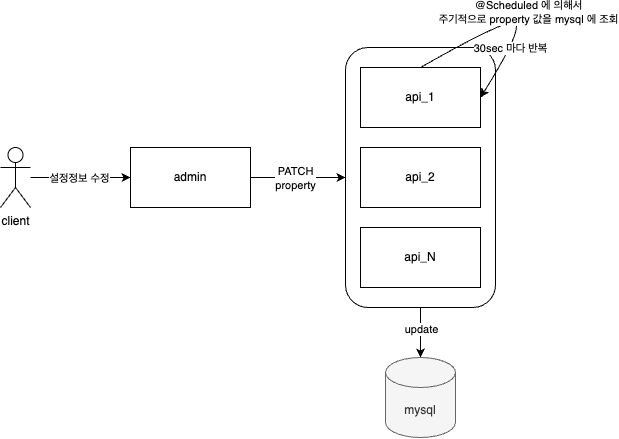
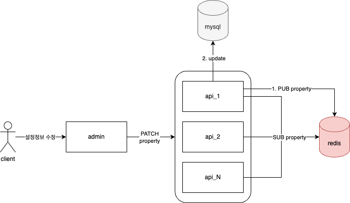

# redis pub/sub 이용하여 설정정보를 서버 N 개에 적용하는 방법
* 어드민에서 설정한 정보들을 서버에 반영하기 위해선 어떻게 하는게 좋을까?   
* 서버가 1대면 상관없지만 N대의 서버에서는 일괄적으로 설정정보를 적용하기 위해 나는 스프링에서 제공하는 @Schedule 애노테이션을 이용했다.
* `하지만` 이번에 스터디를 진행하면서 다른 스터디원분들은 어떻게 하는지 질문을 했고, redis pub/sub, etcd 얘기가 나왔다. 
* `그래서` 이번에 나는 redis pub/sub 을 이용해보기로 했다.

## AS-IS
아래의 그림은 처음에 내가 N개의 서버에 설정정보를 반영하기 위해서 처리했던 방법이다.   
<kbd></kbd><br>

* 어드민에서 설정값을 수정하면 API 는 이를 받아서 수정하고 MySQL 에 반영하고, 변경된 값은 로컬에 저장해둔다.
* API 내부에 별도 스케줄러는 {N}sec 마다 스케줄링 되면서 MySQL 의 데이터를 조회하여 로컬에 저장된 값에 덮어쓴다.
* 해당 방법을 하면 주기적으로 MySQL 에 요청쿼리가 날라가고 스토리지에 부담이 생긴다.
* 그리고 외부에서 별도로 제어할 수 있는 방법이 없다. 내부에서 알아서 스케줄링이 되고 있는 상태다.

## TO-BE
레디스 pub/sub 을 이용했다.   
<kbd></kbd><br>

* API 는 받아서 바로 MySQL 에 저장하지 않고 redis 에 변경된 설정값을 pub 한다. 이후에 MySQL 에 저장한다.
* 나머지 API 들 (pub 을 수행한 API 포함)은 redis 를 sub 하다가, 메시지를 전달받고 각자의 로컬에 변경된 설정값을 덮어쓴다.
* 위처럼 했을 때, 혹시 redis 서버가 중간에 끊겨서 sub 을 제대로 못하는 상황이 발생되면 어떻게 되는가? 였다.
    * 우선 바로 인지하는 건 어렵다고 판단이 든다.
    * 다만 Lettuce 에는 ConnectionWatchdog 가 있는데, Redis 클라이언트와 서버의 연결상태를 모니터링하고, 연결이 끊겼다는 것을 로깅한다. 
    * 그리고 재연결을 시도하면서 다시 연결이 되면 재연결이 되었다고 알려준다. 알아서 HealthCheck 를 수행하고 있다.
    * 결과적으로 Lettuce 의 ConnectionWatchdog 는 연결이 끊겨서 재연결을 애플리케이션 레벨에서 따로 조작할 필요 없이 라이브러리에게 맡기면 된다.

## Line LIVE
[Redis Pub/Sub을 사용해 대규모 사용자에게 고속으로 설정 정보를 배포한 사례](https://youtu.be/CENLaIz2Yb8)
* 위 영상을 보면 Line 에서는 Redis pub/sub 을 이용해서 설정정보를 처리했다고 한다.
* 그리고 설정된 정보를 MySQL 에 바로 저장하지 않고 배치시스템에서 redis 의 정보를 읽어다가 mysql 에 쌓고 있다고 한다.
* 다만 중간에 sub 이 끊여서 데이터를 전송받지 못한 경우는 어떻게 하는지 디테일하게 이해하기 어려웠다.
    * lettuce 가 아닌 다른 클라이언트 jedis 의 경우에는 주기적으로 ping 을 publish 하고 못받는 경우 reconnect 한다는 것 같다.
    * `그러면 결국 받지 못한 데이터는 어디서 어떻게 다시 받는 거지? 라는 의문이 든다.` -> MySQL 에서 다시 땡겨오는 것인가?

## Lettuce events
* Lettuce 에 레디스 서버와의 커넥션 발생 이벤트를 리스너로 등록할 수 있는 기능이 제공된다.
    * [before 3.4/4.1](https://lettuce.io/core/release/reference/#events.before-3.44.1)
    * [since 3.4/4.1](https://lettuce.io/core/release/reference/#events.since-3.44.1)

__spring-redis-data 에서 LettuceConnectionFactory 를 이용해서 만들 수 있다.__
* {} 안에 로그를 찍으면 레디스 연결/끊음/재연결 등의 이벤트를 확인할 수 있다.
* 아래 코드가 적절한 코드인지 몰라서 spring-redis-data 오픈소스쪽에 질문했다. 
    * https://github.com/spring-projects/spring-data-redis/issues/2685
```kotlin
private fun LettuceConnectionFactory.applyNotifyListener() {
    this.requiredNativeClient.addListener(object : RedisConnectionStateListener {
        override fun onRedisConnected(connection: RedisChannelHandler<*, *>?, socketAddress: SocketAddress?) {
            super.onRedisConnected(connection, socketAddress)
        }

        override fun onRedisDisconnected(connection: RedisChannelHandler<*, *>?) {
        }
        override fun onRedisExceptionCaught(connection: RedisChannelHandler<*, *>?, cause: Throwable?) {}
    })
}

private fun LettuceConnectionFactory.applyEventBus() {
    this.connection
    val eventBus = this.requiredNativeClient.resources.eventBus()
    eventBus.get().subscribe { event ->
        when (event) {
            is ConnectEvent -> {}
            is ConnectedEvent -> {}
            is ConnectionActivatedEvent -> {}
            is ConnectionCreatedEvent -> {}
            is ConnectionDeactivatedEvent -> {}
            is DisconnectedEvent -> {}
            is ReconnectAttemptEvent -> {}
            is ReconnectFailedEvent -> {}
            else -> {}
        }
    }
}
```

## 결론
* redis pub/sub 이용 시에 특정 sub 이 레디스 연결이 끊겨서 전달받지 못하면, 해당 이벤트 리스너를 이용해서 재전달 받을 수 있도록 처리를 해주면 될 것 같다.
* 좀 더 간단하게 쓸 수는 없을까? 가령 스프링부트에서 제공하는 @EventListener 를 이용해서도 처리할 수 있지 않을까? -> 테스트한 결과 가능하다. (아래는 샘플코드)

## Lettuce Event + @EventListener 를 조합한 샘플코드
#### ApplicationEventPublisher 등록
(1) 과 (2) 중에 하나를 고르면 된다.
```kotlin
// Lettuce EventBus 를 등록하고, 이벤트 전송
@Configuration
class CustomRedisConfiguration(
    private val eventPublisher: ApplicationEventPublisher,
) {

    // (1) connectionFactory 를 이용한 eventBus 이용
    private fun LettuceConnectionFactory.applyEventBus() {
        this.connection
        val eventBus = this.requiredNativeClient.resources.eventBus()
        eventBus.get().subscribe { event ->
            eventPublisher.publishEvent(CustomREvent(event))
        }
    }

    // (2) clientConfiguration.clientResources 를 이용한 eventBus 이용
    this.clientConfiguration.clientResources.ifPresent {
        it.eventBus().get().subscribe { event ->
            eventPublisher.publishEvent(CustomREvent(event))
        }
    }
}
```

#### 이벤트 리스너 등록
```kotlin
// 이벤트 전송을 위한 페이로드 객체
data class CustomREvent (
    val event: Event
) { /** 자세한 메소드 내용은 생략 */ }
```

#### @EventListener 이용
```kotlin
// @EventListener 등록 후, 로깅
@Component
class CustomRedisEventWatcher {

    private val log = LoggerFactory.getLogger(javaClass)

    @EventListener
    fun handleRedisEvent(rEvent: CustomREvent) {
        val line = StringBuilder().apply {
            this.appendLine()
            this.appendLine("event-state=${rEvent.currentState()}")
            this.appendLine("event-redis-uri=${rEvent.getRedisUriOrEmpty()}")
            this.appendLine("event-remote-address=${rEvent.getRemoteAddressOrEmpty()}")
        }
        if (rEvent.currentState() == CustomREvent.RState.NONE) {
            log.error("event check!! : ${rEvent.getInfoOrNull()}")
            return
        }
        log.info(line.toString())
    }
}
```