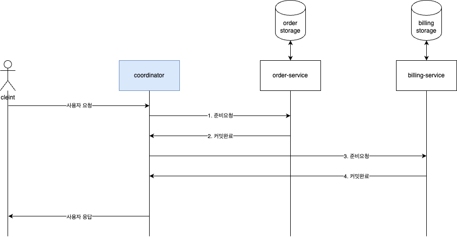

## 2 phase commit protocol (=2PC)
- 2PC 라고 부른다. (줄임말)
- 분산 시스템의 모든 참여노드가 트랜잭션의 성공/실패를 합의(agreement) 에 이르게 하는 원자성 보장 알고리즘.

## 2PC 단계
두 단계로 나뉜다.
- (1) 준비단계 (prepare phase)
  - 코디네이터(`트랜잭션을 관리하는 중앙노드`)는 모든 참여노드에 트랜잭션 실행을 준비하라는 요청을 전송.
  - 참여노드들은 트랜잭션을 실행할 수 있는지 검사하고, 실행이 가능하다면 필요한 자원들을 예약. 만약 어떤 이유로 준비가 되지 않았을 경우에는 N(아니오) 로 투표 수행.
- (2) 커밋/롤백 단계 (commit/rollack phase)
  - 코디네이터는 모든 참여노드들로부터 Y(예) 투표를 받으면 커밋을 진행. 그 후 모든 참여노드에게 커밋 명령을 보내고, 각 노드는 트랜잭션을 커밋하고 결과를 코디네이터에게 보고.
  - 만약 참여노드 중에서 하나라도 N(아니오) 를 투표하거나 응답이 없는 경우는 코디네이터를 롤백을 진행. 그리고 모든 참여노드에게 롤백 명령을 보내도록 요청처리.

## 2PC 의 장단점
- 장점
  - `원자성 보장` : 모든 노드가 커밋을 수행하거나 모두 롤백을 수행하여 트랜잭션의 원자성을 유지.
  - `일관성 유지` : 데이터베이스의 일관성/무결성을 유지
- 단점
  - `성능 저하` : 모든 참여노드의 응답을 기다려야 한다. 따라서 트랜잭션이 완료되는 데까지 지연이 발생.
  - `블로킹 문제` : 모든 참여노드의 동의여부 필요. 참여노드의 응답을 기다리기 때문에 시스템이 블록킹 상태에 빠질 수 있음.
    - 코디네이터의 중앙집중적 역할
    - 노드의 응답대기

## 구현 다이어그램

   
- OrderService, BillingService 로 요청구문에는 모두 익셉션 처리를 한다.
- 익셉션 발생 시, 롤백처리를 한다.
  - OrderService 요청에 익셉션 발생 시, OrderStorage 는 롤백되고 사용자에게 실패응답을 준다.
  - BillingService 요청에 익셉션 발생 시, OrderService 에 롤백요청을 하도록 한다. 
    - OrderService 롤백이 되면 사용자에게 실패응답을 준다.
    - OrderService 에 롤백요청이 실패되는 케이스를 고려. 코디네이터에서 자체적으로 전체 트랜잭션 성공/실패 여부를 관리한다.
    - 그래서 주기적으로 코디데이터가 트랜잭션 시작 시, 결과여부를 별도로 저장하고 트랜잭션 틀어지는 부분을 맞추도록 스케줄링 처리되도록 한다. -> `이 방법 말고 다른 방법이 있을까?`
  - OrderService, BillingService 요청은 성공했으나 코디네이터에서 결과여부 처리 시, 실패했을때는 어떻게 할 것인가?
    - (1) 코디네이터는 참여노드가 다 성공했기 때문에 retry 를 통해 전체 트랜잭션을 성공처리
    - (2) 참여노드가 다 성공하였더라도 코디네이터 단에서 실패되었기 때문에 실패처리, 사용자 실패응답을 준다.
      - OrderService, BillingService 모두 롤백처리가 되어야한다. 

## 참고링크
- [Two-phase_commit_protocol](https://en.wikipedia.org/wiki/Two-phase_commit_protocol)