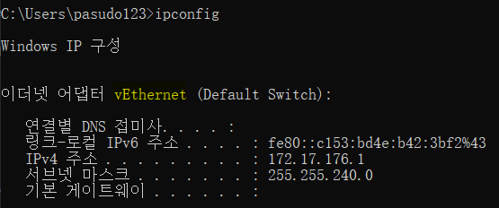
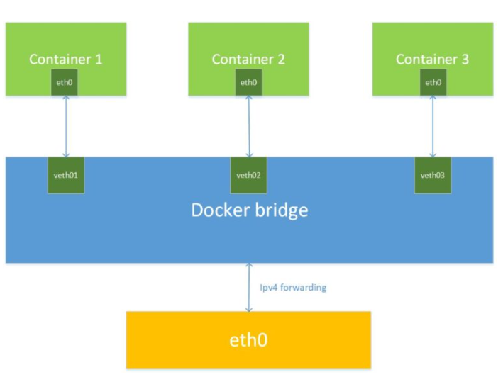
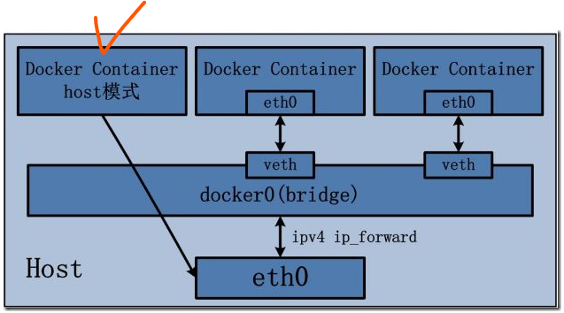
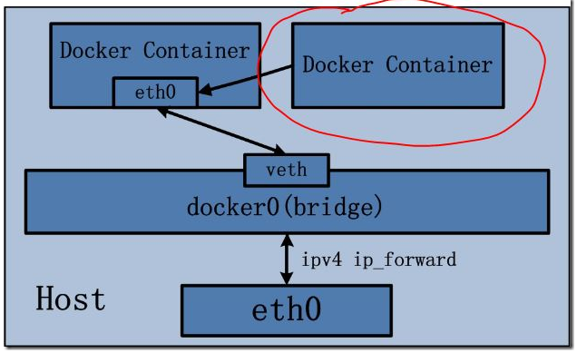
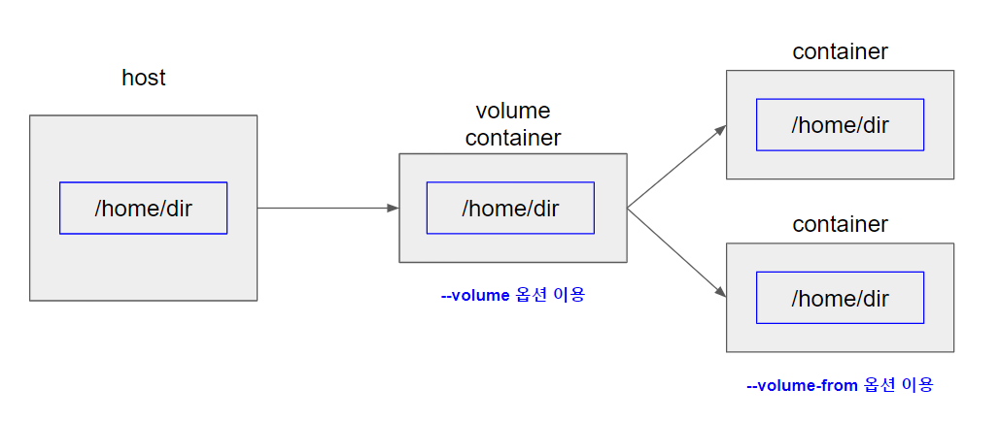

# docker-zero-to-all
* 도커를 정리.

<BR>

## <a id="index"></a>index
* [docker 기본개념](https://pasudo123.tistory.com/398)
* [docker 컨테이너를 외부에 노출](#how-to-expose-to-external-that-container-of-docker)
* [Dockerfile 작성하기](#how-to-write-way-docker-file)
* [docker command](#docker-command-text)
    * [docker attach command](#docker-attach-command)
    * [docker build command](#docker-build-command)
    * [docker build command option](#docker-build-command-option)
    * [docker image command](#docker-image-command)
        * rm, prune
    * [docker images command option](#docker-images-command-option)
    * [docker container command](#docker-container-command)
    * [docker container command option](#docker-container-command-option)
    * [docker run command](#docker-run-command)
        * [docker network](#docker-network)
    * [docker run command option](#docker-run-command-option)
    * [docker inspect command : 도커 로우레벨 정보를 반환한다.](https://docs.docker.com/engine/reference/commandline/inspect/)
    * [docker ps](#docker-ps-command)
    * [docker start / restart](#docker-start-restart)
    * [docker search : 도커허브에서 이미지를 조회한다.](https://docs.docker.com/engine/reference/commandline/search/)
    * [docker commit : 컨테이너 변경사항에 대한 새로운 이미지를 생성한다.](https://docs.docker.com/engine/reference/commandline/commit/)
    * [docker port : 컨테이너의 port 와 매핑된 호스트 port 조회](https://docs.docker.com/engine/reference/commandline/port/)
    * [docker system df](#docker-system-df)
* [도커 컴포즈](#docker-compose)
    * [도커 컴포즈 개념 및 설치](#docker-compose-concept-install)
    * [도커 컴포즈 기본 명령어](#docker-compose-cmd)
    * [도커 컴포즈 활용 명령어](#docker-compose-advanced-cmd)
* [궁금한 것들](#wonder)
    * [컨테이너 접속 이후 ctrl + P,Q 와 exit 의 차이는 무엇인가](#ctrl-vs-exit)
    * [도커 볼륨 : 호스트 볼륨(bind mount) 시, 호스트 디렉토리와 컨테이너 디렉토리 간의 마운트 설명](#host_mount)
    * [도커의 두가지 구성 : 도커 클라이언트 및 도커 데몬](#docker-client&docker-daemon)
* [도커 명령어 reference](https://docs.docker.com/engine/reference/commandline/docker/)

<BR>
<hr>
<BR>

## <a id="how-to-expose-to-external-that-container-of-docker"></a>docker 컨테이너를 외부에 노출하는 방법
* [목차이동](#index)
* 컨테이너는 가상IP 와 마찬가지로 가상 IP 주소를 할당받는다.
```shell
/ # ifconfig
eth0      Link encap:Ethernet  HWaddr 02:42:AC:11:00:02
          inet addr:172.17.0.2  Bcast:172.17.255.255  Mask:255.255.0.0
          UP BROADCAST RUNNING MULTICAST  MTU:1500  Metric:1
          RX packets:17 errors:0 dropped:0 overruns:0 frame:0
          TX packets:0 errors:0 dropped:0 overruns:0 carrier:0
          collisions:0 txqueuelen:0
          RX bytes:1382 (1.3 KiB)  TX bytes:0 (0.0 B)

lo        Link encap:Local Loopback
          inet addr:127.0.0.1  Mask:255.0.0.0
          UP LOOPBACK RUNNING  MTU:65536  Metric:1
          RX packets:0 errors:0 dropped:0 overruns:0 frame:0
          TX packets:0 errors:0 dropped:0 overruns:0 carrier:0
          collisions:0 txqueuelen:1000
          RX bytes:0 (0.0 B)  TX bytes:0 (0.0 B)
```
* 기본적으로 도커는 컨테이너에 172.17.0.x 의 IP 를 순차적으로 할당받는다.
* 도커의 NAT IP 인 172.17.0.2 가 존재
* eth0 인터페이스, lo 로컬호스트 인터페이스가 있다.
* 외부에 컨테이너를 노출시키기 위해선 호스트 포트와 컨테이너 포트가 바인딩되어야 한다.
    * [docker container command 참고 : docker run ~](#docker-ps-command)
* __유의점__
    * 컨테이너 내부의 __서비스가__ 어떤 포트로 동작되고 있는지 파악해야 한다.
    * 가령, 웹서버 nginx 컨테이너를 띄어놓고 호스트와 컨테이너의 포트 바인딩을 `80:81` 로 하였다면 컨테이너의 `81` 포트는 현재 컨테이너에 있는 `80` 포트로 띄어진 nginx 프로세스에 연결되지 못하기 때문에 접근이 안된다.
```
// 특정한 컨테이너의 포트 바인딩 조회
PS C:\Users\pasudo123> docker port {container-id}
14480/tcp -> 0.0.0.0:14480
{dest-port}/tcp -> 0.0.0.0.{sour-port}

// 0.0.0.0 은 호스트의 활용 가능한 모든 네트워크 인터페이스에 바인딩함을 의미.
// 호스트의 어떤 IP 로 {sour-port} 를 접근하든 컨테이너의 {dest-port} 에 연결
```
   
<BR>

## <a id="how-to-write-way-docker-file"></a>Dockerfile 작성하기
* [목차이동](#index)
* [Dockerfile 작성하는 최선의 방법에 대한 관련 링크](https://docs.docker.com/develop/develop-images/dockerfile_best-practices/)
* context (컨텍스트)
    * Dockerfile 과 같은 디렉토리에 있는 모든 파일들은 컨텍스트라고 한다. (context)
* ADD vs COPY 
    ```shell
    COPY requirements.txt /tmp/
    RUN pip install --requirement /tmp/requirements.txt
    COPY . /tmp/
    ```
    * 둘이 사용방법은 동일하다.
        * `COPY test.html /home/`
        * `COPY ["test.html", "/home/"]`
    * `결론부터 말하면 COPY 를 애용` 하자.
    * __ADD__
        * 파일을 이미지에 추가한다. 추가하는 파일은 Dockerfile 이 위치한 Context 가 기본경로인 상태에서 추가한다.
        * __외부 URL 및 tar 파일도 추가할 수 있다.__
        * `ADD http://example.com/big.tar.xz /usr/src/things/`
    * __COPY__
        * 로컬 디렉토리에서 읽어들인 Context 로부터 이미지에 파일을 복사하는 역할
        * __로컬 파일만 이미지에 추가할 수 있다.__
    * ADD 를 이용하게 되면 실질적으로 이미지에 추가하는 파일이 어떤 것인지 확신하기 어렵다. 
    * COPY 는 Context 로 부터 직접 파일을 추가하기 때문에 명확하다.
* CMD vs ENTRYPOINT
    * 
* [STOPSIGNAL](https://docs.docker.com/engine/reference/builder/#stopsignal)
    * 컨테이너가 정지될 때 사용될 시스템 콜의 종류를 지정한다.
    * 숫자도 가능하고 KILL SIGNAL 명칭도 가능하다. (`SIGTERM`, `SIGKILL` 등등)
* [HEALTHCHECK](https://docs.docker.com/engine/reference/builder/#healthcheck)
    * 이미지로부터 생성된 컨테이너에서 동작하는 애플리케이션의 상태를 체크하도록 설정한다. 컨테이너 내부에서 동작중인 애플리케이션의 프로세스가 종료되지는 않았으나 `애플리케이션이 동작하고 있지 않은 상태를 방지하기 위해 사용` 될 수 있다.

<BR>

## <a id="docker-command-text"></a>docker command
* [목차이동](#index)
```
// 도커 버전 확인
$ docker -v
```

<BR>

## <a id="docker-attach-command"></a>docker attach command
* [목차이동](#index)
```
// 특정 container 내부 접속
$ docker attach {container-name}
```

<BR>

## <a id="docker-build-command"></a>docker build command
* [목차이동](#index)
```
// 이미지 빌드 ( dot 표기 필요 : 현재 디렉토리의 Dockerfile 을 이용하기 때문)
$ docker build -t {name}:{tag} .

// 이미지 빌드 (만약 Dockerfile 명칭이 아닌 Dockerfile.real 인 경우, 끝에 온점을 붙여주도록 한다.)
$ docker build -t {name}:{tag} -f Dockerfile.real .
```

<BR>

## <a id="docker-build-command-option"></a>docker build command option
|name(shortcut)|description|example|
|-------------|-------------|-------------|
|--tag(-t)|{name}:{tag} 형식 이름 지정|`$docker build -t ubuntu:14.04 .`|
|--no-cache|image 빌드 시에, 이미지 레이어 캐시를 사용하지 않고 다시 빌드를 수행한다.|`docker build --no-cache -t mybuild:1.0`|
|--build-arg|image 빌드 시에 이미지내 사용할 수 있는 값을 동적으로 할당할 수 있다. Dockerfile 에서 ARG 로 받을 수 있다. |`docker build --build-arg HTTP_PROXY=http://10.20.30.2:1234 --build-arg FTP_PROXY=http://40.50.60.5:4567`|

<BR>

## <a id="docker-image-command"></a>docker image command
* [목차이동](#index)
```
// 도커 이미지 조회
$ docker images


// 도커 특정 이미지 삭제
$ docker rmi {image-id}


// 도커 미사용 이미지 전체 삭제
$ docker image prune


// 도커 REPOSITORY, TAG 가 <none> 값인 것 모두 삭제
$ docker rmi $(docker images -f "dangling=true" -q)
```

<BR>

## <a id="docker-images-command-option"></a>docker images command option
* [목차이동](#index)

|name(shortcut)|description|example|
|-------------|-------------|-------------|
|--filter(-f)|조건을 주고, 필터링해서 출력|`docker images --filter "dangling=true" // UNTAGGED IMAGES 를 출력한다.`|
|--no-trunc|출력을 자르지 않고 전체 다 보여줌|`docker ps (-a) --no-trunc`
|--quiet(-q)|숫자 ID 만 보여줌|`docker images --filter "dangling=true" -q // UNTAGGED IMAGES 에서 IMAGE ID 만 보여준다.`|

<BR>

## <a id="docker-container-command"></a>docker container command
* [목차이동](#index)
```
// 특정 이미지에 대한 컨테이너 생성 및 실행
$ docker create -i -t --name {custom-container-name} {image}
$ docker create -i -t --name mycustom centos:8
$ docker start {container-name}
$ docker start mycustom


// -d 옵션에 의해 백그라운드로 돌아가는 특정한 컨텐이너 접속 : 배시 셸을 쓸수 있도록 도와준다. (-i 와 -t 옵션이 필요하다.)
// container-id 입력 시 2~3 자리만 입력하여도 무방, 하지만 다른 동일한 2~3 자리 컨테이너 id 존재 시, 3~4 자리 입력을 권장함
// exec 는 실행중인 컨테이너에 대한 명령이다.
$ docker exec -it {container-id | container-name} /bin/bash
$ docker exec -i -t {container-id | container-name} /bin/bash


// 특정한 컨테이너 정지
$ docker stop {container-name}


// 특정한 컨테이너 삭제
$ docker rm {container-name} // 해당 컨테이너가 정지 되어 있지 않다면 삭제 안됨


// 특정한 컨테이너 [강제] 삭제
$ docker rm -f {container-name}


// 정지된 컨테이너 모두 삭제
$ docker container prune
```

<BR>

## <a id="docker-container-command-option"></a>docker container command option
* [목차이동](#index)

|name(shortcut)|description|example|
|-------------|-------------|-------------|
|--detach(-d)|백그라운드에서 컨테이너를 실행하고, 컨테이너 ID 를 출력한다.|`docker run -d -p 23340:14480 pasudo123/springboot-docker-basis`|
|--interactive(-i)|상호입출력이 가능하도록 한다.||
|--tty(-t)|tty를 활성화 해서 배시(bash) 셸을 사용하도록 한다.||


<BR>

## <a id="docker-run-command"></a>docker run command
* [목차이동](#index)
```shell
// 컨테이너 생성 및 실행
// sour-port : 호스트의 포트번호
// dest-port : 컨테이너의 포트번호
$ docker run -p {sour-port}:{dest-port} {image-name}:{tag-name}

// docker run : 호스트 볼륨 공유
// {host 공유 디렉토리}:{컨테이너 공유 디렉토리}
docker run -d -v /home/wordpress_db:/var/lib/mysql


// 볼륨 컨테이너를 만들고 해당 컨테이너와 볼륨 마운트를 수행
docker run -d --name new_container --volume-from {container-name}


// docker volume 생성 : 호스트와 컨테이너 간의 연결
$ docker volume create --name {volume-name}
$ docker volume create {volume-name}

// docker volume 조회
$ docker volume ls

// docker volume 삭제
$ docker volume rm {volume-name}

// docker 의 볼륨 정보 조회
$ docker volume inspect {volume-name}
$ docker inspect --type volume {volume-name}

[
    {
        "CreatedAt": "2020-12-24T16:35:56Z",
        "Driver": "local",  // 볼륨이 쓰는 드라이브
        "Labels": {},       // 볼륨을 구분하는 라벨
        "Mountpoint": "/var/lib/docker/volumes/customvolume/_data",     // 해당 볼륨이 실제로 호스트의 어디에 저장되었는지 의미
        "Name": "customvolume",    
        "Options": {},
        "Scope": "local"
    }
]

// 사용하지 않는 docker volume 제거
docker volume prune
```

<BR>

## <a id="docker-network"></a> docker-network
도커는 컨테이너 내부에 `ip` 를 순차적으로 할당하며, 해당 ip 는 컨테이너를 재시작 할 때마다 변경될 수 있다. 이 내부 `ip` 는 설치된 호스트, 즉 내부망에서만 쓸 수 잇는 ip 는 외부와 연결할 필요가 있다. 

이 과정은 컨테이너를 시작할 때마다 호스트에 `veth...` 라는 네트워크 인터페이스를 생성함으로써 이루어진다. `veth` 는 사용자가 직접 생성할 필요가 없으며 `도커엔진` 에 의해서 자동으로 생성된다.

```shell
// 도커 네트워크 조회
C:\Users\pasudo123>docker network ls
NETWORK ID     NAME      DRIVER    SCOPE
23de2428e6da   bridge    bridge    local
90dc82501c19   host      host      local
2f66b7e39ac8   none      null      local

// 사용자 정의 네트워크 생성 : network 이름은 "custom-network" 라고 칭한다.
C:\Users\pasudo123>docker network create custom-network
79e883b1e328e7e044a4c0ca6b37d3f070d7386bcbc707fee0a6a5b778b18fab

// 네트워크 조회를 하면 "custom-network" 가 조회되는 것을 확인할 수 있다.
C:\Users\pasudo123>docker network ls
NETWORK ID     NAME             DRIVER    SCOPE
79e883b1e328   custom-network   bridge    local

// "custom-network" 에 대한 상세한 정보 확인.
C:\Users\pasudo123>docker network inspect custom-network
[
    {
        "Name": "custom-network",
        "Id": "79e883b1e328e7e044a4c0ca6b37d3f070d7386bcbc707fee0a6a5b778b18fab",
        "Created": "2020-12-30T05:10:31.7945484Z",
        "Scope": "local",
        "Driver": "bridge",
        "EnableIPv6": false,
        "IPAM": {
            "Driver": "default",
            "Options": {},
            "Config": [
                {
                    "Subnet": "172.19.0.0/16",
                    "Gateway": "172.19.0.1"
                }
            ]
        },
        "Internal": false,
        "Attachable": false,
        "Ingress": false,
        "ConfigFrom": {
            "Network": ""
        },
        "ConfigOnly": false,
        "Containers": {},
        "Options": {},
        "Labels": {}
    }
]

// 특정 컨테이너 실행 시, 네트워크 모드 설정
$ docker run -i -t -d --name custom-container \
--network {net-mode} \
ubuntu:18.04
```

윈도우에서 확인한 `virtual eth`  


### 🤭 bridge network (net-mode : bridge-name)


* __사용자 정의 브리지__ 를 생성하여 각 컨테이너에 연결하는 네트워크 구조이다.
* 컨테이너는 연결된 브리지를 통하여 외부와 통신을 수행할 수 있다.
* 도커의 측면에서 `브리지 네트워크` 는 동일한 브리지 네트워크에 연결된 컨테이너가 통신할 수 있도록 하는 소프트웨어 브리지를 사용한다. 그리고 해당 브리지를 사용하지 않는 컨테이너로부터 격리시킨다. 도커 브리지 드라이버는 서로 다른 브리지 네트워크의 컨테이너가 서로 직접적인 통신을 할 수 없도록 호스트 머신에 규칙을 자동으로 설치한다.
* `사용자 정의 브리지` 와 `디폴트 브리지` 간의 차이점
    * `사용자 정의 브리지` 는 컨테이너 간의 자동 dns 를 설정시켜준다.
        * 디폴트 브리지 네트워크의 경우에는 `--link(deprecated)` 를 사용하지 않는한 서로 ip address 를 가지고 접근이 가능하다. 하지만 `사용자 정의 브리지` 의 경우에는 컨테이너의 이름 또는 `alias` 를 통해서 접근이 가능하다.
    * `사용자 정의 브리지` 는 더 나은 `isolation` 을 제공하고 있다.
        * 모든 컨테이너는 `--network` 를 설정하지 않는다면 `디폴트 브리지` 에 연결된다. 이건 꽤나 `위험성` 있는데 연관성이 없는 `stack/services/containers` 가 서로 통신할 수 있기 때문이다.
    * 자세한 내용은 [여기](https://docs.docker.com/network/bridge/)를 참고한다.

#### 사용자 정의 브리지 관리
```
// 사용자 정의 브리지 생성
$ docker netowrk create {user-defined-bridge-name}

// 사용자 정의 브리지 삭제
$ docker network rm {user-defined-bridge-name}

// 사용자 정의 브리지 연결 해제
$ docker network disconnect {user-defined-bridge-name} {container-name}
```

<hr>

### 🤭 host network (net-mode : host)


* 호스트 드라이버를 별도로 생성할 필요가 없다.
* 기존의 host 라는 이름의 네트워크를 바로 사용한다.
* 특별하게 포트포워딩할 필요가 없이 호스트 내 포트를 사용하는데 충돌에 유의한다.
    * 실제 호스트를 외부에 노출하는 것과 별반 다르지 않다.

<hr>

### 🤭 none network(net-mode : none)
* 아무런 네트워크를 쓰지 않는다.

<hr>

### 🤭 container network(net-mode : container-name)


* 다른 컨테이너의 네트워크 네임스페이스 환경을 공유한다.
* 공유되는 속성은 내부 ip, 네트워크 인터페이스의 mac 주소 등이다.
* 두 컨테이너의 `eth0` 의 정보가 동일하다.

<BR>

## <a id="docker-run-command-option"></a>docker run command option
|name(shortcut)|default|description|example|
|-------------|-------------|-------------|-------------|
|--volume(-v)||bind volume 를 수행한다. <br> 이미지에 안에 디렉토리가 존재하는 상태에서 호스트의 볼륨을 공유하면 __이미지 내 기존 디렉토리는 덮어씌어진다.__ |`docker run -d -v /data/etc:/var/etc -p 23340:14480 pasudo123/springboot-docker-basis`|
|--volume-from||지정한 컨테이너와 볼륨 바인드를 수행한다.|`docker run  -d  --name new_container --volume-from {container_name}` |
|--link||타 컨테이너의 내부 ip 를 알 필요없이 컨테이너 alias 만으로도 접근하도록 설정한다. (deprecated 될 예정이고, docker bridge 이용해야한다.)|`docker --link wordpressdb:mysql` (wordpressdb 컨테이너 명칭을 mysql 로 지정하였다. 이렇게하면 wordpressdb 의 ip 를 몰라도 호스트명으로 접근이 가능하다.)|
|--interactive, -i||docker attached 하지않고도 STDIN 을 열어둔다||
|--restart||docker 가 종료되었을 때, 적용할 재시작 정책. ([상세링크](https://docs.docker.com/engine/reference/commandline/run/#restart-policies---restart))|
|-publish, -p||Dockerfile 에 설정된 EXPOSE 의 모든 포트를 호스트에 연결하도록 설정한다. 호스트의 포트는 `무작위` 로 설정된다.| `docker run -d -P --name myserver mybuild:1.0`
* restart 정책 네가지
   * always :: 컨테이너의 exit status 값에 상관없이 항상 재시작을 수행한다.
   
<BR>

## volume container 구성
* 볼륨에는 세가지 구성이 있다.
    * bind mount : 컨테이너와 호스트간의 디렉토리 및 파일 공유
    * container volume : 컨테이너와 컨테이너간의 디렉토리 및 파일 공유
    * docker volume : 도커 자체에서 제공하는 볼륨기능을 활용하는 것
* 컨테이너 내부가 아닌 컨테이너 외부에 데이터를 저장하고 컨테이너는 그 데이터로 동작하도록 설계하는 것을 `stateless` 하다고 한다. `stateless` 한 컨테이너 설계가 `best practice` 이다.
* 컨테이너가 데이터를 저장하고 있는 상태의 경우는 `stateful` 한 설계라고 한다. 해당 설계는 `지양해야` 한다.

아래는 호스트와 컨테이너간 마운트가 되어있고, 그 컨테이너는 볼륨 컨테이너로서 서비스되는 컨테이너와 마운트가 다시 한번 되어있는 상태이다.



<BR>

## <a id="docker-ps-command"></a>docker ps
* [목차이동](#index)
```
// 도커 엔진위에 올라간 [실행중인] 컨테이너 목록 출력
$ docker ps


// 도커 엔진위에 올라간 [전체] 컨테이너 목록 출력 (정지된 컨테이너 포함)
$ docker ps -a


// 전체 도커 컨테이너의 id 값을 출력한다.
// (--quiet) -q 옵션은 container id 만 표시하는 옵션값이다.
$ docker ps -a -q


// {value} 값을 가진 container 조회
// ex) docker ps -a -f status=exited
$ docker ps -a -f status={value}
```
* CONTAINER ID
    * 컨테이너에게 자동으로 할당된 고유한 ID
    * 전체 CONTAINER ID 확인 시 `$ docker inspect {container-name} | grep Id`
* IMAGE
    * 컨테이너를 생성할 때 사용된 이미지의 이름
* COMMAND
    * 컨테이너가 시작될 때 실행할 명령어
* CREATED
    * 컨테이너가 생성되고 난 뒤 흐른 시간
* STATUS
    * 컨테이너의 상태 (Up : 실행중,  Exited : 종료)
* PORTS
    * 컨테이너가 개방한 포트와 호스트에 연결한 포트를 나열
* NAMES
    * 컨테이너의 고유한 이름 
    * 컨테이너 생성 시, `--name` 옵션으로 이름을 설정하지 않으면 도커엔진이 임의로 이름을 조합한다.

<BR>

## <a id="docker-system-df"></a> docker system df
https://docs.docker.com/engine/reference/commandline/system_df/ 
* 도커 데몬이 사용하는 디스크 용량을 표현하기 위해 사용한다.
* 연관된 명령어로 `docker system prune` 이 존재한다.
   * 미사용중인 모든 컨테이너를 제거한다.
   
<!-- -------------------------------------------------------------------------------------------------------------------------------------------------------------------------------------------------------------------------------------------------------------------------------------------------------------------------------------------------------------------------------------------- -->
   
# <a id="docker-compose"></a> 도커 컴포즈
## <a id="docker-compose-concept-install"></a> 도커 컴포즈 개념 및 설치
* 컨테이너를 이용한 서비스의 개발과 CI 를 위하여 여러 개의 컨테이너를 하나의 프로젝트로서 다룰 수 있는 작업환경을 제공한다.
* 도커 컴포즈는 여러 개의 컨테이너의 옵션과 환경을 정의한 파일을 읽어 컨테이너를 순차적으로 생성하는 방식으로 동작한다.
* 설정파일에 정의된 서비스의 컨테이너 수를 유동적으로 조절할 수 있다.
* `docker-compose -v` 명령어를 통해 확인할 수 있다.
```
$ docker-compose -v
docker-compose version 1.27.4, build 40524192
```

## <a id="docker-compose-cmd"></a> 도커 컴포즈 기본 명령어
* `docker-compose up -d` 를 통해서 실행할 수 있다.
    * 도커 컴포즈는 컨테이너를 각 프로젝트 및 서비스 단위로 구분하므로 컨테이너의 이름은 일반적으로 아래과 같다.
        * `{project_name}_{service_name}_{container_number_by_service}`
        * `{프로젝트 이름}_{서비스 이름}_{서비스 내에서 컨테이너의 번호}`
* `docker-compose up -d {service-name}` 을 통해서 특정 서비스 명에 대한 컨테이너만 실행할 수 있다.
* 생성된 컨테이너는 `docker-compose ps` 로도 확인할 수 있다.
```
$ docker-compose ps
       Name                     Command               State                   Ports
----------------------------------------------------------------------------------------------------
dockerfile_mysql_1   docker-entrypoint.sh --def ...   Up      3306/tcp, 33060/tcp
dockerfile_web_1     /opt/bitnami/scripts/apach ...   Up      0.0.0.0:80->80/tcp, 8080/tcp, 8443/tcp
```
* `docker-compose scale {service-name}={number}` 를 통해서 차례대로 증가하는 컨테이너의 번호를 붙여서 서비스 내의 컨테이너를 구별시킬 수 있다.
```
$ docker-compose scale mysql=2
The scale command is deprecated. Use the up command with the --scale flag instead.
Creating dockerfile_mysql_2 ... done

$ docker-compose ps
       Name                     Command                State                     Ports
-------------------------------------------------------------------------------------------------------
dockerfile_mysql_1   docker-entrypoint.sh --def ...   Up         3306/tcp, 33060/tcp
dockerfile_mysql_2   docker-entrypoint.sh --def ...   Up         3306/tcp, 33060/tcp
dockerfile_web_1     /opt/bitnami/scripts/apach ...   Up         0.0.0.0:80->80/tcp, 8080/tcp, 8443/tcp
```
* `docker-compose down` 을 통해서 생성된 프로젝트를 삭제할 수 있다.
    * 서비스 컨테이너 또한 전부 정지된 이후에 삭제된다.
* `-p` 옵션을 통해서 서로 이름이 다른 여러 개의 프로젝트를 생성 및 제어가 가능하다.
```
// {service-name} 에 대한 컨테이너를 정지 및 삭제한다. (dockerfile)
$ docker-compose -p dockerfile down
Stopping dockerfile_mysql_2 ... done
Stopping dockerfile_web_1   ... done
Stopping dockerfile_mysql_1 ... done
Removing dockerfile_mysql_2 ... done
Removing dockerfile_web_1   ... done
Removing dockerfile_mysql_1 ... done
Removing network dockerfile_default     // network 도 같이 삭제되는 상태이다.
```
* `-f` 옵션을 주고 yml 파일의 위치와 이름을 지정할 수 있다.
```
$ docker-compose \
-f /dev/my_docker_compse.yml \
up -d
```

## <a id="docker-compose-advanced-cmd"></a> 도커 컴포즈 활용 명령어
* yml 파일은 총 4가지로 정의된다.
    * 버전 정의 : version
    * 서비스 정의 : service
    * 볼륨 정의 : volume (선택)
    * 네트워크 정의 : network (선택)

### 버전 정의
* 기본적으로 도커 컴포즈 버전은 최신으로 하는 것이 좋다. 
* 버전 3이 도커 스웜과 호환되는 버전이므로 3버전 이상부터 사용하는걸 권장한다.

### 서비스 정의
* `images`
* `links`
    * docker run --link 의 옵션과 동일하다. (하지만 --link 옵션은 `deprecated` 될 예정이다.)
* `environment`
    * docker run 의 --env, -e 옵션과 동일하다.
    * 서비스의 컨테이너 내부에[서 사용할 환경변수를 지정할 수 있다.
    ```
    services:
        web:
            environment:
                - MYSQL_ROOT_PASSWORD={password}
            // 또는 아래와 같이 사용할 수 있다.
            environment:
                MYSQL_ROOT_PASSWORD: {password}
    ```
* `command`
    * 컨테이너가 실행될 때 수행할 명령어를 설정할 수 있다.
    * docker run 명령어의 마지막에 붙는 커맨드와 동일하다.
    ```
    services:
        web:
            image: {}
            command: apachectl -DFORGROUND
            // 또는 아래와 같이 사용할 수 있다.
            command: [apachectl, -DFORGROUND]
    ```
* `depends_on`
* `ports`

### 네트워크 정의
* 자세한 내용은 [Network configuration reference](https://docs.docker.com/compose/compose-file/compose-file-v3/#network-configuration-reference) 와 [networking](https://docs.docker.com/compose/networking/) 을 참고한다.
아래는 `docker-compose up -d` 수행시 mynetwork 라는 overlay 타입의 네트워크도 같이 생성하고 해당 컨테이너가 mynetwork 네트워크도 같이 이용할 수 있도록 하는 예제이다.
```
version: '3.0'
services:
        web:
            image: nginx
            network: 
                - mynetwork

networks:
    mynetwork:
        driver: overlay
        driver_opts:
            subnet: "255.255.255.0"
            IPAddress: "10.0.0.2"
```

<BR>

아래는 컨테이너가 기존의 네트워크를 사용하려는 경우 `external` 이라는 옵션을 이용한 경우이다.
```
version: '3.0'
services:
        web:
            image: nginx

networks:
    default:
        name: {existing-network}
```
   
### 볼륨정의


# <a id="wonder"></a> 궁금한 것들
## <a id="ctrl-vs-exit"></a>컨테이너 접속 이후 ctrl + P,Q 와 exit 의 차이는 무엇인가
* [목차이동](#index)

### ctrl + P,Q
* 백그라운드로 동작하지 않는 컨테이너에 대해 attach 명령어로 접속이 가능하다. 그리고 ctrl + P,Q 명령어를 통해 컨테이너를 빠져나올때 필요하다. 만약 `exit` 명령어를 수행한다면 해당 컨테이너는 빠져나오는 즉시 컨테이너는 종료된다. 내부에 별도의 포그라운드 프로그램이 없는 상태이다.
    * 만약 컨테이너 내부에 프로그램이 실행하지 않은 채 컨테이너 실행 명령어 `docker run -d ~` 을 하게된다면 해당 컨테이너는 생성이후 바로 종료된다.

### exit 
* 컨테이너 내부에 포그라운드로 실행중인 프로그램이 있는 경우에는 `docker exec` 명령어를 통해 접속한다. 이는 `docker run -d ~` 를 통해서 컨테이너를 백그라운드에서 동작하는 애플리케이션으로 실행하였을 때 가능하다. 
    * `exec` 수행 시, `-i` 와 `-t` 옵션이 없으면 컨테이너 내부에 돌아가는 포그라운드 프로그램에 대한 명령어 결과만 반환받는다.
* 결과적으로 포그라운드 프로그램이 컨테이너 내부에서 동작하기 때문에 `exit` 명령어를 이용하더라도 `컨테이너는 종료되지 않는다.`

`포그라운드` 로 실행되는 프로그램에 대한 `설정파일` 같은 경우는 `호스트의 빈 디렉토리와 마운트` 시키면 구동 시 에러가 발생한다.

## <a id="host_mount"></a>도커 볼륨 : 호스트 볼륨(=bind mount) 시, 호스트 디렉토리와 컨테이너 디렉토리 간의 마운트 설명
* [목차이동](#index)

두 가지 시나리오를 생각해볼수 있다.
* 볼륨 공유 시, 컨테이너 내 파일을 생성하면 호스트 내 동일 디렉토리에 파일이 자동으로 생성된다. 반대의 경우에도 호스트 내 마운트된 디렉토리 내 파일을 생성하면 컨테이너에 동일하게 생성된다.
* 호스트 디렉토리에 파일이 있는 상태에서 컨테이너의 비어있는 디렉토리를 마운트 설정 시, 컨테이너의 마운트된 디렉토리는 호스트 디렉토리의 파일들을 자신의 디렉토리로 복사시킨다.
    * 호스트 파일이 컨테이너로 복사됨. (둘은 동일한 디렉토리)

## <a id="docker-client&docker-daemon"></a>도커의 두가지 구성 : 도커 클라이언트 및 도커 데몬
일반적으로 개발자는 docker 라는 명령어를 통해 도커 실행에 관여한다. docker 명령어는 실제로 어디에 있는지 확인할 수 있다.
```shell
pasudo123@developer1997:/mnt/c/Windows/system32$ which docker
/usr/bin/docker
```

실행중인 도커 프로세스를 확인해보자
```shell
pasudo123@developer1997:/mnt/c/Windows/system32$ ps aux | grep docker
pasudo1+   180  0.0  0.1 758952 35448 pts/1    Ssl+ 21:47   0:00 docker serve --address unix:///home/pasudo123/.docker/run/docker-cli-api.sock

root       188  0.0  0.1 1241064 32928 pts/2   Ssl+ 21:47   0:00 /mnt/wsl/docker-desktop/docker-desktop-proxy --distro-name Ubuntu --docker-desktop-root /mnt/wsl/docker-desktop --use-cloud-cli=true
```

도커의 구조는 크게 두가지로 나뉘고 아키텍처는 아래와 같다.
* client docker
    * 개발자와 server docker DAEMON 사이의 미들웨어 역할을 수행한다.
    * 개발자가 API를 이용할 수 있도록 docker CLI 를 제공한다.
* server docker
    * 이미지를 관리하는 주체이다.
    * 실제 컨테이너를 생성하고 실행한다.
    * dockerd 프로세스로서 동작한다.
    * docker engine 은 외부에서 API 를 받아 docker engine 으로서의 기능을 수행한다.
    * docker process 가 실행되서 서버로서 입력을 받을 준비가 된 상태를 `도커 데몬` 이라고 칭한다.

```
+-----------------------------------+   CLI   +-----------+
| client docker CLI                 | <------ | developer |
| +-------------------------------+ |         +-----------+
| | REST API                      | |
| | +---------------------------+ | |
| | | server docker DAEMON      | | |
| | |                           | | |
| | |                           | | |
| | +---------------------------+ | |
| +-------------------------------+ |
+-----------------------------------+
```
터미널이나 Putty 등으로 도커가 설치된 호스트에 접속하여 docker CLI 를 입력하면 아래와 같이 동작한다.
1. `developer` 가 `docker ps` 등의 도커 명령어를 입력한다.
2. /usr/bin/docker 는 var/run/docker.sock 유닉스 소켓을 사용하여 도커 데몬에게 명령어를 전달한다.
3. `docker daemon` 은 이 명령어를 파싱하고 명령어에 해당하는 작업을 수행한다.
4. 수행 결과를 `docker client` 에게 반환하고 `developer` 에게 결과를 출력한다.


# reference
* 책 : 시작하세요! 도커/쿠버네티스 
