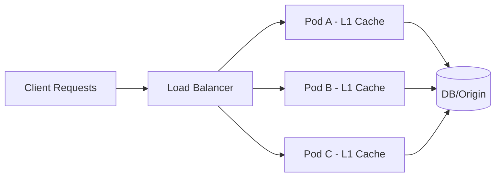
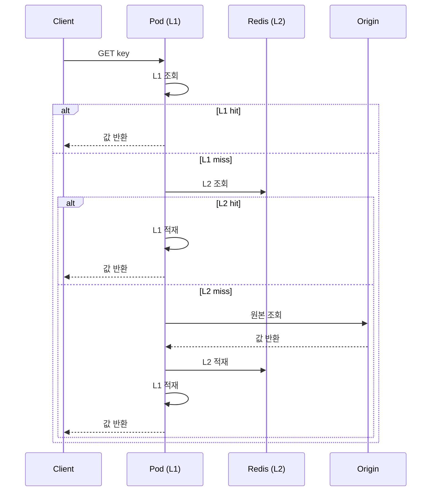
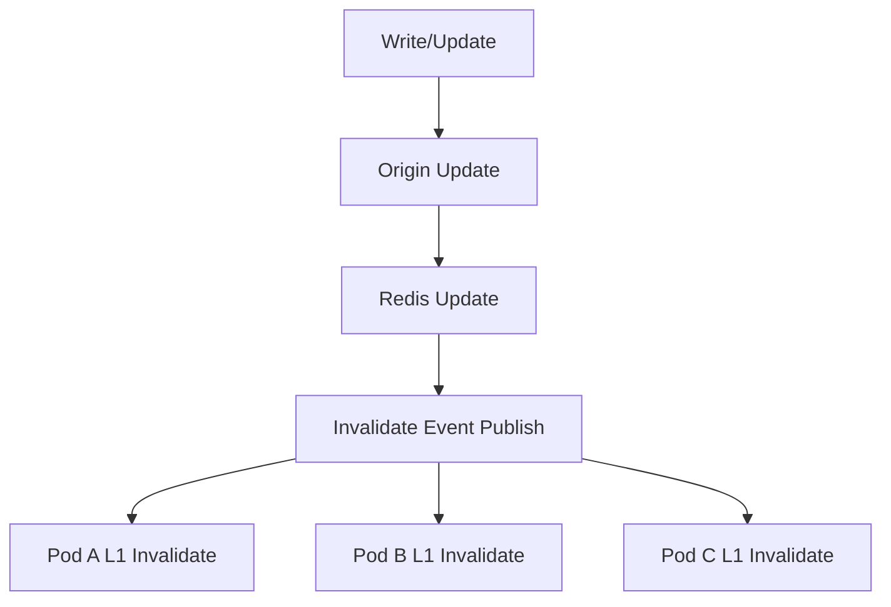

# K8s 다중 파드에서 Local Cache 운영 패턴 가이드

이 문서는 기존 cachetier 학습 문서와 별개로, **다중 파드(K8s) 운영 환경**에서 Local Cache를 어떻게 써야 하는지 의사결정 관점으로 정리한다.

---

## TL;DR
- 파드가 많아질수록 Local Cache는 파드별로 분산되어 hit ratio가 떨어지기 쉽다.
- 실무 기본값은 `L1(Local) + L2(Redis)` 구조다.
- 일관성이 중요해지면 무효화 이벤트 전파(Pub/Sub 등)까지 포함한 구조로 확장한다.
- 캐시 전략은 "성능 최적화"보다 "일관성 요구 + 운영 복잡도 + 장애 대응"을 함께 보고 결정한다.

---

## 1) 문제 정의: 왜 100개 파드에서 Local Cache 효율이 떨어지나

### 1-1. 현상
- 첫 요청이 A 파드에 들어가면 A 파드의 Local Cache만 warm-up된다.
- 동일 키라도 다음 요청이 B/C/D 파드로 가면 각 파드에서 다시 miss가 발생한다.
- 파드 수가 많아질수록 "파드별 독립 캐시" 특성 때문에 전체 hit ratio가 낮아진다.

### 1-2. 구조 다이어그램

핵심은 "캐시가 파드 간 공유되지 않는다"는 점이다.
따라서 L1만으로는 수평 확장 시 hit ratio가 구조적으로 낮아질 수 있다.

---

## 2) 운영 패턴 3가지

### 2-1. 패턴 비교표

| 패턴 | 구조 | 장점 | 단점 | 추천 상황 |
| --- | --- | --- | --- | --- |
| Pattern A: L1 only | 파드별 Local Cache만 사용 | 응답 지연 최소, 구조 단순 | 파드 수 증가 시 hit ratio 저하, 일관성 약함 | 소규모 트래픽, 일관성 민감도 낮음 |
| Pattern B: L1 + L2 | Local miss 시 Redis 조회 후 L1 적재 | 공유 캐시로 miss 비용 완화, 실무 기본형 | L1/L2 TTL 설계 필요, Redis 의존성 증가 | 대부분의 일반 웹 서비스 |
| Pattern C: L1 + L2 + 무효화 전파 | L2 업데이트 시 이벤트로 각 L1 무효화 | stale 완화, 데이터 일관성 개선 | 운영 복잡도 상승(Pub/Sub, 재시도, 순서) | 정합성 요구가 높은 도메인 |

### 2-2. 운영 난이도/효과 비교표

| 항목 | Pattern A | Pattern B | Pattern C |
| --- | --- | --- | --- |
| 구현 난이도 | 낮음 | 중간 | 높음 |
| 운영 난이도 | 낮음 | 중간 | 높음 |
| 평균 응답속도 | 빠름 | 빠름 | 빠름 |
| 수평 확장 대응 | 낮음 | 중간~높음 | 높음 |
| 데이터 일관성 | 낮음 | 중간 | 높음 |
| 장애 대응 복잡도 | 낮음 | 중간 | 높음 |

---

## 3) 패턴별 흐름 다이어그램

### 3-1. Pattern B (L1 + L2) 권장 기본형

### 3-2. Pattern C (무효화 전파 포함)

Pattern C는 stale 억제에 강하지만, 이벤트 유실/지연/중복 처리 규칙을 함께 설계해야 한다.

---

## 4) 운영 체크리스트

| 체크 항목 | 질문 | 권장 기준 |
| --- | --- | --- |
| TTL 계층 설계 | L1 TTL과 L2 TTL이 역할별로 분리되어 있는가? | L1은 짧게(마이크로캐시), L2는 상대적으로 길게 |
| 키 설계 | 키 단위로 데이터 소유 범위가 명확한가? | 버전/테넌트/도메인 구분 키 포함 |
| Stampede 완화 | same-key 동시 miss 보호가 있는가? | single-flight, jitter TTL, preload 검토 |
| 관측성 | hit/miss/eviction/load latency를 보는가? | 배포 전후 지표 비교 필수 |
| 무효화 정책 | 쓰기 시 invalidate 경로가 명확한가? | 최소한 write-path invalidate 규칙 문서화 |
| Warm-up | 기동 직후 cold start를 완화하는가? | hot key pre-warm 또는 점진 warm-up |

---

## 5) 증상 기반 대응표

| 증상 | 가능한 원인 | 먼저 볼 지표 | 1차 대응 |
| --- | --- | --- | --- |
| 파드 늘린 뒤 hit ratio 급락 | L1 분산 심화 | 파드별 hit/miss, key 분포 | Pattern B(L1+L2) 전환 또는 L1 TTL 단축 |
| Redis QPS 급증 | 동시 miss 폭주, stampede | Redis cmd/sec, miss burst | single-flight, TTL jitter, hot key 분리 |
| stale 데이터 노출 증가 | 무효화 지연/누락 | stale 비율, 이벤트 처리 지연 | write invalidate 강화, Pattern C 검토 |
| 배포 직후 지연 스파이크 | cold start + warm-up 부재 | p95/p99, startup hit ratio | pre-warm, rolling 시 warm-up 단계 추가 |
| 특정 키만 과부하 | hot key 편중 | key별 트래픽 상위 N | key 분리, 별도 TTL/보호 정책 적용 |

---

## 6) 이후 대안 로드맵

### 6-1. 단계별 실행 계획

| 단계 | 기간 예시 | 목표 | 주요 작업 | 성공 지표 |
| --- | --- | --- | --- | --- |
| 단기 | 2~4주 | 현재 구조 안정화 | L1+L2 정착, TTL 재정의, 관측성 대시보드, stampede 완화 | hit ratio 개선, Redis burst 감소 |
| 중기 | 1~2분기 | 일관성/효율 개선 | 키 기반 라우팅 검토, 무효화 이벤트 전파 도입, hot key 최적화 | stale 감소, p95 안정화 |
| 장기 | 분기+ | 아키텍처 단순화/고도화 | 도메인별 캐시 전략 분리, 일부 L1 축소 또는 Redis 중심화 | 운영 복잡도 대비 성능 효율 최적화 |

### 6-2. 다음 단계로 넘어가는 신호

| 현재 상태 | 전환 신호 | 다음 권장 단계 |
| --- | --- | --- |
| Pattern A 사용 중 | 파드 증가 후 hit ratio 하락이 반복 | Pattern B 전환 |
| Pattern B 사용 중 | stale 이슈가 운영 이슈로 반복 | Pattern C 도입 검토 |
| Pattern C 사용 중 | 운영 복잡도 과다, 장애 대응 부담 증가 | 도메인별 전략 분리/단순화 |

---

## 7) 결론
- 100개 파드 환경에서는 Local Cache 단독 전략이 구조적으로 불리하다.
- 운영 기본형은 Pattern B(`L1 + L2`)이고, 정합성 요구가 높을 때 Pattern C로 확장하는 흐름이 안전하다.
- "정답"보다 중요한 것은, 서비스의 정합성 요구와 운영 복잡도 허용치를 기준으로 단계적으로 진화시키는 것이다.

---

## 참고 연결
- [Caffeine Local Cache 딥다이브](../../dummy/2026-03-22_caffeine-local-cache-deep-dive.md)
- [Caffeine 내부구조 심화](../../dummy/2026-03-22_caffeine-local-cache-internals-deep-dive.md)
