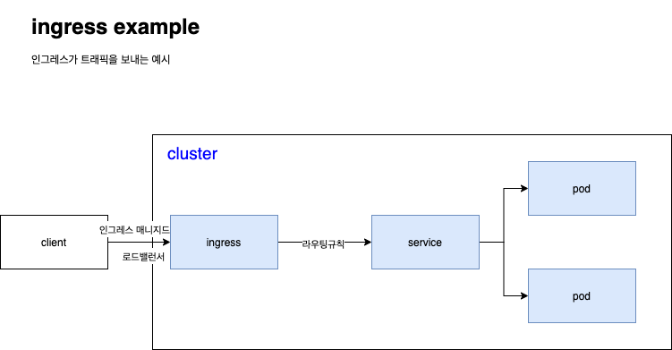

# ingress
클러스터 내의 서비스에 대한 외부접근을 관리하는 API 오브젝트이며, 일반적으로 http 를 관리함.   
인그레스는 부하분산, SSL 종료, 명칭기반의 가상호스팅을 제공한다.

## 용어
* 노드 (Node)
  * 클러스터의 일부이며, 쿠버네티스에 속한 워커머신
* 클러스터 (Cluster)
  * 노드들의 집합, 노드집합은 쿠버네티스에서 관리되는 컨테이너화된 애플리케이션을 실행하는 노드집합을 의미한다.

## 인그레스란?
* 클러스터 외부에서 클러스터의 내부 [서비스](https://kubernetes.io/ko/docs/concepts/services-networking/service/) 로 http/https 경로를 노출한다.   
* 트래픽 `라우팅` 은 인그레스 리소스에 정의된 규칙에 의해서 컨트롤된다.   
* 인그레스 리소스가 작동하려면, 클러스터는 실행중인 [`인그레스 컨트롤러`](https://kubernetes.io/ko/docs/concepts/services-networking/ingress-controllers/) 가 반드시 필요하다.


## 인그레스 리소스 설정파일
```yaml
apiVersion: networking.k8s.io/v1 # apiVersion 명시
kind: Ingress                    # Ingress resources 사용 명시
metadata:                        # metadata 명시
  name: minimal-ingress
  annotations:                   # 인그레스는 종종 애노테이션을 이용하여, 인그레스 컨트롤러에 옵션을 명시한다.
                                 # 아래는 인그레스 컨트롤러 옵션의 재작성 타겟 옵션이다.
    nginx.ingress.kubernetes.io/rewrite-target: /
spec:
  rules:
  - http:
      paths:
      - path: /testpath          # 경로목록 
        pathType: Prefix
        backend:
          service:
            name: test
            port:
              number: 80

```

## 인그레스 규칙
* http 규칙
 * `선택적 호스트`, 별도의 호스트가 지정되지 않는다면 ip 로 인바운드 된 트래픽은 인그레스 리소스에 설정해놓은 값대로 규칙이 적용된다.
  * 만약 호스트가 설정되면 `spec.rules.host[0]` 형태로 호스트값이 할당된다.
 * `경로목록`
  * 위의 예시에서는 `/testpath` 로 경로목록이 잡혀있다. `service.name` 과 `service.port.number` 가 정의되어 `backend` 를 가지고 있다.
  * 로드밸런서가 트래픽을 참조된 [서비스](https://kubernetes.io/ko/docs/concepts/services-networking/service/) 로 보내기 위해선 `service.name` 과 `service.port.number` 가 일치하여야 한다.
 * `backend` 는 서비스와 포트이름의 조합이다.

## 리소스 백엔드
reference 를 참고한다.

## 호스트네임과 와일드카드
reference 를 참고한다.

## 인그레스 클래스
reference 를 참고한다.

## reference
* https://kubernetes.io/ko/docs/concepts/services-networking/ingress/
