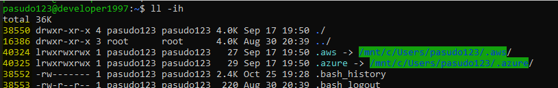

# command & usage & concept
* linux concept
* a list of frequently used commands.

## <a id="index"></a>Page Of Index
* linux
    * [ln : hard link & symbolic link](#ln)
    * [kill](#kill)
    * [awk](#awk)
* shell
    * [변수할당](#variable-command)
* [reference](#reference)

<BR> 

# linux 🚀

## 🔔 <a id="ln"></a> ln : hard link & symbolic link
* 심볼릭과 하드링크를 이해하기 inode 에 대한 이해가 밑바탕이 되어야한다.

### 👀 inode
* 유닉스 계통 파일 시스템에서 사용하는 자료구조이다.
* 아이노드는 정규 파일, 디렉토리 등 파일 시스템에 관한 정보를 가지고 있다.
* 파일들은 각자 하나의 아이노드를 가지고 있으며, 아이노드는 소유자 그룹, 접근모드, 파일형태, 아이노드 숫자 등 해당 파일에 관한 정보를 가지고 있다.
* 파일시스템 내의 파일들은 고유한 아이노드 숫자를 통해 식별이 가능하다.
* 아래 이미지에서 __노란색 형광표기__ 가 되어있는게 아이노드 번호이다.



### 👀 심볼릭링크
* 윈도우 시스템의 `바로가기 기능` 과 매우 유사하다.
* 원본파일에 대한 정보가 포함되어 있지 않으며, 원본 파일 위치에 대한 포인터만 포함되므로 inode 를 가진 링크파일이 생성된다. (inode 값이 다르다.)
* 원본파일을 삭제할경우 액세스 `불가능` 하다.
* 원본파일을 다시 되살릴경우 액세스가 `다시 가능` 하다.

```shell
ln -s {origin-file} {link-file}

pasudo123@developer1997:/mnt/c/develop/etc$ ln -s sample-sym sample
pasudo123@developer1997:/mnt/c/develop/etc$ ll -i
36028797019193832 -rwxrwxrwx 1 pasudo123 pasudo123    6 Oct 25 20:10 sample*
11258999068722483 lrwxrwxrwx 1 pasudo123 pasudo123    6 Oct 25 20:11 sample-sym -> sample*
```

### 👀 하드링크
* 하드링크는 원본 파일의 inode 에 대한 직접적인 포인터이다.
* 원본파일은 하드링크와 비교하면 아무 차이가 없다.
* 하드링크에는 새로운 inode 에 대한 생성이 없다. (`동일한 inode 값` 을 가진다.)
* 원본파일을 삭제하더라도 액세스 `가능` 하다.
```shell
ln {origin-file} {link-file}

pasudo123@developer1997:/mnt/c/develop/etc$ ln sample-hard sample
pasudo123@developer1997:/mnt/c/develop/etc$ ll -i
36028797019193832 -rwxrwxrwx 1 pasudo123 pasudo123    6 Oct 25 20:10 sample*
36028797019193832 lrwxrwxrwx 1 pasudo123 pasudo123    6 Oct 25 20:11 sample-hard*
```

<BR>

## 🔔 <a id="kill"></a> kill
*  실행중인 프로세스에 `시그널` 를 보내기 위해 널리 사용되는 운영체제 명령어
* `시그널` 은 특정 이벤트가 발생했을 때, 신호를 보내서 알려주는 것이다.
* 현재 지원하는 시그널을 확인하기 위한 명령어
```shell
pasudo123@developer1997:/mnt/c/Windows/system32$ kill -l

 1) SIGHUP       2) SIGINT       3) SIGQUIT      4) SIGILL       5) SIGTRAP
 6) SIGABRT      7) SIGBUS       8) SIGFPE       9) SIGKILL     10) SIGUSR1
11) SIGSEGV     12) SIGUSR2     13) SIGPIPE     14) SIGALRM     15) SIGTERM
16) SIGSTKFLT   17) SIGCHLD     18) SIGCONT     19) SIGSTOP     20) SIGTSTP
21) SIGTTIN     22) SIGTTOU     23) SIGURG      24) SIGXCPU     25) SIGXFSZ
26) SIGVTALRM   27) SIGPROF     28) SIGWINCH    29) SIGIO       30) SIGPWR
31) SIGSYS      34) SIGRTMIN    35) SIGRTMIN+1  36) SIGRTMIN+2  37) SIGRTMIN+3
38) SIGRTMIN+4  39) SIGRTMIN+5  40) SIGRTMIN+6  41) SIGRTMIN+7  42) SIGRTMIN+8
43) SIGRTMIN+9  44) SIGRTMIN+10 45) SIGRTMIN+11 46) SIGRTMIN+12 47) SIGRTMIN+13
48) SIGRTMIN+14 49) SIGRTMIN+15 50) SIGRTMAX-14 51) SIGRTMAX-13 52) SIGRTMAX-12
53) SIGRTMAX-11 54) SIGRTMAX-10 55) SIGRTMAX-9  56) SIGRTMAX-8  57) SIGRTMAX-7
58) SIGRTMAX-6  59) SIGRTMAX-5  60) SIGRTMAX-4  61) SIGRTMAX-3  62) SIGRTMAX-2
63) SIGRTMAX-1  64) SIGRTMAX
```
* `SIGINT`, `SIGKILL`, `SIGTERM` 을 살펴볼 예정
* SIGINT (2)
    * 터미널 인터럽트 신호
    * 키보드로부터 오는 이터럽트 시그널로 실행을 중지 (Ctrl + c 입력시에 보내지는 시그널)
* SIGKILL (9)
    * 킬
    * 무조건 종료, 즉 프로세스를 강제로 종료시키는 시그널
* SIGTERM (15)
    * 종료신호
    * Terminate 의 약자로 가능한 정상종료 시키는 시그널로 `kill 명령의 디폴트 시그널`
* 사용방법
```shell
$ kill {signal} {pid}
$ kill -9 123
$ kill -15 123
$ kill 123      // 생략 시 SIGTERM 으로 시그널이 전송된다.
```
* 일반적으로 프로세스가 시그널을 받았을 때, 기본 처리 방법은 프로세스를 종료하는 것이 대부분이다. 이 때, 시그널을 수신한 프로세스의 반응은 아래와 같다.
    * 시그널에 대해 기본적인 방법으로 대응한다. (대부분의 시그널에 대해서 프로세스는 종료하게 된다.)
    * 시그널을 무시한다. 단, SIGKILL 과 SIGSTOP 은 무시될 수 없다.
    * 프로그래머가 지정한 핸들러를 호출한다.

### 👀 SIGTERM & SIGKILL 의 차이점은 무엇인가?
* `SIGTERM` 은 gracefully 하게 프로세스를 종료시킬 수 있다. 반면에 ``SIGKILL` 은 프로세스를 즉시 종료시킨다.
* `SIGTERM` 신호는 처리/무시/차단 할 수 있지만, `SIGKILL` 은 처리하거나 차단할 수 없다.
* `SIGTERM` 은 자식 프로세스를 죽이지 못하지만, `SIGKILL` 은 자식 프로세스를 죽일 수 있다.
* `SIGKILL` 을 사용하면 좀비 프로세스가 생성될 수 있다. `SIGKILL` 을 받은 프로세스는 자식 프로세스에게 `SIGKILL` 신호를 알릴 기회를 얻지 못하기 때문이다.


<BR>

## 🔔 <a id="awk"></a> awk
* [목차이동](#index)
* `오크` 리고 부른다.
* 기본 기능은 텍스트 형태로 되어있는 입력데이터를 행과 단어 별로 처리해 출력해주는 것.
* awk 는 명령파일과 입력파일 두 가지 데이터를 받아 실행
    * 명령파일은 awk 가 어떤 데이터 규칙에 따라 처리할 지 지시
* 사용방법
```shell
$ awk '{function-name}'
$ awk '{print $1}'              // 첫번째 필드 출력
$ awk '{print}' ./sample.txt    // sample.txt 의 모든 레코드 출력

sample.txt 문서

|----|----|----|----|
| $1 | $2 | $3 | $4 |  ==>  ... $n 필드
|----|----|----|----|
|  A | 10 | 20 | 30 |  ==>      $0 레코드
|  B | 40 | 50 | 60 |
|  C | 70 | 80 | 90 |
| .. | .. | .. | .. |
|----|----|----|----|
```
* awk print 이용
```shell
// 도커의 특정한 이미지의 IMAGE ID 출력
$ docker images | grep {name}:{tag} | awk '{print $3}'

// 특정 프로세스의 pid 출력
$ ps -ef | grep java | awk '{print $2}'
```

<BR> 

# shell 🚀
## ⛑ <a id="variable-command"></a> bash 변수 할당
* [목차이동](#index)
* 값이나 명령어를 변수에 할당할 시, `variable={value}` 형식으로 equals(=) 에 딱 맞게 붙여준다.
```shell
number=10
echo $number        // 10 

newNumber = 10      // 띄어쓰기가 존재하면 안된다.!!
echo $newNumber     // 10 을 출력하지 못함.

show_list='ls -al'
echo $show_list     // 'ls -al' 명령어 실행
```

<BR>

# <a id="reference"></a> reference 🚀
* [kill wiki](https://en.wikipedia.org/wiki/Kill_(command))
* [awk 명령어 참고링크](https://recipes4dev.tistory.com/171)