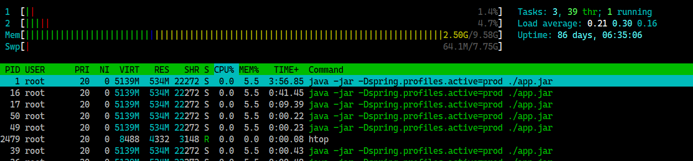

## htop 👀
* 시스템 사용량 즉, CPU 사용량 및 메모리 사용량 등을 비주얼적으로 모니터링할 수 있는 프로그램
* 기존 리눅스 커맨드의 `top` command 를 개량한 것중에 하나가 `htop` 이다.

### htop 설치
```
// 새로운 프로그램 설치 이전에 update && upgrade 수행
apt-get update
apt-get upgrade

// htop 설치
apt-get install htop

// htop 이용
htop
```

### htop


#### Load average
CPU 가 처리하는 걸 기다리는 작업의 개수를 의미하며 1분당 평균으로 몇 개의 작업이 쌓이는지 나타내는 `값` 이다. 만약 작업량이 적으면 쌓인 작업량은 평균치로 `0.1` 이나 `0.2` 정도로 매우 작다. 이와 반대로 작업이 많아져서 `처리속도 < 작업발생속도` 가 되면 `과부하상태` 가 되며 load average 값은 올라간다.

* 이 떄 고려해야할 것은 코어가 싱글코어/듀얼코어/멀티코어 여부를 확인해야한다.
    * 싱글코어일때 값이 1 이면 CPU 내 코어가 1개인데 일을 잘 처리하고 있는 상태
    * 듀얼코어일때 값이 2 이면 CPU 내 코어가 2개인데 일을 잘 처리하고 있는 상태
    * 쿼드코어일때 값이 4 이면 CPU 내 코어가 4개인데 일을 잘 처리하고 있는 상태
    * 일을 잘 처리하더라도 CPU 가 모두 가동중인 상태는 위험할 요소가 있다. 추가적인 작업이 들어오는 경우에는 `과부하상태` 가 될 수 있기 때문이다.
* load average 는 `세 개` 의 값이 노출되는데 각각 `1분간의 평균`, `5분간의 평균`, `15분간의 평균` 을 의미한다.
* 정리하면 아래와 같다.
    * load average >= 코어 개수 : 과부하상태
    * cpu 사용률 + cpu 시간이 큰 프로세스는 과부하 원인의 가능성이 있다.
    * 해당 프로세스를 `kill` 여부는 판단이 필요하다.

|name|desc|
|---|---|
|PID|프로세스의 ID 번호|
|USER|프로세스 소유자|
|PR|우선순위|
|NI|우선순위에 영향을 주는 프로세스 nice 값(`nice` : 프로세스가 실행할 때 실행의 우선순위를 조정한다. nice 값은 보통 0에서 시작한다. -20이 우선순위가 가장 높고 19가 가장 낮다. 일반 유저는 nice 값을 증가시킬 수 밖에 없으며 `root` 의 경우는 nice 갑을 감소시켜 우선순위를 높일 수 있다.)|
|VIRT|프로세스가 사용중인 가상 메모리 양|
|RES|프로세스가 사용중인 물리 메모리(RAM) 양 (KB 단위)|
|SHR|프로세스가 사용중인 공유 메모리 양|
|S(state)|프로세스의 현재상태|
|%CPU|프로세스가 프로세서를 사용한 시간의 사용률|
|%MEM|프로세스가 사용중인 메모리(RAM)의 사용률|
|TIMR+|프로세서를 사용한 시간|
|COMMAND|프로세스를 시작하도록 수행한 명령|


## reference
* [서버 모니터링 프로그램 htop](https://happist.com/557995/%EC%84%9C%EB%B2%84-%EB%AA%A8%EB%8B%88%ED%84%B0%EB%A7%81-%ED%94%84%EB%A1%9C%EA%B7%B8%EB%9E%A8-htop-%EC%82%AC%EC%9A%A9-%EB%B0%A9%EB%B2%95-ubuntu)
* 책 : 만화로 배우는 리눅스 시스템 관리